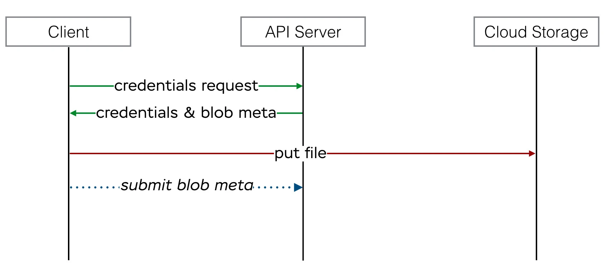

# Envoyer un message avec une PJ

Il est possible d'envoyer un message via les API GraphQL. Mais avant cela, voici un petit tour d'horizon du fonctionnement :&#x20;

## Préambule

### 1. Vous demandez a notre **API une authorisation pour uploader un fichier sur notre object storage**.&#x20;


Cette requete implique de décrire le fichier que vous allez envoyer : le filename, byteSize, checksum (un digest md5, base64digesté) et son contenu. Ceci pour nous permettre de valider que nous echangeons le meme fichier, qu'il n'a pas été altéré etc.. Nous vous renvoyer&#x20;

1. les crédentials pour communiquer avec notre object storage
2. l'identifiant du fichier (blob\_signed\_id) a utiliser dans une autre requete pour le lier à une autre mutation&#x20;

### 2. Vous upoadez le fichier sur notre object storage, en réutilisant les crédentials de la 1ere requete&#x20;

<figure><figcaption><p>résumé des étapes 1 et 2,source: <a href="https://evilmartians.com/chronicles/active-storage-meets-graphql-direct-uploads">https://evilmartians.com/chronicles/active-storage-meets-graphql-direct-uploads</a></p></figcaption></figure>

### 3. Vous, client, faites une requete pour lier ce fichier (maintenant sur nos serveurs, identifié par le signed\_blob\_id) a un message

createDirectUpload


```
// Some code
```
