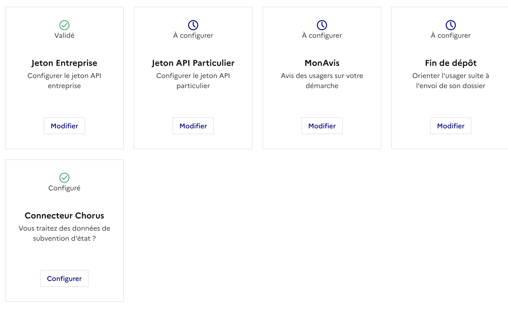
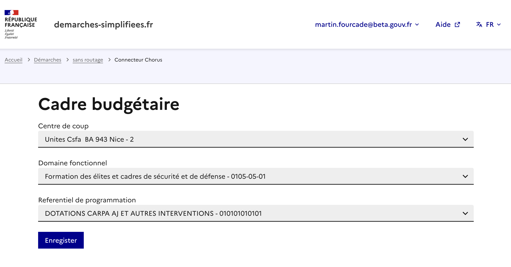
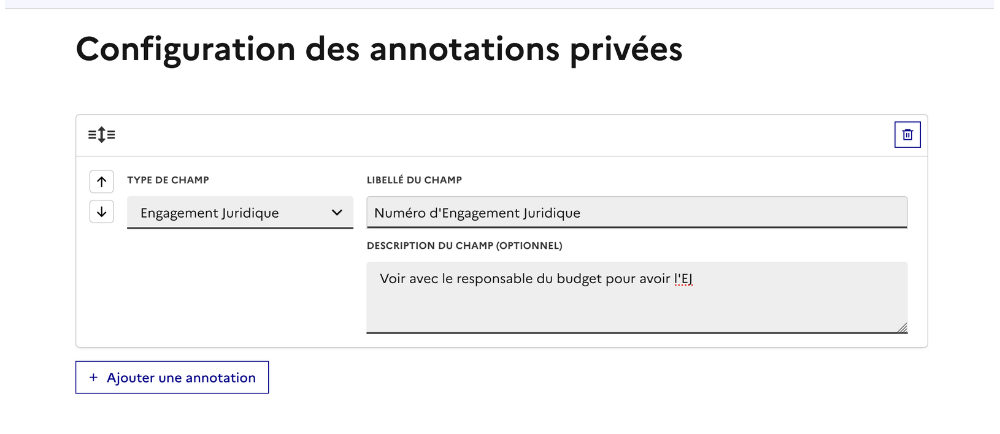

# Chorus

Vous êtes concerné par cette expérimentation si :&#x20;

* vous usagers vous sollicitent régulière pour savoir ou en est l'état de paiement de leurs subvention
* votre service opérère des solution de data visualisation autour du budget&#x20;

Si vous souhaitez prendre part a cette expérimentation, contactez nous par mail (contact@demarches-simplifiees).

Nous avons mis en place plusieurs solutions pour faciliter le rapprochement d'exports/API des données DS avec votre SI.

### Saisir le cadre budgetaire

Vous pouvez saisir le cadre budgetaire en vous rendant sur la page de configuration de votre démarche et en cliquant&#x20;

<figure><figcaption>
cliquer sur "Configurer" dans la tuile Connecteur Chorus
</figcaption></figure>

Vous pouvez ainsi configurer le cadre budgetaire en renseignant le centre de coût, le domaine fonctionnel et le référentiel de programmation

<figure><figcaption>
A savoir que nous pour le moment, nous n'avons pas toutes les références du cadre budgetaire (uniquement les informations des cadres déjà en activitéé )
</figcaption></figure>

Une fois le cadre budgetaire, celui sera présent sur les exports xlsx de vos démarches de sorte à ce que votre service financier puisse recouper son cadre budgetaire à des dossiers DS.

### L'annotation privée EJ

Vous pouvez aussi ajouter une annotation privée de type EJ de sorte a ce que les instructeurs puissent saisir l'EJ correspondant à un dossier. Celle ci remontera dans les appels a l'API ainsi que dans les exports DS.&#x20;

<figure><figcaption></figcaption></figure>

### Arrivera Bientôt&#x20;

Pour les démarches avec cette fonctionnalité activée, nous allons mettre en avant, sur la page de leur dossier, que lorsque l’engagement juridique sera saisi par un instructeur, celui-ci apparaîtra dans l’interface et garantira l’engagement financier.&#x20;
