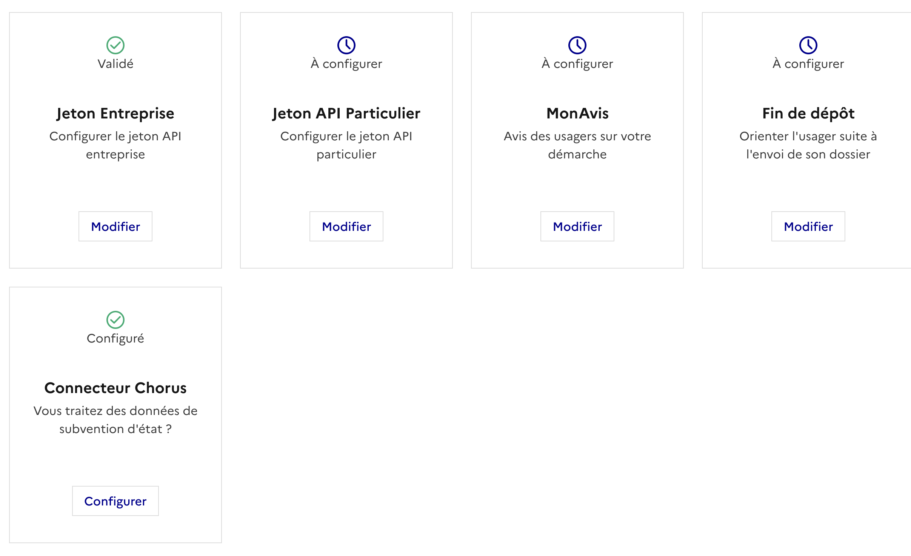
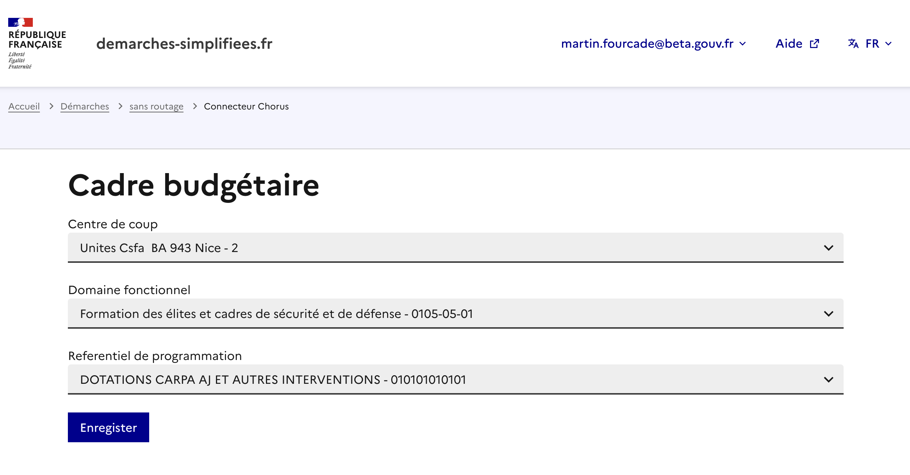
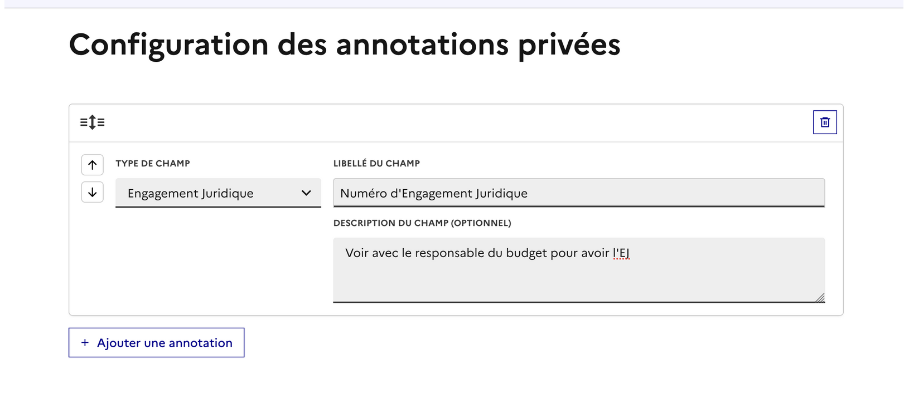

# Chorus

Vous êtes concerné par cette expérimentation si :&#x20;

* vos usagers vous sollicitent régulièrement pour savoir où en est le paiement de leurs subventions
* votre service opère des solutions de data visualisation autour du budget&#x20;

Si vous souhaitez prendre part à cette expérimentation, contactez-nous par courriel (contact@demarche.numerique.gouv.fr).

Nous avons mis en place plusieurs solutions pour faciliter le rapprochement d'exports/API des données DS avec votre SI.

### Saisir le cadre budgétaire

Vous pouvez saisir le cadre budgétaire en vous rendant sur la page de configuration de votre démarche et en cliquant sur « Configurer » dans la tuile Connecteur Chorus.

<figure><figcaption>
cliquer sur "Configurer" dans la tuile Connecteur Chorus
</figcaption></figure>

Vous pouvez ainsi configurer le cadre budgétaire en renseignant le centre de coût, le domaine fonctionnel et le référentiel de programmation.

<figure><figcaption>
À savoir que, pour le moment, nous n'avons pas toutes les références du cadre budgétaire (uniquement les informations des cadres déjà en activité)
</figcaption></figure>

Une fois le cadre budgétaire saisi, celui-ci sera présent sur les exports xlsx de vos démarches, de sorte que votre service financier puisse recouper son cadre budgétaire avec des dossiers DS.

### L'annotation privée EJ

Vous pouvez aussi ajouter une annotation privée de type EJ, de sorte que les instructeurs puissent saisir l'EJ correspondant à un dossier. Celle-ci remontera dans les appels à l'API ainsi que dans les exports DS.&#x20;

<figure><figcaption></figcaption></figure>

### Arrive bientôt&#x20;

Pour les démarches avec cette fonctionnalité activée, nous allons mettre en avant, sur la page de leur dossier, que lorsque l’engagement juridique sera saisi par un instructeur, celui-ci apparaîtra dans l’interface et garantira l’engagement financier.&#x20;
