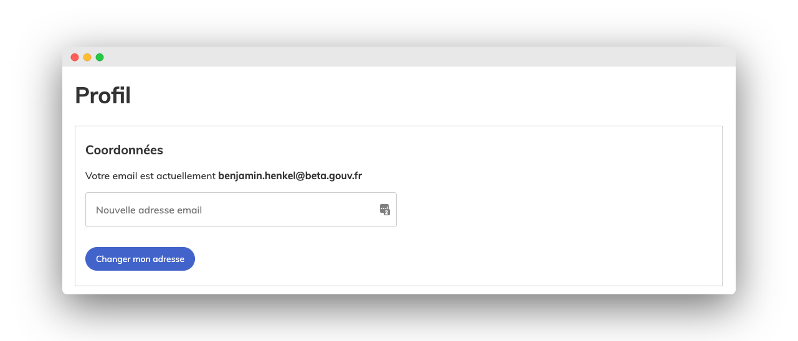

# Pour les administrateurs

## Changement de couleurs

Afin de permettre aux citoyens d'avoir une cohérence graphique et une meilleure expérience à travers l'ensemble des sites de l'État, le site demarches-simplifiees.fr s'adapte progressivement au Système de Design de l'État.\
\
La première phase d'adaptation de « Démarches simplifiées » se situe au niveau des couleurs et dans les prochains mois d'autres changements seront visibles au niveau des composants et icônes.

## Modification d'une démarche en ligne

Il est désormais possible de modifier une démarche qui a été publiée.

Cette fonctionnalité est désormais activée pour l'ensemble des administrateurs, vous disposez des mêmes options que quand vous créez un formulaire !

### L'ajout d'un champ s'effectue de la même manière que lors d'une création

### Pour republier, il suffit de cliquer sur le bouton « publier les modifications »

La publication des modifications **n'entraîne pas la suppression des dossiers !**

### **Pour les instructeurs, les nouveaux champs et les champs supprimés sont accessibles dans les dossiers et dans les exports.**

**Les dossiers déposés ne sont obligés de modifier leur dossier, seuls les nouveaux dossiers auront les modifications accessibles**

### Recommandations :

Pour les utilisateurs de l'API, il conviendra donc parfois d'adapter l'utilisation de l'API à la nouvelle structure de données.

## Le type de champ « Communes » est disponible&#x20;

Ce champ est connecté à la BAN (Base d'Adresse Nationale) et permet à l'usager de chercher sa commune parmi l'ensemble des communes françaises.&#x20;

## Mettez en forme certains textes de votre démarche grâce à des balises HTML

La description de votre démarche et les descriptions de vos champs peuvent être mises en forme grâce à des balises HTML qui vous permettent de :&#x20;

* mettre votre texte en _italique_
* souligner votre texte
* mettre votre texte en **gras**&#x20;
* faire un paragraphe
* mettre votre texte sous forme de titre.

Retrouvez plus d'informations dans notre aide[ en cliquant ici. ](https://faq.demarches-simplifiees.fr/article/76-puis-je-mettre-en-forme-le-texte-de-ma-demarche)

## La page de description de la démarche change d'interface

Elle a été simplifiée et suit désormais la charte graphique du reste du site.

## Changez l'adresse email associée à votre compte démarches-simplifiées.fr&#x20;

Vous pouvez désormais facilement modifier l'adresse e-mail associée à votre compte démarches-simplifiées.fr. Plus d'informations ici : [https://faq.demarches-simplifiees.fr/article/68-changer-mon-adresse-email](https://faq.demarches-simplifiees.fr/article/68-changer-mon-adresse-email)

## Les administrateurs peuvent proposer à l'usager d'évaluer leurs démarches grâce à « MonAvis »&#x20;

Il est désormais possible de proposer à l'usager d'évaluer votre démarche grâce à [https://monavis.numerique.gouv.fr/](https://monavis.numerique.gouv.fr/), et ce, même si celle-ci est déjà publiée !&#x20;

Plus d'informations ici : [https://doc.demarches-simplifiees.fr/tutoriels/integration-du-bouton-mon-avis](https://doc.demarches-simplifiees.fr/tutoriels/integration-du-bouton-mon-avis)

## Soyez plusieurs administrateurs sur une même démarche&#x20;

Vous pouvez désormais ajouter autant de co-administrateur sur votre démarche que vous voulez !

Plus d'informations ici : [https://faq.demarches-simplifiees.fr/article/52-plusieurs-administrateurs-sur-une-meme-demarche](https://faq.demarches-simplifiees.fr/article/52-plusieurs-administrateurs-sur-une-meme-demarche)


Une présentation de DS pour les acteurs publics


