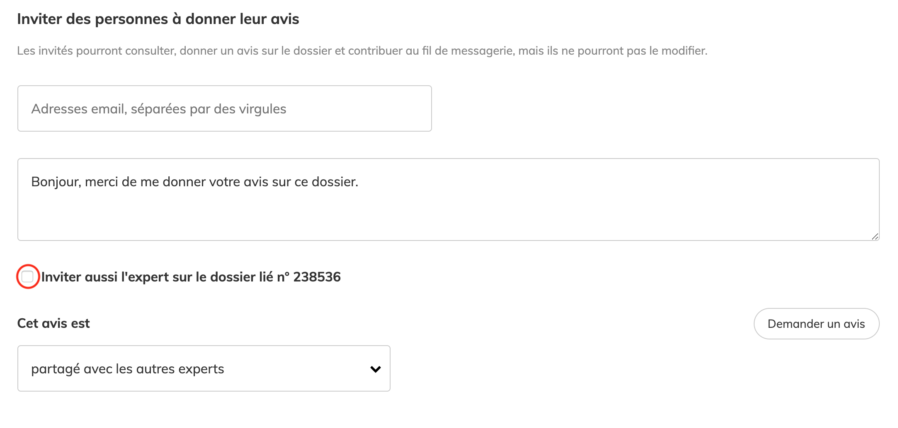

# Pour les instructeurs

### Retrouvez toutes les nouveautés et l'actualité Démarches simplifiées depuis l'onglet "nouveautés" de votre compte :&#x20;

<figure><figcaption></figcaption></figure>

## La possibilité de supprimer un message envoyé par erreur sur la messagerie

Il est désormais possible de supprimer un message envoyé par erreur depuis la messagerie du dossier en cliquant sur le bouton « supprimer le message » :&#x20;

.png>)

Côté usager, le message envoyé par l'instructeur est automatiquement supprimé : &#x20;

.png>)

## Les instructeurs peuvent contacter les usagers disposant d'un dossier en brouillon&#x20;

Pour s'assurer que l'ensemble des usagers déposent leurs dossiers, les instructeurs de la démarche ont désormais la possibilité de contacter les usagers avec des dossiers en brouillon.&#x20;

Ils peuvent alors envoyer **un mail à l'ensemble des usagers** dont le dossier est en brouillon :&#x20;

.png>)

## L'ajout de nouveaux instructeurs à la démarche&#x20;

En tant qu'instructeur d'une démarche, vous pouvez désormais nommer d'autres instructeurs depuis l'interface de cette même démarche :&#x20;


**En amont, nous vous recommandons de contacter l'administrateur de la démarche afin de l'avertir des ajouts de nouveaux instructeurs.**&#x20;


Après avoir cliqué sur le bouton « instructeurs », vous pourrez ajouter l'adresse e-mail des nouveaux instructeurs selon le même principe que l'affectation d'instructeurs par l'administrateur de la démarche.&#x20;

Pour plus d'informations concernant l'ajout d'instructeurs, nous vous invitons à cliquer [ici.](https://doc.demarches-simplifiees.fr/tutoriels/tutoriel-administrateur#11.-nommer-des-instructeurs)&#x20;

## Changement de couleurs&#x20;

Afin de permettre aux citoyens de bénéficier d'une cohérence graphique et d'une meilleure expérience à travers l'ensemble des sites de l'État, le site demarches-simplifiees.fr s'adapte progressivement au Système de Design de l'état.\
\
La première phase d'adaptation de « Démarches simplifiées » se situe au niveau des couleurs et dans les prochains mois d'autres changements seront visibles au niveau des composants et icônes.

## Suppression de la possibilité de changer l'adresse e-mail associée à son compte demarches-simplifiees.fr

Pour des raisons de sécurité, toute personne disposant de droits instructeur ou administrateur ne peut plus changer l'adresse e-mail associée à son compte demarches-simplifiees.fr, comme elle pouvait le faire jusqu'ici. Il est dorénavant nécessaire de nous envoyer un mail à l'adresse contact@demarches-simplifiees.fr depuis votre ancienne adresse e-mail en indiquant bien la nouvelle adresse e-mail. La fonctionnalité reste disponible pour les personnes qui ne sont qu'usagers de demarches-simplifiees.fr.

## La fonction « Télécharger toutes les pièces jointes » inclut désormais les pièces jointes échangées dans la messagerie

Jusqu'à maintenant seules les pièces jointes incluses dans le dossier par l'usager étaient téléchargeables _via_ cette fonctionnalité. Celles-ci sont téléchargées sous un format ZIP.

## Lorsqu'un instructeur envoie un dossier à un autre instructeur, ce dernier suivra automatiquement le dossier concerné

Auparavant, il fallait que l'instructeur qui reçoit le dossier fasse l'action de suivre le dossier, et ce, pour chaque dossier transmis. Désormais, il recevra toujours un e-mail lui indiquant qu'un dossier lui a été envoyé, mais ce dossier apparaîtra directement sur son portail instructeur parmi ses dossiers suivis.

## Les experts invités peuvent accéder aux dossiers liés

Si l'usager a lié son dossier à un autre dossier via un champ « Lien vers un autre dossier », l'instructeur a désormais la possibilité de permettre à l'expert invité de consulter le dossier lié. Pour cela, il lui suffit de cocher la case « Inviter aussi l'expert sur le dossier lié n°xxxx ».

## Changement dans la récupération des dossiers sous un format tableur

Certaines démarches étaient devenues trop lourdes pour permettre un téléchargement directement depuis votre navigateur. Désormais, après avoir cliqué sur le bouton « Télécharger tous les dossiers », vous recevrez un mail lorsque votre fichier sera prêt. Un lien dans ce mail  vous permettra finalement de télécharger le fichier.

## Les instructeurs peuvent repasser des dossiers acceptés en instruction

Vous avez accepté un dossier par erreur ? Pas de panique : vous pouvez désormais le repasser en instruction ! Il suffit pour cela de cliquer sur le bouton « Accepté » puis « Repasser en instruction ». Plus d'informations [en cliquant ici.](https://faq.demarches-simplifiees.fr/article/57-repasser-un-dossier-en-instruction)

## **Statistiques de traitement d'une démarche**

Il est maintenant possible de consulter, pour chaque démarche, le temps de traitement usuel, le nombre de dossiers en brouillon, déposé, etc ainsi que le taux d'acceptation. Pour cela, il faut sélectionner la démarche puis cliquer sur « statistiques » :&#x20;

## Amélioration de l’export tableur des dossiers :&#x20;

Le libellé des colonnes est maintenant en français. L'export inclut les blocs répétables ainsi que les avis.

## Téléchargez toutes les pièces jointes d'un seul clic&#x20;

Dorénavant, vous pouvez télécharger toutes les pièces jointes contenues dans le dossier d'un seul clic ! Celles-ci sont téléchargées sous un format ZIP.

## Changez l'adresse e-mail associée à votre compte demarches-simplifiees.fr&#x20;

Vous pouvez désormais facilement modifier l'adresse e-mail associée à votre compte demarches-simplifiees.fr. Plus d'informations ici :&#x20;



## Les instructeurs peuvent repasser des dossiers classés sans suite ou refusés en instruction . Il est également possible d'envoyer à l'usager une demande de correction.&#x20;

Vous avez classé sans suite ou refusé un dossier par erreur ? Pas de panique : vous pouvez désormais le repasser en instruction ! Il suffit pour cela de cliquer sur le bouton « Sans suite » ou « Refusé » puis « Repasser en instruction »

Un usager a transmis une mauvaise information ? Pas de panique : vous pouvez désormais envoyer à l'usager une demande de correction. L'usager recevra un mail pour corriger son dossier, dans l'attente, celui sera marque comme "en attente" de correction depuis vos tableau de bord instructeur de la démarche.&#x20;

\
Plus d'informations ici :&#x20;

[https://www.demarches-simplifiees.fr/faq/instructeur/comment-repasser-un-dossier-en-instruction](https://www.demarches-simplifiees.fr/faq/instructeur/comment-repasser-un-dossier-en-instruction)

