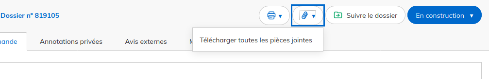

# Archivage longue durée des démarches

Démarches-simplifiées conserve **par défaut** les dossiers pour une **durée maximale de 36 mois**. Cette durée est configurable par les administrateurs au moment de la création de la démarche.

Dans la très grande majorité des cas, cette durée peut être inférieure, **car le principe est la supression des dossiers de la plateforme à l'issue de son traitement.**

Pour déterminer la durée de conservation globale d'un dossier, vous devez à la fois vous appuyer sur les règles d'archivage, mais aussi sur **l'analyse de risque que vous devez avoir effectuée préalablement.**

**L' administration est en effet responsable du traitement et de la conservation des dossiers**. Cela concerne principalement les dossiers terminés (acceptés, refusés ou sans suite). Vous recevez des notifications par email un mois avant la suppression de dossiers afin de vous rappeler de les sauvegarder.

Plusieurs fonctionnalités sont disponibles pour stocker ces archives dans votre service :

* [L'export des dossiers au format tableur](https://doc.demarches-simplifiees.fr/pour-aller-plus-loin/exports-de-donnees) permet d'avoir une vue d'ensemble des dossiers d'une démarche.

* Le téléchargement individuel des dossiers au format ZIP permet de télécharger toutes les pièces échangées au cours de la vie du dossier.

* L'export PDF d'un dossier permet d'avoir une archive de la demande.

.png>)

* [L'utilisation de l'API](https://doc.demarches-simplifiees.fr/pour-aller-plus-loin/graphql) permet d'automatiser la récupération des données.

Vous pouvez aussi récupérer une l'archive mensuel pour tous les dossiers d'une démarche. Cet archive au format .zip intégre&#x20;

* tous les dossiers et leurs pièces jointes
* tous les messages échangés par le biais de la messagerie entre les instructeurs et les usagers (incluant aussi les pièces jointes)
* les attestations pour chaque dossier quand celles ci sont présente

