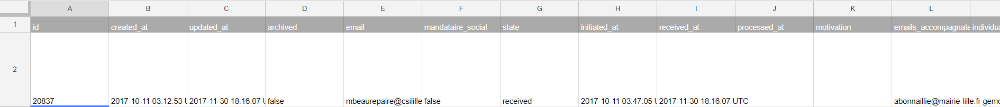

# Exports de données

## Export manuel

Il est possible d'exporter manuellement l'intégralité des dossiers déposés sur une procédure donnée.&#x20;

Pour cela, dans l'interface instructeur, cliquer sur la procédure concernée puis sur la liste des dossiers que vous souhaités  bouton «Télécharger les dossiers » en haut à droite et choisir le format d'export souhaité (.csv, .xls, .ods,zip.).

<figure><figcaption></figcaption></figure>

Une liste déroulante avec les différents formats s'affichera alors avec deux options de téléchargement :&#x20;

* standard
* A partir d'un modèle ( vous permettant de sélectionner les informations que vous souhaitez exporter) Vous retrouverez plus d'informations concernant l'export personnalisé en cliquant[ ici. ](https://doc.demarches-simplifiees.fr/pour-aller-plus-loin/export-personnalise)

<figure><figcaption></figcaption></figure>

Il n'est pas possible d'effectuer cette opération dans l'interface administrateur, mais les administrateurs peuvent le faire en se nommant instructeur sur la procédure.

Le tableau exporté est composé d'une ligne par dossier, chaque ligne comportant les informations suivantes :

* métadonnées : numéro de dossier et dates
* données saisies par le demandeur : identité du demandeur et  champs du formulaire
* données d'instruction : emails des usagers suivant le dossier et annotations privées

En revanche, selon le type d’export demandé, certaines informations peuvent ne pas figurer, notamment :

* liens vers les pièces jointes
* avis
* messages échangés

#### Export sous la forme d'un ZIP

Une option a été mis en place qui permet d'exporter non pas sous forme d'un tableau, mais sous forme de fichier (un fichier par dossier) contenant les données, les PJ, et les métadonnées.

**Tout est alors prêt pour faire de l'archivage !**

#### Métadonnées

Les métadonnées du dossier comprennent les informations suivantes:&#x20;

* id: numéro du dossier
* created\_at: date de création du dossier
* updated\_at: date de la dernière modification du dossier
* archived: informe si le dossier est archive (_true_) ou non (_false_)
* email: email de l'usager
* state: correspond à l'état du dossier
  * initiated: en construction
  * received: en instruction
  * closed: accepté
  * refused: refusé
  * without\_continuation: classé sans suite
* initiated\_at: date du dépôt de dossier
* received\_at: date du passage en instruction
* processed\_at: date de décision du dossier
* motivation: motivation de la décision&#x20;
* email\_instructeurs: email de l'instructeur qui a donné la décision pour le dossier

### Attention à la stabilité des exports manuels

Voir la page [exports et macros](exports-et-macros.md)

## Export par API

demarches-simplifiees.fr est fourni avec une API qui permet d'exporter de manière automatique la _totalité_ des informations relatives aux dossiers déposés sur une procédure donnée.

Cette API ne permet en revanche pas d'entrer des données dans l'application ou de commander des opérations.

Pour plus d'information, vous pouvez consulter [la documentation dédiée à l'API](https://doc.demarches-simplifiees.fr/api-graphql)&#x20;
