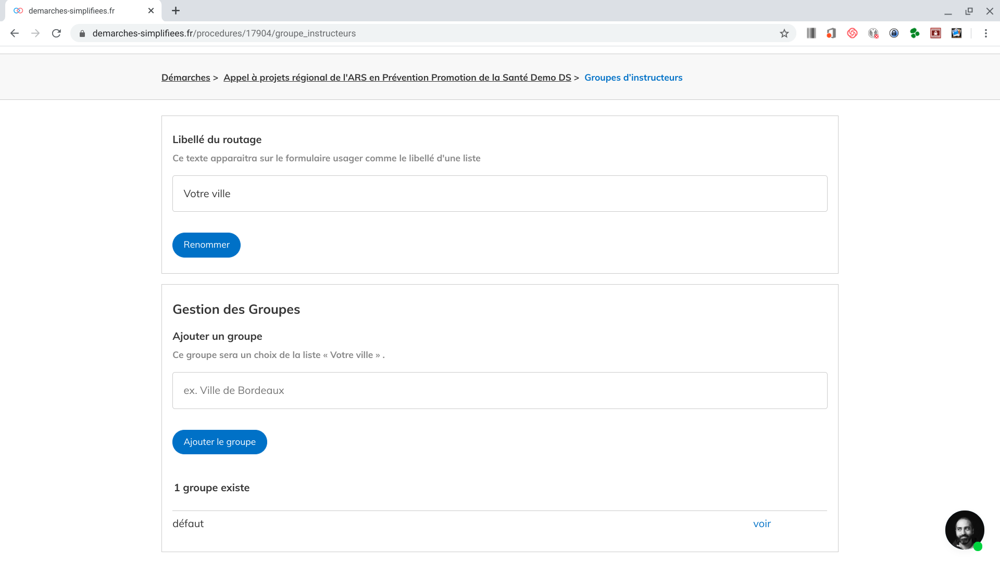
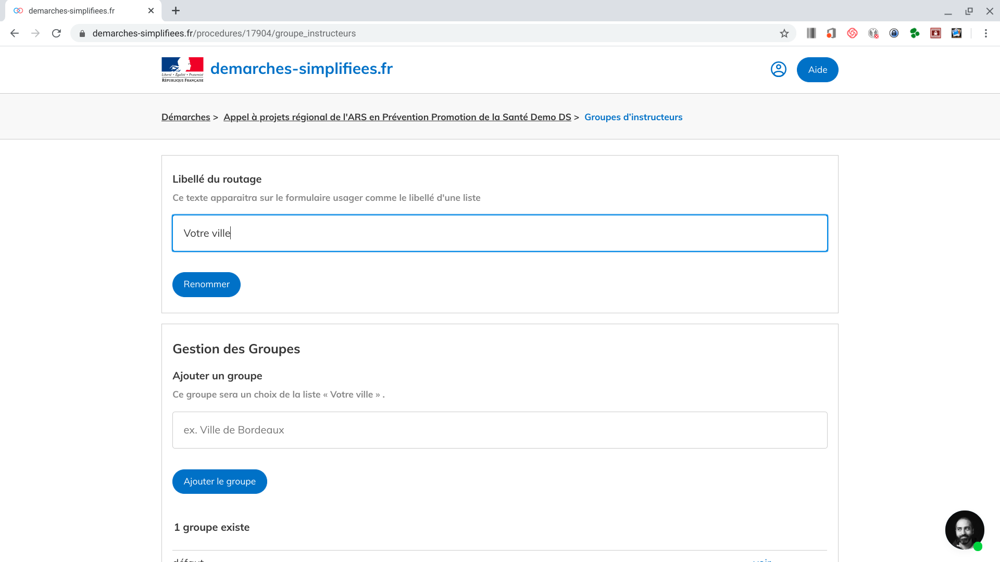
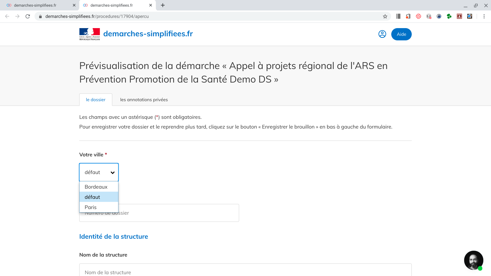

# Routage des dossiers

## 1. **Présentation de la fonctionnalité routage**&#x20;

Le routage est une fonctionnalité pour les démarches nécessitant le partage de l’instruction entre différents groupes en fonction d’un critère précis (territoire, thématique ou autre).

Cette fonctionnalité permet d’acheminer les dossier vers chaque groupe, et de ne plus avoir besoin de filtrer ses dossiers parmi une grande quantité de demandes. Elle est donc particulièrement adaptée pour les démarches nationales instruites localement.&#x20;

Les instructeurs ne voient que les dossiers les concernant et n'ont donc pas accès aux données extérieures à leur périmètre.&#x20;

## **2. Activation de la fonctionnalité**

La fonctionnalité routage est désormais activée pour l'ensemble des démarches même si celle-ci est désactivée par défaut. Vous trouverez ci-dessous le tutoriel d'activation de la fonctionnalité .&#x20;

## **3.  Mise en place du routage**

Une fois la fonctionnalité activée, l'onglet "Instructeurs" de votre interface de configuration de la démarche se transforme en "Groupe instructeurs".

 (1).png>)

Pour les démarches sans routage, vous pourrez continuer à affecter vos instructeurs en les ajoutant au groupe “défaut”

Pour mettre en place le routage, il faut se rendre dans l’onglet "Groupe d’instructeurs" :

* **Renseigner le libellé du routage**&#x20;

Le libellé du routage correspond au nom du menu déroulant qui permettra à l'usager d'orienter son dossier vers le bon groupe d'instructeur.&#x20;

* **Ajouter les groupes d'instructeurs**

Chaque groupe d'instructeurs correspond à un choix du menu déroulant&#x20;

Une fois le groupe créé, il suffit d'indiquer les adresses mails des futurs instructeurs afin de leur ouvrir les droits.

## 4. Le routage en tant qu'usager&#x20;

Vous trouverez ci-dessous la prévisualisation d'un formulaire utilisant le routage. Le champ permettant le routage est obligatoirement un menu déroulant situé au tout début de la démarche. Il n'est pas possible de faire le routage sur un autre type de champ

Si l'usager s'est trompé en sélectionnant ce champ et que son dossier est routé vers le mauvais groupe d'instructeur, il lui suffit de modifier la valeur du champ routage pour que son dossier puisse être transmis au bon groupe d'instructeur. Pour ce faire, il faut néanmoins que son dossier soit en construction.

## 5. Le routage en tant qu'instructeur&#x20;

En tant qu'instructeur d'une démarche utilisant le routage, l'onglet "instructeurs" apparaît en dessous du titre de la démarche.

Ce menu permet à l'instructeur de voir l'ensemble des groupes auxquels il a été affecté.&#x20;

Pour chaque groupe d'instructeurs, il peut visualiser l'ensemble des instructeurs qui y sont affectés.

Tous les instructeurs d'un groupe ont la possibilité d'ajouter un nouvel instructeur à ce groupe ou d'en retirer un. La  gestion des groupes peut donc se faire en autonomie et ne nécessite pas l'intervention de l'administrateur. Néanmoins, chaque ajout ou retrait d'un instructeur entraîne l'envoi d'un e-mail à l'ensemble des instructeurs du groupe concerné.
