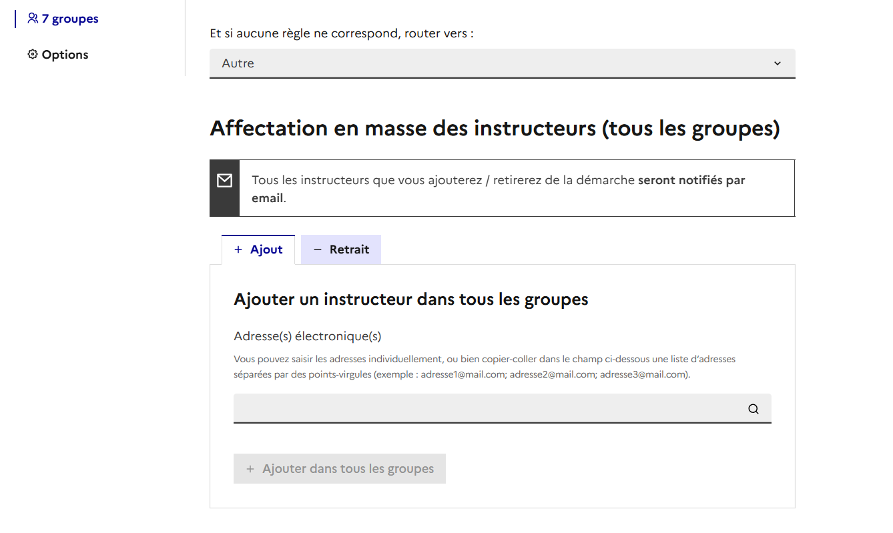

# Routage des dossiers

## Version vidéo



## 1. **Présentation**&#x20;

Pour faciliter le travail des instructeurs, il est possible de configurer à l'avance la répartition automatique des dossiers en activant le « routage ».

Cette fonctionnalité permet d'affecter les dossiers uniquement à certains instructeurs, en fonction du contenu du formulaire rempli par l'usager.

Ce système est particulièrement adapté aux démarches nationales instruites localement.

## **2. Configuration du routage**&#x20;

* Plusieurs types de champ du formulaire permettent de router les dossiers, notamment « Choix simple », « Choix multiple », « Case à  cocher»,  « Nombre entier »,  « Nombre décimal », « Communes »,  « EPCI », « Départements » et « Régions ».
* Dans la page « Configuration des champs », créez un champ de l'un de ces types, par exemple « Choix simple ». Ce champ peut être déplacé au sein du formulaire. Cliquez ensuite sur « Valider le formulaire ».

<figure><figcaption></figcaption></figure>

* Cliquez sur la tuile « Instructeurs » de votre interface de configuration, puis sur « Options » dans le menu latéral, puis sur le bouton « Configurer le routage ».

<figure><figcaption></figcaption></figure>

* Deux options sont possibles : routage automatique ou manuel.&#x20;

<figure><figcaption></figcaption></figure>

## **3.  Routage à partir d'un champ**

* Ce mode de configuration du routage vous permet de créer automatiquement les groupes d'instructeurs et les règles de routage à partir du contenu d'un champ.
* Une fois le mode « Routage à partir d'un champ » sélectionné, choisissez le champ du formulaire à partir duquel router les dossiers.

<figure><figcaption></figcaption></figure>

* Au clic sur « Créer les groupes », un groupe d'instructeurs et la règle de routage associée seront créés pour chaque option du champ.

<figure><figcaption></figcaption></figure>

* Dans le cas d'un routage à partir d'un champ de type  « Choix simple », le nombre de groupes créés correspond au nombre d'options du champ.
* Dans le cas d'un routage à partir d'un champ de type « Régions », 18 groupes sont créés (un par région).
* Dans le cas d'un routage à partir d'un champ de type « Départements », 110 groupes sont créés (un par département).
* Dans le cas d'un routage à partir d'un champ de type « Communes » ou « EPCI », 110 groupes (un par département) sont créés également. Ainsi, lors du dépôt du dossier, le code du département correspondant à la commune ou à l'EPCI choisi par l'usager permet de router le dossier vers le bon groupe d'instructeurs.

## 4. Routage manuel

* Ce mode de configuration du routage crée deux groupes d'instructeurs. Ensuite, libre à vous de les renommer et de leur attribuer des règles de routage à partir du ou des champs « routables » de votre formulaire.

<figure><figcaption></figcaption></figure>

* Si un badge « aucune règle » apparaît , c'est que la règle de routage du groupe doit être définie.
* Si deux groupes ont la même règle de routage, les dossiers seront envoyés au premier groupe de la liste par ordre d'affichage.

## 5. Gestion d'un groupe

* Dans la page d'un groupe d'instructeurs, il est possible de renommer le groupe, de changer ses règles de routage, de le désactiver ou encore de le supprimer.

<figure><figcaption></figcaption></figure>

* Par défaut la règle de routage concerne un seul champ cible. On peut aussi définir une règle composite impliquant plusieurs champs, avec l'opérateur ET ou OU.

<figure><figcaption></figcaption></figure>

## 6. Ajout de groupes

* Une fois le routage mis en place, vous pouvez créer de nouveaux groupes d'instructeurs. Si besoin, vous pouvez créer ou modifier des champs à utiliser pour le routage depuis la page « Champs du formulaire ». Une fois les modifications du formulaire publiées, vous pouvez définir la règle de routage dans la page du groupe d'instructeurs.&#x20;
* Pour simplifier l’ajout des groupes instructeurs, vous pouvez importer un fichier CSV contenant les adresses e-mail et les groupes instructeurs. Un modèle de fichier CSV à importer est mis à votre disposition.

<figure><figcaption></figcaption></figure>

## 7. Ajout et retrait des instructeurs&#x20;

* Vous avez la possibilité d'ajouter un instructeur à tous les groupes, ou le retirer de tous les groupes, en un seul clic. L’instructeur ajouté ou retiré ne recevra qu’une seule notification par email.

<figure><figcaption></figcaption></figure>

## 8. Routage et conditionnel

* Il est possible de conditionner l'affichage d'un champ dédié au routage (voir l'exemple ci-dessous). Si le champ est affiché, le dossier sera routé en fonction du choix de l'usager. Si le champ n'est pas affiché, le dossier sera routé vers le groupe d'instructeurs par défaut (à définir en bas de la page « Gestion des groupes »)

<figure><figcaption></figcaption></figure>

<figure><figcaption></figcaption></figure>

## 9. Supprimer le routage

* Pour supprimer le routage, vous pouvez soit supprimer tous les groupes d'instructeurs, soit aller dans la page « Options » et cliquer sur « Supprimer le routage ».

## 10. Le routage en tant qu'instructeur&#x20;

* En tant qu’instructeur d’une démarche utilisant le routage, l’onglet « Gestion des instructeurs » apparaît dans l’onglet « Gestion de la démarche », en dessous du titre de la démarche.

<figure><figcaption></figcaption></figure>

* Ce menu permet à l'instructeur de voir l'ensemble des groupes auxquels il a été affecté.&#x20;

<figure><figcaption></figcaption></figure>

* Pour chaque groupe d'instructeurs, il peut visualiser l'ensemble des instructeurs qui y sont affectés.

<figure><figcaption></figcaption></figure>

* Tous les instructeurs d'un groupe ont la possibilité d'ajouter un nouvel instructeur à ce groupe ou d'en retirer un. La gestion des groupes peut donc se faire en autonomie et ne nécessite pas l'intervention de l'administrateur.&#x20;

## 11. Réaffectation d'un dossier

* Si l'usager se trompe en sélectionnant une option du champ dédié au routage, son dossier est routé vers le mauvais groupe d'instructeurs. Cependant, tant que le dossier est en construction, l'usager peut modifier lui-même la valeur du champ pour que son dossier soit réaffecté au bon groupe d'instructeurs.
* En tant qu'instructeur, suite à une erreur de l'usager, il est aussi possible de réaffecter un dossier à un autre groupe d'instructeurs.&#x20;

<figure><figcaption></figcaption></figure>

