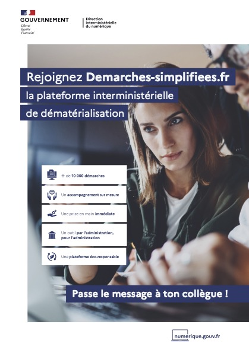

# Présentation

_**Vidéo Vimeo (**les informations contenues dans cette vidéo sont explicitées dans le texte en dessous)_


5 minutes pour comprendre demarches-simplifiees.fr


**demarches-simplifiees.fr** est une application en ligne qui permet à tous les organismes exerçant des missions de service public de créer des démarches en ligne en quelques minutes et de gérer les demandes des usagers sur une plateforme dédiée.

L'objectif est d'assurer la dématérialisation dans les meilleures conditions en simplifiant la vie des usagers, l'instruction des demandes et en faisant économiser de l’argent à l’État et au contribuable.

<figure><figcaption></figcaption></figure>

## Un outil visant à accélérer la dématérialisation

Les usagers du service public devraient aujourd'hui pouvoir effectuer toutes leurs démarches en ligne. Ils ne devraient plus avoir à transmettre des informations dont l’administration dispose déjà ou à faire eux-mêmes le lien entre une multitude d’interlocuteurs publics.

La dématérialisation, quant à elle, ne devrait pas être un investissement humain et financier pour les gestionnaires et les agents publics mais un gain de temps et un facteur d’économie.

C’est loin d’être le cas.

Pour les seules démarches des entreprises sous la responsabilité de l’État, plus de 1000 procédures sont encore gérées uniquement au format papier. Au rythme d’environ 100 démarches dématérialisées par an, il faudra près de 10 ans pour achever la dématérialisation.

Si chaque administration fait le choix de développer ses propres outils informatiques, au lieu d’utiliser un outil mutualisé comme demarches-simplifiees.fr, ce sont des dizaines de millions d’euros qui seront dépensées en pure perte…

## Un produit issu du programme « Dites-le nous une fois »

Le programme « Dites-le-nous une fois » était un élément clé du choc de simplification lancé en 2013 pour faciliter la vie des entreprises afin que celles-ci ne perdent plus de temps sur de les formalités administratives mais se concentrent sur leur cœur de métier : créer et innover.

Concrètement, le programme reposait sur quatre leviers de simplification :

* **L’échange des données entre les administrations** : la sollicitation directe de l’usager doit être une exception ;
* **La ré-ingénierie des formulaires** : seules les informations réellement utiles doivent être demandées ;
* **La dématérialisation des procédures** : le traitement et la soumission d’informations doivent être simplifiées ;
* **La confiance a priori** : les pièces justificatives doivent être demandées uniquement lorsqu'elles sont nécessaires, non détenues par l’administration et au moment opportun (par exemple, en cas de contrôle).

D'après une étude conduite en 2013 par le Secrétariat Général pour la Modernisation de l’Action Publique (SGMAP, actuelle DINUM) sur un échantillon de procédures concernant les entreprises, la simplification permettrait d'économiser 25 € par formulaire (économies cumulées pour les entreprises et les administrations) dont 1,18 € en ré-ingénierie, 8,06 € en automatisant les échanges de données et 15,44 € en dématérialisant les procédures restées au format papier.

## Une Startup d'État

Dès juin 2013, l’État a pu expérimenter au sein de la Direction interministérielle du Numérique (DINUM)  une nouvelle manière de construire des services publics numériques, en réussissant tout d’abord la refonte de [**data.gouv.fr**](https://data.gouv.fr)**.**

L’exigence d’innovation radicale impose d’initier une Startup d’État loin de toute contrainte, pour qu’elle ne reproduise pas les règles explicites ou implicites qui fondent le service tel qu’il existe aujourd'hui. Pour autant, elle n’a pas besoin de capital privé. Une Startup d’État est donc simplement une équipe de 2 à 4 personnes financée par une administration et totalement autonome.

L'ensemble des Startups d’État sont présentées sur [**beta.gouv.fr**](https://beta.gouv.fr)**.**

**Vous trouverez ci-dessous notre support de présentation :**&#x20;


