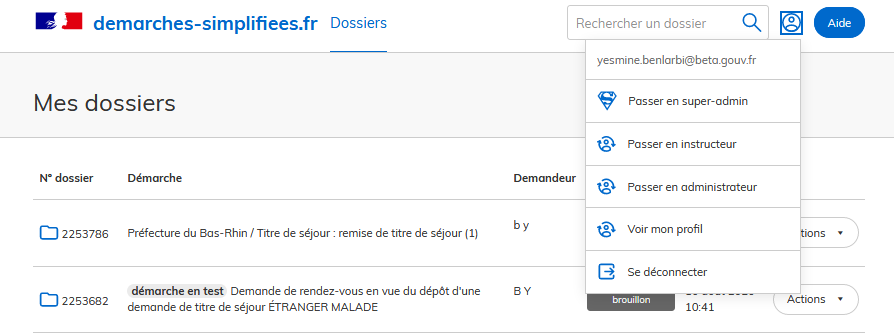
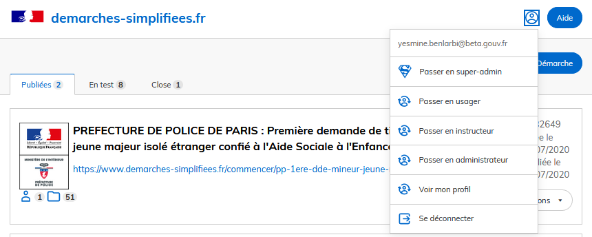
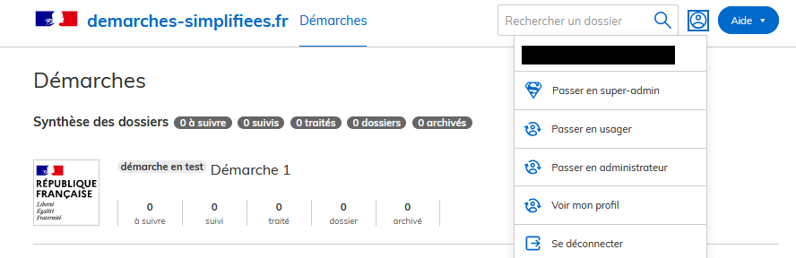

# Tutoriels et vidéos

Cette rubrique contient les tutoriels permettant d'apprendre à utiliser demarches-simplifiees.fr en tant qu’administrateur, instructeur et usager.

Les tutoriels décrivent de manière précise les manipulations nécessaires à l'utilisation de demarches-simplifiees.fr selon les profils suivants :

* **Administrateur** : création et publication de formulaires
* **Instructeur** : instruction de dossiers
* **Usager** : dépôt et suivi de dossiers

Il est possible qu’un compte soit lié à différents profils. Par exemple, un administrateur peut aussi être usager ou instructeur sur des procédures différentes.

Dans ce cas, l’utilisateur peut changer de profil en cliquant sur le bouton en haut à droite de l’interface.

Pour utiliser l'outil dans les meilleures conditions, vous devez utiliser un navigateur dont la version  est supérieure ou égale à :

* Chrome  V50
* Internet Explorer V12
* Edge V14
* Firefox V50
* Opera V40
* Safari V8
* iOS V8
