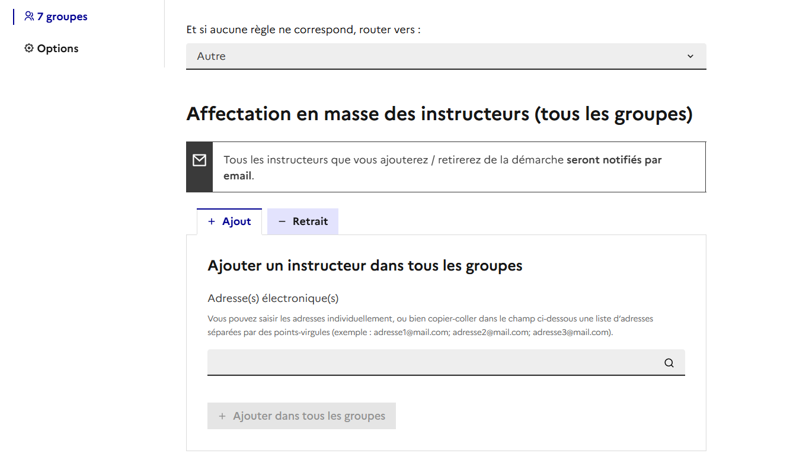

# Tutoriel administrateur

Ce tutoriel présente les étapes de création d’une démarche sur demarches-simplifiees.fr par un administrateur.

Vous avez des questions ? Vous pouvez nous contacter à tout moment depuis votre interface administrateur grâce au Chat situé en bas à droite de la page :&#x20;

<figure><figcaption></figcaption></figure>

Vous avez également la possibilité de nous contacter à l'adresse : **contact@demarches-simplifiees.fr**


**ATTENTION** : nous apportons continuellement des améliorations à demarches-simplifiees.fr.&#x20;


\
**Qu’est-ce qu’un administrateur ?**&#x20;

Un administrateur est en charge de la construction du formulaire et de la gestion de la démarche en général. Il nomme les instructeurs et est automatiquement considéré comme instructeur. Il a donc accès aux dossiers et peut les instruire. Pour ce faire, il devra néanmoins changer de profil pour passer du profil d’administrateur à celui d’instructeur ou bien d’usager.

## 1. Création d’un compte administrateur

**Rendez-vous sur la page :** [**https://www.demarches-simplifiees.fr/commencer/demande-d-inscription-a-demarches-simplifiees**](https://www.demarches-simplifiees.fr/commencer/demande-d-inscription-a-demarches-simplifiees)

<figure><figcaption>
Formulaire d'ouverture de compte administrateur 
</figcaption></figure>

Les comptes administrateurs sont les seuls comptes que l'équipe demarches-simplifiees.fr  instruit. En effet, ils sont uniquement réservés aux agents publics.&#x20;

Une fois votre demande acceptée, vous recevrez un e-mail vous invitant à créer votre mot de passe. Pour des raisons de sécurité, celui-ci doit atteindre une certaine complexité. En effet, il doit contenir au minimum 8 caractères.


Attention : tous les 30 jours, une nouvelle fois pour des raisons de sécurité,  nous vous enverrons un mail vous demandant de vérifier votre compte. Il suffit alors de cliquer sur le lien contenu dans l'e-mail envoyé automatiquement par nos services.


## 2. Se connecter à demarches-simplifiees.fr

[Rendez-vous sur la page d’accueil](https://www.demarches-simplifiees.fr/) et cliquez sur le bouton connexion en haut à droite. Vous arrivez alors sur la page de connexion. Rentrez l’e-mail lié au compte demarches-simplifiees.fr et le mot de passe indiqué lors de la création de votre compte.

Vous avez également la possibilité de vous connecter via "ProConnect" avec la double authentification. Les usagers ont également la possibilité de se connecter via "France connect". &#x20;

<figure><figcaption></figcaption></figure>

## 3. Découvrir son tableau de bord des démarches créées

Une fois connecté, vous accédez au tableau de bord qui affiche les démarches créées. Ce dernier s’organise en quatre parties, comme suit :&#x20;

* **En test** : les démarches à l’état de brouillon sont celles créées mais non finalisées et non publiées. Aucun usager ne peut y déposer des dossiers et l’ensemble de leurs éléments peut être modifié.&#x20;
* **Publiées** : une démarche est considérée publiée lorsque celle-ci est accessible via un lien url. Les usagers peuvent désormais y déposer des dossiers et la majorité des éléments  de la démarche ne peuvent plus être modifiés.
* **Terminées** : une démarche terminée est une démarche qui a été active mais qui désormais ne permet plus le dépôt de dossier par les usagers. Les dossiers déposés peuvent néanmoins toujours être instruits.
* **Supprimées** : une démarche supprimée est une démarche close qui a été supprimée et qui n'est plus accessible par les usagers. En revanche, en tant qu'administrateur vous pouvez restaurer la démarche.&#x20;

<figure><figcaption></figcaption></figure>

Vous avez un accès direct à vos démarches en sélectionnant le numéro de la démarche que vous recherchez. Vous devez être administrateur de cette démarche pour y accéder.&#x20;

<figure><figcaption></figcaption></figure>

## 4. Découvrir le tableau de bord de l'ensemble des démarches publiées &#x20;

Vous avez désormais la possibilité en tant qu'administrateur de consulter les démarches publiées grâce à un tableau de bord dédié. Cela vous permet également de cloner une démarche existante.

Ainsi,  pour consulter les informations (administrateur et date de création) sur les démarches simplifies pour toutes les zones, il vous suffit de cliquer sur « toutes les démarches » puis de filtrer par zones et/ou par statut, service, département, type d'usager , date de publication ou encore par thématique.&#x20;

<figure><figcaption></figcaption></figure>

## 5. Découvrir les nouveautés&#x20;

Vous retrouverez sur cette page les principales nouveautés, corrections de bugs, ou autre actualités à propos de Démarches Simplifiées. Une petite pastille s'affichera à côté du bouton  « _Nouveautés_ »  lorsqu'il y a du nouveau qui peut vous intéresser sur cette page.

<figure><figcaption></figcaption></figure>

Sur la gauche, vous pouvez filtrer pour voir les annonces dans diverses catégories. Les catégories concernant votre profil sont sélectionnées par défaut.

## 6. Créer une nouvelle démarche

Pour créer votre formulaire, vous devez cliquer sur le bouton « Nouvelle Démarche » situé en haut à droite de votre tableau de bord.

<figure><figcaption></figcaption></figure>

&#x20;La création d’une nouvelle démarche peut se faire soit à partir de zéro soit à partir d’une démarche existante. Cette dernière possibilité permet de cloner c’est-à-dire de copier une démarche pré-existante, déjà publiée et utilisée par une autre administration afin de l’adapter à sa situation.

<figure><figcaption></figcaption></figure>

Pour chercher une démarche dans le catalogue, il suffit d'indiquer l'intitulé la démarche recherchée dans le moteur de recherche puis cliquez sur le bouton « rechercher ».

La liste des démarches associées à l'intitulé recherché s'affichera et vous pourrez alors cliquer sur le bouton « Cloner ».&#x20;

Une copie de la démarche apparaît automatiquement dans les démarches en test.&#x20;

**Vous pouvez également rechercher une démarche depuis l'onglet** [**"toutes les démarches".**](https://doc.demarches-simplifiees.fr/tutoriels/tutoriel-administrateur#id-4.-decouvrir-le-tableau-de-bord-de-lensemble-des-demarches-publiees)&#x20;

<figure><figcaption></figcaption></figure>

Le principe est le même, il vous suffit de rechercher la démarche que vous souhaitez dématérialiser et la cloner depuis ce tableau de bord.&#x20;

En clonant la démarche, le gain de temps est considérable ! Il vous suffira uniquement de modifier la démarche afin de la personnaliser en fonction de vos besoins !&#x20;

**Enfin, nous mettons également à votre disposition des démarches modèles prêtes à l'emploi . Voici le lien vers la documentation dédiée :** [https://doc.demarches-simplifiees.fr/listes-des-demarches/demarches-modeles-a-dupliquer](https://doc.demarches-simplifiees.fr/listes-des-demarches/demarches-modeles-a-dupliquer)


**ATTENTION** : les administrateurs ont la liberté de choisir l'intitulé de leurs démarches, il n’est donc pas toujours homogène. Nous vous conseillons de tester plusieurs mots-clés pour une même recherche.&#x20;

Exemple : pour la dotation aux équipements pour les territoires ruraux, on peut aussi tester le sigle DETR.


## 7. Décrire sa démarche

Après avoir cliqué sur le bouton « Créer une nouvelle démarche de zéro » en haut à gauche de la page, une nouvelle page s’affiche. Celle-ci permet de paramétrer la page de présentation de votre démarche. Ce seront les premières informations visibles par l’usager.&#x20;


Lorsque vous clonez une démarche, le procédé ci-dessous est identique&#x20;


Tous les champs marqués d'un astérisque sont obligatoires.

#### **a) Titre et description de la démarche**&#x20;

<figure><figcaption></figcaption></figure>

En premier lieu, il faut indiquer le titre de votre démarche. Vous devez ensuite la décrire dans la partie "quel est l'objet de la démarche". Cette étape est importante car elle permet à l’usager de savoir s’il est bien sur la bonne démarche ce qui réduira d'autant le nombre de dossiers mal orientés.&#x20;

Dans l'objet de la démarche, on indique le contexte et l’objectif de la démarche.&#x20;

Vous avez également la possibilité de décrire les destinataires finaux de la démarche dans la partie " à qui s'adresse la démarche". Cela permet à l'usager de confirmer qu'il est bien concerné par la démarche.&#x20;

Une fois la description terminée, descendez en bas de la page et cliquez sur le bouton « Créer la démarche ».&#x20;

Vous pouvez enregistrer votre avancement à tout moment et revenir dessus plus tard. En revanche, comme les informations remplies ne s’enregistrent pas automatiquement, nous vous conseillons de le faire par vous-même régulièrement.

#### **b) Listes des pièces jointes demandées**&#x20;

Vous pouvez renseigner la liste des pièces jointes à fournir. Cela permettra à l'usager de prendre connaissance des pièces jointes avant d'accéder au formulaire.&#x20;

Si votre formulaire contient des pièces jointes et que vous ne complétiez pas cette rubrique, une liste sera automatiquement générée.&#x20;

<figure><figcaption></figcaption></figure>

#### **c) Logo de la démarche**&#x20;

Vous pouvez ensuite télécharger un logo. Celui-ci apparaîtra au-dessus du titre de votre démarche lorsque l’usager y déposera un dossier.&#x20;

<figure><figcaption></figcaption></figure>

Si vous souhaitez intégrer plusieurs logos, il est conseillé de copier-coller l'ensemble de vos logos sur un fichier texte (doc) puis de faire une capture d’écran de tous vos logos.

#### **d) Conservation des données**&#x20;

Afin d’être en conformité avec le Règlement Général sur la Protection des Données (RGPD) vous devez indiquer le temps de conservation des données. Le délai maximal que vous pouvez paramétrer est de 12 mois. Si vous souhaitez conserver les dossiers au delà de 12 mois, il faudra passer par notre équipe support en justifiant le besoin. Nous pouvons étendre la durée de conservation à maximum 5 ans.&#x20;

<figure><figcaption></figcaption></figure>


**À savoir que les dossiers sur démarches-simplifiees.fr seront automatiquement supprimés de la plateforme une fois cette période dépassée. L'usager est prévenu 2 semaines à l'avance  par mail.**&#x20;


Cependant tant l'instructeur que l'usager peuvent étendre la durée de conservation.&#x20;

* L'usager peut étendre la durée d'autant de mois que la démarche.
* L'instructeur peut étendre la durée d'un mois, autant de fois que nécessaire.

Enfin, un dossier en cours d'instruction ne peut être supprimé pour des raisons juridiques.

#### **e) Cadre juridique**&#x20;

De même, le cadre juridique doit être obligatoirement renseigné. En effet, dans l’intérêt de l’usager et de la protection de ses données, il est important de savoir ce qui vous autorise à lui demander des informations.&#x20;

Néanmoins, le cadre juridique comprend un vaste ensemble de textes. Vous pouvez indiquer une loi, un décret, une délibération en conseil municipal ou un règlement intérieur. Vous pouvez soit copier-coller le lien vers un site web qui le propose, soit télécharger le texte qui s'applique.

<figure><figcaption></figcaption></figure>

#### **f) Contact du Délégué à la Protection des Données (DPO)**&#x20;

Afin d'être conforme au RGPD, les informations permettant de contacter le DPO doivent être mentionnées.  &#x20;

<figure><figcaption></figcaption></figure>

Les usagers pourront consulter l'ensemble des informations relatives au cadre juridique en cliquant en bas du formulaire dans la partie dédiée.&#x20;

<figure><figcaption></figcaption></figure>

#### **g) L'open data**&#x20;

Afin de favoriser la transparence des données, vous avez la possibilité d'autoriser la publication  des descriptifs des démarches sur https://data.gouv.fr.&#x20;

Cette donnée est modifiable pour chaque démarche depuis la partie « présentation » de votre interface administrateur .&#x20;

<figure><figcaption></figcaption></figure>

#### **h) Notice explicative de la démarche**

Vous pouvez ensuite télécharger une notice explicative qui est optionnelle. Une notice explicative est un document destiné à guider l’usager dans sa démarche. C’est un document que vous aurez préalablement élaboré. Celui-ci peut prendre la forme d’un fichier .doc, .pdf ou bien de diapositives. Le bouton pour télécharger cette notice apparaît en haut du formulaire pour l’usager.&#x20;

<figure><figcaption></figcaption></figure>

Les premiers éléments que vous venez de renseigner sont les premières informations vues par l’usager lorsqu'il aura cliqué sur le lien de votre démarche. Ils constituent ainsi la page d’accueil de votre démarche.

#### **i) Choix du public de votre démarche : personnes morales ou particuliers ?**

Votre démarche s’adresse-t-elle à des personnes morales ou à des particuliers ? Ce choix détermine la seconde page de votre démarche sur laquelle l’usager sera renvoyé après s’être connecté.&#x20;

* **Personnes morales** : l’usager est tenu de renseigner son numéro SIRET. Celui-ci nous permet d'interroger directement les bases de l’INSEE, d’Infogreffe et du Répertoire National des Associations (RNA) afin de recueillir automatiquement des informations sur les entreprises (raison sociale, adresse, code NAF).
* **Particuliers** : l'usager renseigne simplement son nom et son prénom. Si celui-ci ne les indique pas, il ne pourra pas se rendre sur la troisième page qui correspond au corps du formulaire. Si vous choisissez cette option, nul besoin de lui demander son nom et prénom dans votre formulaire.

<figure><figcaption></figcaption></figure>

#### **j) Thématiques de la démarche**&#x20;

Vous pouvez associer des thématiques à votre démarche afin de les retrouver plus facilement dans l'onglet "toutes les démarches"

<figure><figcaption></figcaption></figure>

#### **k) Les options avancées**

Enfin, il existe deux options avancées optionnelles. La première est le choix de la date limite de dépôt des dossiers et la seconde est la possibilité de rendre une démarche déclarative.

* **Date limite de dépôt des dossiers** : cette option permet de clôturer automatiquement votre démarche. Cela permet de clore automatiquement le dépôt des dossiers à la date de votre choix. Grâce à cette fonctionnalité, lorsque la démarche est close, tous les dossiers passent en instruction. Les dossiers restés à l'état de brouillon ne pourront plus être soumis. Cet outil est particulièrement utile pour les appels à projet.&#x20;

<figure><figcaption></figcaption></figure>

* **Démarche déclarative** : cette option permet de rendre votre démarche déclarative. Une fois le dossier déposé, celui-ci ne pourra plus être modifié. Deux issues sont alors possibles ; soit il passe directement « en instruction » pour être traité, soit il est immédiatement « accepté ».\
  Pour ces deux issues, l'usager ne pourra pas modifier son dossier.&#x20;

<figure><figcaption></figcaption></figure>

* **Champ « pièce justificative » avec multiples fichiers** : cette option permet aux usagers d'envoyer plusieurs fichiers par champ « pièce justificative » .&#x20;

<figure><figcaption></figcaption></figure>

Vous pouvez désormais passer à l’étape suivante en cliquant sur le bouton « Créer la démarche » ou « enregistrer » , situé en bas à droite de l’écran.

<figure><figcaption></figcaption></figure>

## 7. Créer son formulaire

Le corps de votre démarche est constitué par votre formulaire. Celui-ci va permettre de recueillir les informations fournies par les usagers lesquelles vous permettront de valider leur demande ou non. Un formulaire se construit par empilement de champs, un champ étant une information que vous indiquez ou que vous demandez à l’usager.&#x20;

Exemple : si vous souhaitez obtenir les coordonnées d’un usager, vous pouvez créer un champ « adresse », un champ « téléphone » et un champ « e-mail ».

La civilité, le prénom et le nom sont des informations déja demandées en préambule de la démarche à destination des personnes physiques. Il convient de ne pas les redemander dans le formulaire.&#x20;

A tout moment, vous pouvez prévisualiser le formulaire que vous êtes en train de créer en cliquant sur l’onglet « Prévisualiser le formulaire ».

<figure><figcaption></figcaption></figure>

Pour commencer votre formulaire, vous cliquerez sur l’onglet « Ajouter un champ ». Une fois sur la page champ, vous pourrez ajouter autant de champs que vous le désirez.

<figure><figcaption></figcaption></figure>

Pour créer un champ vous devez :&#x20;

* Renseigner le type de champ&#x20;
* Indiquer un libellé&#x20;
* Renseigner une description&#x20;

**A. Renseigner le type de champ**&#x20;

Le type de champ formate la manière dont l'usager vous donnera l'information demandée. Plusieurs types de champ existent, ils sont désormais **regroupés par catégories dans la liste déroulante**  : &#x20;

<figure><figcaption></figcaption></figure>

**La durée de remplissage estimée évolue en fonction des types de champs ajoutés.**&#x20;

#### **1) Les champs structurels "Structure des champs" :**&#x20;

**a) Titre de section**&#x20;

Le titre de section permet de segmenter et de structurer votre formulaire.  En effet, la construction de ce dernier étant linéaire par empilement de champs, il convient de le structurer afin de le rendre plus facilement lisible par l’usager. Il existe plusieurs niveaux de titre de section (avec des tailles de police différentes). Cela permet également d'avoir un menu de navigation qui vous permet d'aller facilement d'une section à l'autre.&#x20;

<figure><figcaption>
Champ "titre de section" en tant qu'administrateur
</figcaption></figure>

#### **b) Bloc répétable**

Ce champ permet à l'usager de saisir un certain nombre de champs autant de fois qu'il le souhaite. Pour savoir comment l'utiliser, je vous invite à vous rendre sur la page dédiée en cliquant [ici](https://faq.demarches-simplifiees.fr/article/48-les-blocs-repetables). &#x20;

<figure><figcaption>
Exemple de "bloc répétable", en tant qu'usager 
</figcaption></figure>

#### **c) Lien vers un autre dossier**&#x20;

Ce type de champ donne la possibilité de relier deux dossiers déposés sur demarches-simplifiees entre eux.&#x20;

Exemple : je fais une demande de subvention en 2019 et en 2020, je dois en faire le bilan. En choisissant ce type de champ, l’usager indique seulement le numéro du dossier 2019 dans son dossier 2020, et l’instructeur peut alors accéder facilement à la demande grâce à un lien présent dans le bilan.&#x20;

<figure><figcaption>
Champ "lien vers un autre dossier" en tant qu'usager 
</figcaption></figure>

Pour accéder au premier dossier déposé par l'usager, l'instructeur de la seconde démarche devra également être instructeur de la première démarche. Il lui suffira alors de cliquer sur le lien du dossier, comme ci-dessous :&#x20;

<figure><figcaption>
Champ "lien vers un autre dossier", en tant qu'instructeur 
</figcaption></figure>

#### **d) Explication**&#x20;

&#x20;Ce type de champ présente un texte sans possibilité de réponse qui vous permet de détailler un point spécifique, de guider l'usager ou bien d'introduire des sous-titres de section.

Il est possible d'afficher un texte complémentaire affichable au clic ainsi qu'une pièce jointe.&#x20;

<figure><figcaption></figcaption></figure>

#### 2) Les  champs relatifs à l'état civil&#x20;

#### a) Civilité&#x20;

L'usager peut choisir entre « Madame » ou « Monsieur ».

<figure><figcaption>
Champ "civilité", en tant qu'usager 
</figcaption></figure>

#### b) email&#x20;

&#x20;L'usager doit renseigner un e-mail.

<figure><figcaption>
Champ "email", en tant qu'usager 
</figcaption></figure>

#### c) Téléphone&#x20;

L'usager doit renseigner un numéro de téléphone.

<figure><figcaption>
Champ "téléphone", en tant qu'usager 
</figcaption></figure>

#### 3) Les champs relatifs à la localisation&#x20;

a) Adresse&#x20;

L'usager doit entrer une adresse avec une auto-complétion - l'adresse se complète sans que l'usager n'ait besoin de l’écrire entièrement - grâce à la connexion à la Base Adresse Nationale (BAN).

<figure><figcaption>
Champ "adresse",en tant qu'usager 
</figcaption></figure>

#### b) Communes, départements, régions, pays&#x20;

Ces quatre types de champ sont des menus déroulants dont les valeurs sont préétablies. Il n'est pas possible de les modifier.

Le champ « Pays » comporte des pays qui ont existé dans le passé, ou dont la reconnaissance internationale est contestée, pour permettre à des usagers de répondre à la question « Quel est votre pays de naissance ? »

Les champs « Régions », « Département » et « Communes » utilisent des valeurs provenant de l’[API Géo](https://api.gouv.fr/les-api/api-geo). Il s’agit des régions, départements et communes de France métropolitaine et des DROM. Les communes des TOM ne sont donc pas incluses.

Pour le champ « Communes », les usagers doivent dans un premier temps entrer par auto-complétion leur département puis un second champ dédié à la commune s'affichera.&#x20;

<figure><figcaption>
Champ "commune" , en tant qu'usager 
</figcaption></figure>

<figure><figcaption>
Champ "commune", en tant qu'usager 
</figcaption></figure>

#### 4) Les champs relatifs au paiement et à l'identification&#x20;

#### a) Le numéro Iban&#x20;

Ce champ permet uniquement de collecter les numéros Iban valides français.

<figure><figcaption>
Le champ "Iban", en tant qu'usager 
</figcaption></figure>

#### b) Le numéro Siret&#x20;

Ce champ permet de collecter le numéro Siret ainsi que les informations administratives reliées à ce numéro grâce à l'API Entreprise. Vous trouverez également la liste des informations remontées automatiquement.

Le numéro SIRET doit comporter exactement 14 chiffres.&#x20;

<figure><figcaption></figcaption></figure>

<figure><figcaption></figcaption></figure>

#### 5) Les champs standards&#x20;

#### a) Texte court&#x20;

Ce champ permet à l'usager de répondre de manière libre. Si le nombre de caractères est illimité, ce champ est adapté à une réponse courte.

<figure><figcaption>
Champ "texte", en tant qu'usager 
</figcaption></figure>

#### b) Texte long&#x20;

Ce champ est similaire au précédent à la différence qu'il est adapté à une réponse longue et structurée. Le nombre de caractères est aussi illimité.

<figure><figcaption>
Champ "texte long", en tant qu'usager 
</figcaption></figure>

#### c) Nombre décimal&#x20;

L'usager doit renseigner un nombre qui peut être décimal.&#x20;

<figure><figcaption>
Champ "nombre décimal", en tant qu'usager
</figcaption></figure>

#### d) Nombre entier&#x20;

L'usager doit renseigner un nombre entier.

<figure><figcaption>
Champ "nombre entier", en tant qu'usager 
</figcaption></figure>

#### e) Date&#x20;

L'usager doit renseigner une date au format jj/mm/aaaa.

<figure><figcaption>
Champ "date" , en tant qu'usager
</figcaption></figure>

#### f) Date et Heure&#x20;

L'usager doit renseigner une date et un horaire.

<figure><figcaption>
Champ "date et heure" en tant qu'usager 
</figcaption></figure>

#### g) Champ formaté

Vous avez la possibilité de formater un champ selon le format de votre choix. Deux options s'offrent à vous:&#x20;

* Le mode simple: vous pouvez formater un champ en choisissant le nombre de caractères que comportera ce champ, mais aussi s'il comporte des chiffres, des lettres et/ou des caractères spéciaux.&#x20;

<figure><figcaption>
Champ formaté en mode "choix simple" 
</figcaption></figure>

* Le mode avancé: vous pouvez formater un champ selon une expression régulière en définissant le nombre de caractères, l'ordre des caractères, etc. Attention, à n'utiliser que si vous êtes sur du format du champ car si le format renseigné par l'usager ne correpond pas à l'expression régulière, ce dernier ne pourra déposer le dossier.&#x20;

<figure><figcaption>
Champ formaté en mode "avancé"
</figcaption></figure>

Voici le résultat en prévisualisant le formulaire&#x20;

<figure><figcaption></figcaption></figure>

Voici l'écran en cas d'erreur dans la saisie, bloquant le dépôt du dossier.&#x20;

<figure><figcaption></figcaption></figure>

#### 6) Les champs relatifs aux pièces jointes&#x20;

#### a) Pièce à joindre

Ce champ permet à l'usager d'ajouter au dossier un document. La taille de chaque pièce justificative doit être inférieure à 200 Mo. \
Vous pouvez désormais choisir la nature de la pièce à joindre entre:&#x20;

* Relevé d'identité bancaire (RIB)
* Titre d'identité&#x20;
* Non spécifié&#x20;

<figure><figcaption></figcaption></figure>

Vous avez également la possibilité de joindre un modèle de pièce justificative que les usagers peuvent télécharger et remplir pour joindre à leur dossier. Cela est particulièrement utile dans les démarches impliquant par exemple l'utilisation de fichiers tableurs.

<figure><figcaption>
Champ "pièce justificative" avec modèle en tant qu'usager 
</figcaption></figure>

#### b) Titre d'identité&#x20;

Ce champ permet à l’usager de joindre une carte d'identité (uniquement le recto), passeport, titre de séjour ou autre justificatif d’identité. Formats acceptés : jpg/png, taille maximale : 20 Mo

De plus, pour des raisons relatives au RGPD, le titre d'identité sera filigrané et automatiquement supprimé une fois le dossier terminé (faisant l'objet d'une décision finale).&#x20;

<figure><figcaption></figcaption></figure>

**7) Les champs relatifs aux choix**&#x20;

**a) Case à cocher seule**&#x20;

Ce type de champ insère à gauche du libellé du champ une case que l'usager peut cocher.

<figure><figcaption>
Champ "case à cocher seule", en tant qu'usager 
</figcaption></figure>

**8) Choix simple**&#x20;

**a) Manuelle**&#x20;

L'usager doit choisir l'une des valeurs paramétrées par l'administrateur. Pour créer des valeurs, il vous suffit de les ajouter dans la partie « options de la liste » .&#x20;

<figure><figcaption>
Champ de choix simple dans une liste de choix "manuelle"
</figcaption></figure>

Vous pouvez également proposer à l'usager une option « autre » avec un texte libre afin de laisser la possibilité à l'usager de cocher cette valeur si les autres valeurs ne correspondent pas à sa situation.

<figure><figcaption>
Champ "choix simple" en tant qu'usager 
</figcaption></figure>

**b) Import référentiel**&#x20;

Lorsque la liste de choix est trop grande, vous avez la possibilité d'intégrer un fichier de référentiel à importer en csv. L'usager ne verra que la première colonne présente dans le fichier. L'instructeur en revanche verra toutes les autres colonnes.&#x20;

Le fichier ne doit pas contenir plus de 5000 lignes et doit peser maximum 1 Mo

<figure><figcaption>
Champ choix simple avec import référentiel 
</figcaption></figure>

**c) Choix multiple**&#x20;

Le principe est le même que le champ précédent à la différence que l'usager pourra sélectionner plusieurs valeurs simultanément.

À noter : lorsque plus de six champs sont ajoutés, le champ choix multiple est affiché sous forme de liste déroulante.&#x20;

<figure><figcaption></figcaption></figure>

**d) Deux menus déroulants liés**&#x20;

Ce champ autorise un premier niveau de conditionnalité, c'est-à-dire que le contenu du second menu change en fonction du choix fait par l’usager dans le premier.&#x20;

Exemple : si mon premier menu propose les choix A, B, C et que l’usager fait le choix B, un second menu déroulant apparaît avec les choix B1, B2, B3.&#x20;

Pour l'utiliser, remplissez l'encadré « Liste déroulante » en suivant le modèle ci-dessous :

<figure><figcaption>
Exemple de choix dans la liste déroulante 
</figcaption></figure>

Les titres des menus déroulant liés doivent donc être encadrés par des doubles tirets "--" sans espace tandis que les choix du second menu doivent être laissés tels quels.

<figure><figcaption></figcaption></figure>

<figure><figcaption>
Champ "Deux menus déroulants liés" en tant qu'usager 
</figcaption></figure>

**e) Oui/Non**&#x20;

L'usager peut répondre « Oui » ou « Non » à la question posée dans le libellé du champ.

#### &#x20;

<figure><figcaption>
Champ "Oui/non" en tant qu'usager 
</figcaption></figure>

#### 9) Les champs relatifs aux référentiels externes&#x20;

#### a) L'annuaire de l'éducation

Il s'agit d'un référentiel spécifique de l’Éducation nationale permettant d'accéder aux caractéristiques et aux informations de contact des établissements de l'Éducation nationale grâce à son [API ](https://api.gouv.fr/les-api/api-annuaire-education)dédiée.&#x20;

<figure><figcaption>
Champ " Annuaire de l'éductaion" en tant qu'usager 
</figcaption></figure>

#### b) RNA

Ce champ permet aux associations d'indiquer leurs numéros RNA. Les données liées aux numéros RNA seront alors automatiquement récupérées via l’API Répertoire des Associations (RNA).&#x20;

<figure><figcaption>
Champ "RNA" en tant qu'usager
</figcaption></figure>

**c) Carte**&#x20;

Du point de vue de l'administrateur, lorsque le champ "carte" est sélectionné, il peut choisir de faire figurer les informations suivantes:&#x20;

* Unesco
* Arrêtés de protection
* Conservatoire du littoral&#x20;
* Réserve nationales de chasse et faune sauvage&#x20;
* Réserves biologiques
* Réserves naturelles
* Natura 2000
* Zones humides d'importance internationale
* ZNIEFF (La zone naturelle d’intérêt écologique, faunistique et floristique)
* Cadastres
* RPG (registre des parcelles graphiques)

<figure><figcaption></figcaption></figure>

Ce champ permet de faire appel à l’API géo. Sur un fond de carte, l’usager peut dessiner la localisation de son projet. Sont alors automatiquement ressortis les champs sélectionnés au préalable (Réserves naturelles, cadastres, etc) . Vous pouvez consulter le tutoriel dédié en cliquant [ici.](https://doc.demarches-simplifiees.fr/pour-aller-plus-loin/cartographie)&#x20;

<figure><figcaption>
Champ "Carte" en tant qu'usager 
</figcaption></figure>

<figure><figcaption></figcaption></figure>

**c) référentiel à configuré (avancé)**

### Qu’est-ce qu’un champ référentiel à configurer (avancé ) ?

Nous vous renvoyons à la [documentation](champ-referentiel-avance-a-configurer.md) spécifique à ce type de champ.&#x20;

### **C. Renseigner une description**&#x20;

Vous pouvez ajouter une description afin de mieux renseigner l’usager sur l’information que vous attendez.&#x20;

Exemple : si vous demandez le numéro de téléphone vous pouvez préciser : renseigner un numéro sur lequel nous pouvons vous joindre entre 14h et 18h.

### D. Ajouter des logiques conditionnelles&#x20;

En tant qu'administrateur, vous pouvez conditionner vos champs en fonction des réponses des champs précédents afin de simplifier vos formulaires.&#x20;

Pour activer le conditionnel, nous vous renvoyons à [la documentation dédiée à cette fonctionnalité ](https://doc.demarches-simplifiees.fr/pour-aller-plus-loin/le-conditionnel)

### E. Modifier l’ordre des champs

Il est possible de modifier l’ordre des champs en les faisant monter ou descendre dans le formulaire. Pour ce faire, cliquez sur les flèches situées à gauche du champ ou en utilisant la liste déroulante "déplacer le champ" comme suit :&#x20;

<figure><figcaption></figcaption></figure>

### F. Supprimer un champ

Pour supprimer un champ, cliquez sur la corbeille située en bas à droite du champ :&#x20;

<figure><figcaption></figcaption></figure>

### G. Rendre un champ obligatoire&#x20;

Il est possible de rendre un champ obligatoire. Il suffit alors de remplir un champ et de cocher la case « Obligatoire ». Si vous choisissez de rendre un champ obligatoire, l’usager ne pourra pas déposer son dossier tant que ce champ ne sera pas rempli.

Avant de cocher cette case, assurez-vous que tous les usagers disposeront de l'information demandée. Dans le cas contraire, l'usager ne pourra pas effectuer la démarche.&#x20;

<figure><figcaption></figcaption></figure>

### H. Estimation de la durée de remplissage

Une estimation de la durée nécessaire pour remplir le formulaire est affichée en bas de l’écran. Cette durée est calculée en fonction du nombre et du type des champs :

* Champs rapides (texte, case à cocher, etc) : 10 secondes
* Champs moyens (adresse, SIRET, IBAN, etc): 1 minute
* Champs longs (pièces justificatives, etc) : 3 minutes

L’estimation considère qu’un bloc répétable est répété en moyenne entre 2 et 3 fois, et qu’un champ optionnel est rempli en moyenne une fois sur deux.

Pour réduire la durée de remplissage de votre démarche, réellement simplifier la vie des usagers, et réduire le taux d'abandon de votre démarche, pensez à :

* **Demander uniquement les informations strictement nécessaires** à la démarche.&#x20;
* **Demander moins de pièces justificatives**. Chaque pièce justificative nécessite généralement de retrouver un document papier et de le scanner (avec un scanner ou un téléphone), puis de le transférer sur l'appareil où on remplit la démarche pour l'envoyer. Un excès de pièces justificatives est une source majeure d’abandon de la démarche.
* **Utiliser les API pour récupérer des informations**. Vous pouvez par exemple demander le n° SIRET pour obtenir automatiquement des informations sur un établissement (plutôt que de demander ces informations une par une) ; ou interroger l’annuaire Éducation.

_Voir aussi : les_ [_bonnes pratiques pour la création d’une démarche_](les-bonnes-pratiques-lors-de-la-creation-dune-demarche.md)_._

### I. Prévisualiser le formulaire&#x20;

Vous pouvez à tout moment prévisualiser votre formulaire en cliquant sur le bouton « Prévisualiser le formulaire » situé en haut de la page. Toutefois, des champs tels que les blocs répétables ne sont pas fonctionnels dans la partie prévisualisation. Il est donc recommandé de déposer un dossier en test pour avoir un véritable aperçu du point de vue de l'usager.

<figure><figcaption></figcaption></figure>

Les modifications apportés aux champs s'enregistrent automatiquement. Une fois tous les champs créés, vous pouvez poursuivre la création de votre démarche en retournant sur le tableau de bord de l'interface administrateur.&#x20;

A tout moment, vous pouvez tester votre démarche, du dépôt de dossier à son instruction, en cliquant sur l'onglet « Tester ». Profitez de la phase de test pour vérifier la saisie de dossiers ainsi que toutes les fonctionnalités associées (instruction, e-mails automatiques, attestations, etc.).\
Durant la phase test, vous pouvez effectuer toutes les modifications que vous souhaitez sur votre démarche.&#x20;

<figure><figcaption></figcaption></figure>


**ATTENTION** : les dossiers remplis pendant la phase de test seront automatiquement supprimés lors de la modification ou bien de la publication de votre démarche.


Vous pouvez également transmettre **une copie de votre démarche** à vos collègues à condition que ces derniers disposent d'un profil administrateur.&#x20;

## 9. Le processus d’instruction&#x20;

Vous venez de finir votre formulaire, il convient désormais d’en prévoir les modalités d’instruction. Il s’agit de déterminer le processus que suivra l’instructeur pour traiter les dossiers déposés par l’usager.&#x20;

À cette fin, demarches-simplifiees.fr vous propose d’utiliser des **annotations privées**, véritable **formulaire à remplir cette fois-ci par l’instructeur lors de l’instruction d’un dossier.**&#x20;

D’autres fonctionnalités comme **les avis externes et la co-construction usager** peuvent être utilisés dans le cadre de l’élaboration d’un processus d’instruction. Néanmoins, vous avez la possibilité de les construire ultérieurement.

### Annotations privées

Les annotations privées sont l’équivalent du cadre réservé à l’administration présent sur les formulaires papiers. **Ce sont des champs à destination des seuls instructeurs, visibles et modifiables uniquement par eux.**&#x20;

En créant des champs « Annotations privées », vous pouvez en tant qu’administrateur prévoir quelles sont les informations que doit analyser l’instructeur pour traiter le dossier.&#x20;

A titre d’exemple, pour une démarche de demande provisoire de titre de travail pour un étudiant étranger, vous pouvez créer une annotation privée intitulée « Qualité de l’expérience universitaire ». L’instructeur saura donc qu’il doit renseigner et analyser cet élément dans son évaluation générale pour la délivrance ou non du titre. Par ailleurs, comme sur DS, plusieurs instructeurs peuvent instruire le même dossier, les annotations privées peuvent permettre un dialogue entre eux.&#x20;

Pour créer des annotations privées, rendez-vous dans l’onglet « Annotations privées ». Il convient ensuite d’ajouter vos annotations privées comme des champs normaux. Le modèle est exactement le même que pour le formulaire usager, c’est pourquoi on parle parfois de « formulaire instructeur ».

<figure><figcaption></figcaption></figure>

&#x20;La création des annotations privées est identique à la création du formulaire usager. Il s'agit d'une succession de champs. Les champs sont automatiquement enregistrés. &#x20;

Les champs dans les annotations privées peuvent être conditionnés et rendus obligatoires.&#x20;

<figure><figcaption></figcaption></figure>

Une fois le formulaire annotations privées créé, vous pouvez alors cliquer sur « Continuer ».&#x20;

## 10. Informer l’usager sur l’état d’avancement de sa démarche

Il convient désormais de penser d’un point de vue usager à la vie de la démarche suite à la transmission du dossier. Dès à présent, il faut envisager les modalités d’information de l’usager sur l’état d’avancement de son dossier. Pour cela, demarches-simplifiees envoie des e-mails dans lesquels vous pouvez communiquer les informations souhaitées.

### Les e-mails automatiques&#x20;

3 types d’e-mails sont envoyés automatiquement. Chaque catégorie correspond à un moment clé d’une démarche :

* Suite à la transmission de son dossier, l'usager reçoit un **accusé de réception**.
* Lorsque l’instructeur décide de bloquer la possibilité pour l'usager de modifier son dossier, ce dernier reçoit un accusé de **passage en instruction**.
* Lorsque l’instructeur rend une décision sur le dossier, l’usager peut recevoir soit un accusé d'**acceptation** soit de **rejet** ou encore de **classement sans suite**

Ces e-mails sont entièrement personnalisables. Vous pouvez décider de l’objet et du corps de l’e-mail. Pour cela, cliquez sur l'onglet « E-mails » dans la barre latérale de gauche. Vous avez alors une première barre pour l’objet puis une zone de texte où vous pouvez rédiger le corps de votre e-mail.&#x20;

<figure><figcaption></figcaption></figure>

<figure><figcaption>
Personnaliser les email, en tant qu'administrateur 
</figcaption></figure>

Lorsque vous personnalisez votre mail, il est possible d’intégrer des balises de champs dans le corps du message en copiant le format de la balise dans le texte comme montré ci-dessus. **Pour chaque champ dans votre formulaire usager ou dans vos annotations privées, une balise existe**. Lorsque vous intégrez cette balise à votre message, l’information renseignée par l’usager pour le champ correspondant est automatiquement remontée dans le corps du mail.

Exemple : j’ai un champ adresse et j’utilise ma balise adresse dans mon corps de texte comme suit : Attendu que vous habitez au –adresse--. Si l’usager a renseigné comme adresse 20 avenue de Ségur, il recevra un mail avec écrit : attendu que vous habitez au 20 avenue de Ségur.

Les balises sont notamment utiles pour remonter les annotations privées car elles peuvent transmettre directement les commentaires renseignés par l’instructeur à l’usager.

<figure><figcaption>
Exemple de balises possibles, en tant qu'administrateur 
</figcaption></figure>

### Les attestations

Vous pouvez paramétrer une attestation délivrée en cas **d'acceptation ou de refus du dossier**.&#x20;

Les attestations sont des documents au format .pdf qui sont délivrés en pièce jointe des e-mails d’acceptation ou de refus. Celles-ci sont également disponibles en téléchargement sur l’espace personnel de l’usager. Comme pour les e-mails, l’attestation est entièrement personnalisable, notamment avec une signature et différentes balises envisageables.

<figure><figcaption></figcaption></figure>

A la différence de la configuration des e-mails, celle de l’attestation est optionnelle. Pour l’activer, cliquer sur le bouton « Activer l’attestation », situé en haut de votre écran.&#x20;

Désactiver cette option arrête immédiatement l’émission de nouvelles attestations.

<figure><figcaption></figcaption></figure>

En activant l'attestation, vous pouvez alors :

* &#x20;Choisir d'afficher ou non le logo de la Marianne
* **Indiquer l'intitulé de votre institution** ( obligatoire)
* Choisir **un logo additionnel** ( optionnel )&#x20;
* Renseigner **l'intitulé de la direction** (optionnel )&#x20;

<figure><figcaption></figcaption></figure>

* **Rédiger le contenu de l’attestation**. Il est possible de remonter des éléments du dossier de l'usager et des annotations privées grâce à l'utilisation des balises de champs. Pour cela, tapez le caractère @ suivi du nom de la balise, ou cliquez sur les boutons dédiés aux balises et insérez les dans votre texte. Il faut veiller à ce que la balise du texte  soit identique à celle située sous le corps de l'attestation, sinon celle-ci ne fonctionnera pas.  **Les champs conditionnés ne sont pas disponibles en tant que balises.**&#x20;

<figure><figcaption></figcaption></figure>

* **Choisir un tampon ou une signature** scanné qui sera présenté en fin de document. Cette fonctionnalité vous offre aussi la possibilité d'insérer un code QR dans votre attestation. Vous avez également la possibilité d'insérer un contenu en pied de page.&#x20;

<figure><figcaption></figcaption></figure>

L’attestation est automatiquement enregistrée à chaque modificatio&#x6E;**.**&#x20;

<figure><figcaption></figcaption></figure>

Enfin, vous avez la possibilité de vérifier les éléments ajoutés dans votre attestation grâce à l’aperçu, ainsi que de la prévisualiser en taille réelle.

<figure><figcaption></figcaption></figure>

## 11. Nommer des instructeurs&#x20;

Afin que la démarche soit publiée, il est nécessaire en amont d’en assigner la charge à des instructeurs, qui seront alors les seuls habilités à traiter les dossiers déposés. **Vous pouvez ajouter ou retirer des instructeurs à tout moment, y compris après publication de la démarche.**&#x20;

### A. Lors d'une instruction unique

* Si vous souhaitez que l'ensemble des instructeurs aient accès à l'ensemble des dossiers, rendez-vous sur l’onglet « Instructeur ». Il vous suffit ensuite de renseignez l’adresse e-mail de l’instructeur dans le champ « E-mail » et cliquer sur le bouton « Affecter ».

<figure><figcaption></figcaption></figure>

* Pour gagner du temps, vous pouvez également affecter des instructeurs en important une liste CSV avec l'email des instructeurs. Un modèle du fichier à importer est à votre disposition.&#x20;

<figure><figcaption></figcaption></figure>

* Vous avez la possibilité de retirer ou rajouter des instructeurs à tout moment de l'instruction de la démarche.&#x20;

<figure><figcaption></figcaption></figure>

Une fois l'instructeur affecté, un bandeau de confirmation s'affiche. L'instructeur est notifié par email de son affectation à la démarche.&#x20;

<figure><figcaption></figcaption></figure>


**ATTENTION** : Lorsque vous clonez une démarche, il faut recommencer le processus d'affectation des instructeurs à la démarche clonée.


### B. Dans le cadre de l'utilisation du routage

Il est désormais possible d'affecter automatiquement les dossiers à des groupes d'instructeurs préalablement définis à l'avance. Pour en savoir plus, nous vous invitons à consulter notre page consacrée à la fonction routage en cliquant [ici](https://doc.demarches-simplifiees.fr/pour-aller-plus-loin/routage).&#x20;

## **12. La gestion des** « **avis experts invités** » **de votre démarche**

En tant qu'administrateur de la démarche, vous bénéficiez de la possibilité de donner des droits aux instructeurs pour que ces derniers sollicitent l'avis d'experts invités. En effet, afin d'être en conformité avec le Règlement Général sur la Protection des Données (article 32-4 du RGPD), il convient d'assurer la traçabilité des actions de traitement des données personnelles menées par les personnes qui sont habilitées à traiter un dossier, c'est-à-dire les instructeurs de la démarche. &#x20;

Ainsi, vous disposez désormais de plusieurs fonctionnalités en ce qui concerne la gestion des experts invités qui seront sollicités par les instructeurs à donner leurs avis. Pour en savoir plus concernant les « experts invités », nous vous invitons à consulter notre page consacrée au tutoriel « experts invités » en cliquant [ici](https://doc.demarches-simplifiees.fr/tutoriels/tutoriel-expert-invite).&#x20;

#### &#x20;                 **Présentation générale de l'onglet** « **avis externes** »&#x20;

&#x20;Si vous souhaitez opérer une gestion des experts invités d'une démarche qui seront sollicités par les instructeurs, rendez-vous dans l'onglet « avis externes ».&#x20;

<figure><figcaption></figcaption></figure>

* L'écran qui s'affiche est alors celui ci-dessous.&#x20;

<figure><figcaption></figcaption></figure>

* Plusieurs possibilités s'offrent à vous afin de gérer comme vous le souhaitez les experts invités qui seront sollicités par les instructeurs de la démarche.      &#x20;

#### &#x20;**Les différentes fonctionnalités de gestion des experts invités**

En tant qu'administrateur, vous pouvez gérer les experts invités d'une démarche comme vous le souhaitez. Pour ce faire, vous disposez de trois fonctionnalités (qui peuvent se cumuler selon le besoin) : \
\
\- Vous pouvez autoriser ou non les instructeurs à solliciter des experts sur la démarche.\
\- Vous pouvez autoriser ou non les experts à accéder à la messagerie du dossier et donc éventuellement interagir avec l'usager.  \
\- Prédéfinir une liste d'experts invités qui pourront être sollicités par les instructeurs lors de l'instruction d'un dossier. Dans ce cas, les instructeurs ne pourront inviter que les experts qui figurent sur la liste.&#x20;

Vous pouvez à tout moment désactiver ces fonctionnalités en décochant les cases.&#x20;

A chaque modification, un bandeau vert de confirmation s'affiche.&#x20;

<figure><figcaption></figcaption></figure>

###

* **Du coté instructeurs** :&#x20;
* Ils doivent désormais,  **entrer une à une les adresses e-mails des experts invités sollicités à émettre un avis.** Et ensuit&#x65;**, cliquer sur les adresses e-mails** afin que le choix des experts invités soit bien pris en compte dans la démarche comme l'illustre la capture d'écran ci-dessous.&#x20;

<figure><figcaption></figcaption></figure>

* Une fois les adresses e-mails des experts ajoutées, les instructeurs de votre démarche doivent cliquer sur le bouton « envoyer la demande d'avis » situé en bas de l'écran.

L'instructeur peut également poser une question à laquelle l'expert répondra par oui ou non. Ce champ pourra être affiché directement dans le tableau de bord instructeur.&#x20;

L'instructeur peut également choisir si la demande d'avis est confidentielle ou si elle peut être partagée par l'expert à d'autres experts.&#x20;

<figure><figcaption></figcaption></figure>

* **Du coté des experts :**&#x20;
* Lorsque ces derniers sont sollicités par les instructeurs de votre démarche afin d'émettre un avis dans un dossier, l'onglet « avis » s'affichera avec une pastille orange lors de la connexion à leurs interfaces expert. De plus, les experts recevront également un mail automatique de demande d'avis.&#x20;

<figure><figcaption></figcaption></figure>

* Du coté administrateur : vous pouvez consulter la liste des experts invités ayant émis un avis ainsi que le nombre d'avis émis lors de la démarche en bas de page.&#x20;

<figure><figcaption></figcaption></figure>

### **C**. P**rédéfinir une liste d'experts invités**&#x20;

* Vous avez également la possibilité de gérer les experts invités de la démarche en définissant, désormais, à l'avance une liste d'experts invités. Pour ce faire, il vous suffit d'activer le bouton « Gérer les experts invités de la démarche ».

<figure><figcaption></figcaption></figure>

* Une fois cette fonctionnalité activée, vous devrez dresser une liste d'experts invités qui sera accessible aux instructeurs afin de désigner des experts dans les dossiers.&#x20;
* Il vous suffit **d'ajouter une à une les adresses e-mails des experts** et de **cliquer ensuite sur "ajouter à la liste"** afin que cette dernière soit correctement ajoutée à la liste des experts que vous souhaitez affecter à votre démarche. Vous pouvez à tout moment retirer un expert de cette liste. Vous pouvez également choisir ou non de notifier les experts sur les décisions rendues sur les dossiers. &#x20;
* **Si la fonctionnalité est activée, vous pouvez également ajouter et retirer à tout moment des experts même après publication de votre démarche**. Il vous suffit de cliquer sur le bouton « Retirer » situé à droite de l'écran. Du coté expert, si ce dernier a des avis en cours, ils ne seront pas impactés, mais il ne pourra pas être sollicité pour les nouveaux avis.

* Du coté instructeurs : ces derniers **pourront uniquement inviter et demander l'avis des experts prédéfinis au sein de votre liste.**&#x20;

<figure><figcaption></figcaption></figure>

### D. Gérer la notification des décisions finales aux experts affectés au dossier.

Ainsi, si vous souhaitez activer cette fonctionnalité, il vous suffit de cliquer sur le bouton situé en dessous de « Notifier des décisions sur les dossiers ».&#x20;

<figure><figcaption></figcaption></figure>

* Du coté experts : une fois la fonctionnalité activée, les experts recevront une notification de la décision finale. Ainsi, selon l'issue du dossier, il existe trois cas de figure :  
* 1\) L'expert est notifié que le dossier a été accepté.&#x20;

 (1) (1) (1) (1).png>)

* 2\) L'expert est notifié que le dossier a été refusé.&#x20;

 (1) (1) (1) (1) (1) (1).png>)

* 3\)  L'expert est notifié que le dossier a été classé sans suite.&#x20;

 (1) (1) (1) (1) (1) (1).png>)

## 13. Proposez l'évaluation de votre démarche par les usagers

Proposez aux usagers de donner un avis sur votre démarche, grâce à l’outil mis à disposition par l'[Observatoire de la qualité des démarches en ligne.](https://observatoire.numerique.gouv.fr/) demarches-simplifiees.fr permet l'intégration directe de l'outil « MonAvis » au sein de votre démarche. Pour en savoir plus, vous pouvez consulter [l'article dédié en cliquant ici.](https://doc.demarches-simplifiees.fr/tutoriels/integration-du-bouton-mon-avis)

.png>)

## 14. Notification de fin de dépôt de dossier&#x20;

Afin d'orienter les usagers suite au dépôt de son dossier, vous avez la possibilité d'apporter des indications complémentaires aux usagers :&#x20;

<figure><figcaption>
Paramétrage du message de "fin de dépôt de dossier", en tant qu'administrateur 
</figcaption></figure>

<figure><figcaption></figcaption></figure>

Le message de fin de dépôt de dossier est paramétré par défaut. Vous pouvez si besoin modifier le message affiché et mettre en forme votre message ou ajouter un lien URL.

## 15. Configurer un accusé de lecture

Pour les démarches avec **voies de recours,** il est possible de configurer un **accusé de lecture**. L‘activation se fait depuis la tuile _Accusé de lecture_ (en bas de la page d’accueil de la démarche).&#x20;

<figure><figcaption></figcaption></figure>

\
\
Lorsque cette fonctionnalité est activée, l’usager est prévenu par e-mail qu‘une décision a été rendue sur son dossier sans en dévoiler la nature (accepté, refusé, classé sans suite). L'usager doit se connecter puis cliquer sur un bouton pour accepter l’accusé de lecture afin de prendre connaissance de la décision finale. \
\
Du côté de l’instructeur, un bandeau affiche si l’usager a pris connaissance ou non de la décision et dans le cas échéant à quelle date.

## 16. Les labels&#x20;

En tant qu'administrateur, vous avez la possibilité de configurer des labels, il s'agit d'étiquette que les instructeurs peuvent associer aux dossiers pour mieux les identifier ou les organiser.&#x20;

<figure><figcaption></figcaption></figure>

**Les labels peuvent être standards ou personnalisables.**\
Vous avez la possibilité de modifier, supprimer ou ajouter un nouveau label. Seul l’administrateur de la démarche peut configurer les labels.

Les couleurs disponibles permettent aux instructeurs de s’y retrouver plus facilement dans la liste des dossiers. Ils peuvent ainsi associer des labels aux dossiers et les filtrer en fonction de ces labels.&#x20;

<figure><figcaption></figcaption></figure>

## 17. La prise de RDV&#x20;

Vous avez la possibilité de paramétrer la prise de RDV sur vos démarches. Vous pouvez autoriser ou non les instructeurs à proposer des rendez-vous aux usagers qui déposeront des dossiers.&#x20;

<figure><figcaption></figcaption></figure> <figure><figcaption></figcaption></figure>

### A) La connexion à RDV service public&#x20;

Vous devez vous authentifier sur RDV Service Public avec ProConnect.

Si vous avez déjà un compte ✔︎ : Votre authentification vous dirigera vers l’écran de validation !

Si vous n'avez pas de compte ✘ : Votre authentification vous dirigera vers un parcours de création de compte ! Vous pourrez renseigner les informations et créer votre compte.

<figure><figcaption></figcaption></figure>

Validation de la connexion: nous vous demanderons de confirmer la permission de connecter les deux solutions.

### B) Configuration dans RDV service public

Vous pouvez, depuis un compte administrateur, lancer la configuration de votre compte RDV Service Public.

Une mention “vérifier ma configuration” apparaitra dans les options de configuration de prise de rendez-vous depuis une démarche.

Vous serez redirigé vers les options de configuration RDV Service Public. Vous allez ainsi pouvoir inviter vos agents instructeurs et configurer vos options de rendez-vous.

#### 1) Configuration des agents&#x20;

Depuis la carte "agents", vous pouvez voir, modifier et ajouter des agents.

Il sera nécessaire d’ajouter tous les agents instructeurs avec l’email utilisé pour leur compte Démarches Simplifiées.

Ils recevront alors une invitation par email à valider 💡

Ils pourront ainsi connecter leur compte DS à leur compte RDV·SP pour planifier des rendez-vous.

<figure><figcaption></figcaption></figure>

Vous pouvez choisir le niveau de permission accordé à l'agent. Il peut être basique, administrateur ou intervenant.&#x20;

Il vous suffit ensuite de rajouter l'email de l'agent invité puis de cliquer sur "enregistrer".&#x20;

<figure><figcaption></figcaption></figure>

#### 2) Configuration les lieux&#x20;

Vous pouvez ensuite configurer un ou plusieurs lieux (si les rendez-vous proposés sont physiques).&#x20;

Vous devrez renseigner le nom du lieux, l'adresse et éventuellement un numéro de téléphone.&#x20;

<figure><figcaption></figcaption></figure>

#### 3) Configurer les motifs de RDV

Dans un premier temps, vous devrez procéder à la configuration générale en renseignant:&#x20;

* Le nom du motif du RDV&#x20;
* Le service associé&#x20;
* La durée du RDV&#x20;
* La couleur du RDV dans l'agenda&#x20;

<figure><figcaption></figcaption></figure>

Vous pouvez ensuite paramétrer le **type de RDV**:&#x20;

* Sur place : l'agent reçoit l'usager sur place, au lieu sélectionné (MDS…).
* Par téléphone : l’agent appelle le numéro indiqué sur la fiche de l'usager.
* À domicile : l’agent se rend à l'adresse indiquée sur la fiche de l'usager.
* Par visioconférence : l'agent et l'usager se retrouvent sur un lien de visioconférence unique pour chaque RDV. L'agent se connecte au [service de webconférence de l'État](https://www.numerique.gouv.fr/outils-agents/webconference-etat/) avec ProConnect pour démarrer la visioconférence.&#x20;

Une fois ces paramètres renseignés, vous devez cliquer sur "créer le motif" afin de valider les modifications apportées.&#x20;

<figure><figcaption></figcaption></figure>

## 17. Publier sa démarche


**ATTENTION :** avant de publier votre démarche, il est nécessaire d'avoir fait un test global de celle-ci, du dépô du dossier à l'instruction complète de celui-ci, grâce au lien de test disponible dans l'onglet « Test et publication » de la démarche.


La publication de la démarche génère un lien de la forme : "https://www.demarches-simplifiees.fr/commencer/xxxxx". Les usagers qui disposent de ce lien pourront déposer un dossier. Pour cela, rendez-vous dans l'onglet « Test et publication », puis cliquez sur le bouton « Publier », situé en haut à droite de votre écran.

<figure><figcaption></figcaption></figure>

La fenêtre suivante apparaît :&#x20;

<figure><figcaption></figcaption></figure>

Nous vous recommandons de personnaliser la partie de l'URL située après "/commencer/" avec des mots lisibles par l'usager. La partie "https://www.demarches-simplifiees.fr/commencer/" de l'URL n'est pas modifiable.

Vous pouvez ensuite indiquer si la démarche à publier en remplace une ancienne afin d'orienter les  usagers vers la nouvelle démarche.&#x20;

Vous devez ensuite indiquer où les usagers trouveront le lien de la démarche. Si ce n'est pas sur un site internet, vous pouvez indiquer le moyen de diffusion utilisé comme « mail ». Cliquez enfin sur le bouton « Publier » pour finaliser la publication.

**Une fois la démarche publiée, vous avez la possibilité de modifier la démarche à tout moment excepté la partie « à qui s'adresse ma démarche ».**&#x20;

### **Modifier le lien URL de sa démarche**&#x20;

Vous pouvez modifier le lien URL de votre démarche, même après sa publication. Il suffit pour cela de cliquer sur le pictogramme "crayon" à côté du lien de la démarche depuis l'interface administrateur.&#x20;

<figure><figcaption>
Modification du lien de la démarche depuis l'interface administrateur
</figcaption></figure>

<figure><figcaption>
Modification du lien de la démarche 
</figcaption></figure>

## 18. Clore une démarche&#x20;

La démarche peut se clôturer automatiquement si vous avez paramétré une date limite de dépôt de dossier dans la case "présentation" de l'interface administrateur.&#x20;

Si vous n'avez pas paramétré de date limite de dépôt de dossier, vous pouvez manuellement clore votre démarche depuis l'interface administrateur en cliquant sur le bouton "clore".&#x20;

<figure><figcaption></figcaption></figure>

Un message s'affiche vous permettant qu'indiquer la raison de la cloture. Vous pouvez également indiquer si votre démarche est remplacée par une existante afin de rediriger les usagers vers la nouvelle démarche.&#x20;

<figure><figcaption></figcaption></figure>

Si vous renseignez dans "Raison de la clôture", "Autre", vous aurez un encart pour renseigner la raison. Cette information s'affichera lorsque l'usager cliquera sur le lien de la démarche.&#x20;

<figure><figcaption></figcaption></figure>

Vous avez la possibilité d'envoyer un email aux usagers ayant débuté un dossier en brouillon pour l'informer de la clôture de la démarche.&#x20;

<figure><figcaption></figcaption></figure>

**La clôture de la démarche induit :**&#x20;

* pour les usagers : la fermeture de dépôt de dossiers. Toutefois, ils peuvent toujours accéder aux dossiers déjà déposés et ainsi procéder aux modifications si le dossier est en construction.&#x20;
* pour les instructeurs, aucun changement. Ces derniers peuvent poursuivre l'instruction des dossiers déposés.&#x20;
* pour les experts, aucun changement. Les instructeurs peuvent toujours solliciter les experts à donner leurs avis pour un dossier déjà déposé.&#x20;

## 19. Transférer sa démarche

Vous pouvez partager votre démarche avec votre collègue. À cette fin, rendez-vous sur votre profil administrateur puis cliquez sur l'onglet « Envoyer une copie ». Il faut que votre collègue ait un compte administrateur. Une fois la démarche envoyée, elle sera dans l'onglet des démarches en "test" de votre collègue.&#x20;

<figure><figcaption></figcaption></figure>

La fenêtre suivante apparaît,&#x20;

* Renseignez l'adresse e-mail de votre collègue
* Enfin, cliquez sur le bouton « Envoyer à l'administrateur »

<figure><figcaption></figcaption></figure>

Une copie de votre démarche apparaît dans ses démarches « En test ».

Vous avez également la possibilité de télécharger le formulaire en format pdf grâce au bouton dédié :&#x20;

<figure><figcaption></figcaption></figure>

## 20. Réactiver une démarche close&#x20;

Vous avez la possibilité de réactiver une démarche close à tout moment afin qu’elle soit de nouveau accessible au public.  

Pour cela, cliquez sur le bouton **« Terminées »** afin de rechercher la démarche à réactiver, comme illustré ci-dessous.

<figure><figcaption></figcaption></figure>

Cliquez ensuite sur le bouton " modifier " afin d'accéder au tableau de bord de la démarche :

<figure><figcaption></figcaption></figure>

Avant de réactiver votre démarche, vérifiez si une date limite de fin de dépôt de dossier est paramétrée dans les options avancées de l’onglet “Présentation”. Si c’est le cas, vous devez modifier cette date afin de réactiver votre démarche. Un message d’alerte sera affiché pour vous en informer :

<figure><figcaption></figcaption></figure>

\
Une fois ces vérifications effectuées, assurez-vous que votre démarche est bien à jour, puis cliquez sur le bouton « Réactiver » :&#x20;

<figure><figcaption></figcaption></figure>

\
Pour finaliser la réactivation, vous pouvez ensuite compléter et/ou modifier les éléments suivants :

* définir le lien de la démarche à diffuser aux usagers ;
* indiquer la page sur laquelle les usagers pourront accéder à la démarche ;
* activer ou désactiver le référencement de votre démarche par les moteurs de recherche ;
* préciser si votre démarche remplace une démarche précédemment close.

<figure><figcaption></figcaption></figure>

Vous pouvez enfin cliquez sur le bouton "publier" pour réactiver la démarche.&#x20;

<figure><figcaption></figcaption></figure>

 

 

## 21. Télécharger une archive globale des dossiers

Vous avez la possibilité en tant qu'administrateur de la démarche de télécharger une archive globale de l'ensemble des dossiers terminés (faisant l'objet d'une décision finale) sous différents formats. Pour cela, il vous suffit de cliquer sur le bouton « Télécharger ».

<figure><figcaption></figcaption></figure>

Vous pourrez alors accéder aux archives mensuelles :&#x20;

<figure><figcaption></figcaption></figure>

Vous pouvez soit télécharger tous les dossiers, soit générer un export du mois souhaité en cliquant sur "demander la création". Vous pourrez télécharger l'archive directement depuis ce tableau. Selon la taille de l'archive, le temps de téléchargement varie de quelques minutes à plusieurs heures.&#x20;

<figure><figcaption></figcaption></figure>

## 22. Supprimer une démarche

La suppression d’une démarche est optionnelle. Vous pouvez vouloir supprimer des démarches en test ou closes. Toute suppression est définitive. Une fois la démarche supprimée, elle s'appliquera à l'ensemble des éventuels administrateurs de la démarche.

<figure><figcaption></figcaption></figure>

Ensuite, un message d'avertissement apparaît. Il suffit de confirmer afin que la démarche soit supprimée et apparaisse dans les démarches supprimées :&#x20;

<figure><figcaption></figcaption></figure>

Une fois la démarche supprimée, vous pourrez tout de même la restaurer en cas d'erreur :&#x20;

<figure><figcaption></figcaption></figure>

