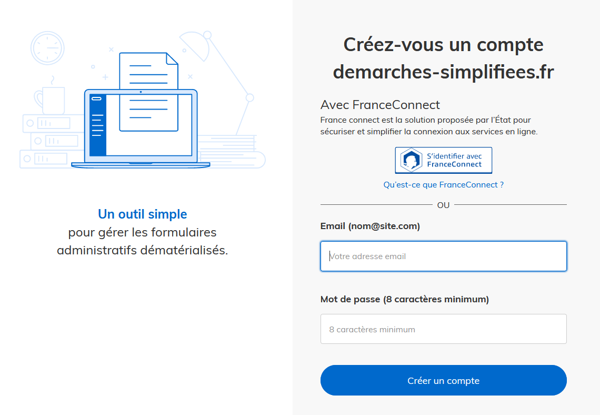

# Tutoriel administrateur

Ce tutoriel présente les étapes de création d’une démarche sur demarches-simplifiees.fr par un administrateur.

Vous avez des questions ? Vous pouvez nous contacter à tout moment depuis votre interface administrateur grâce au bandeau situé en haut de la page :&#x20;


## Version vidéo


**ATTENTION** : Nous apportons continuellement des améliorations à demarches-simplifiees.fr. De ce fait, la vidéo ci-dessous ne mentionne pas les dernières nouveautés. La documentation écrite qui suit la vidéo est, quant à elle, bien à jour.&#x20;




\
**Qu’est qu’un administrateur ?**&#x20;
---------------------------------------

Un administrateur est en charge de la construction du formulaire et de la gestion de la démarche en général. Il nomme les instructeurs et est automatiquement considéré comme instructeur. Il a donc accès aux dossiers et peut les instruire. Pour ce faire, il devra néanmoins changer de profil pour passer du profil d’administrateur à celui d’instructeur ou bien d’usager.


## 1. Création d’un compte administrateur

Rendez-vous sur la page : [https://www.demarches-simplifiees.fr/commencer/demande-d-inscription-a-demarches-simplifiees](https://www.demarches-simplifiees.fr/commencer/demande-d-inscription-a-demarches-simplifiees)


Les comptes administrateurs sont les seuls comptes que demarches-simplifiees.fr filtre. En effet, ils sont réservés aux seuls agents publics.&#x20;

Une fois votre demande acceptée, vous recevrez un mail vous invitant à créer votre mot de passe. Pour des raisons de sécurité, celui-ci doit atteindre une certaine complexité. En effet, il doit contenir au minimum 8 caractères.


Attention : tous les 30 jours, une nouvelle fois pour des raisons de sécurité,  nous vous enverrons un mail vous demandant de vérifier votre compte. Il suffit alors de cliquer sur le lien contenu dans l'e-mail envoyé automatiquement par nos services.


## 2. Se connecter à demarches-simplifiees.fr

[Se rendre sur la page d’accueil](https://www.demarches-simplifiees.fr/) et cliquer sur le bouton connexion en haut à droite. Vous arrivez alors sur la page de connexion. Rentrez l’e-mail lié au compte demarches-simplifiees.fr et le mot de passe indiqué lors de la création de votre compte.



.PNG>)

## 3. Découvrir son tableau de bord des démarches créées

&#x20;Une fois connecté, vous accédez au tableau de bord qui affiche les démarches créées. Ce dernier s’organise en trois parties, comme suit :&#x20;

* **En test** : Les démarches à l’état de brouillon sont celles créées mais non finalisées et non publiées. Aucun usager ne peut y déposer des dossiers et l’ensemble de leurs éléments peut être modifié.&#x20;
* **Publiées** : Une démarche est considérée publiée lorsque celle-ci est accessible via un lien url. Les usagers peuvent désormais y déposer des dossiers et la majorité des éléments  de la démarche ne peuvent plus être modifiés.
* **Closes** : Une démarche close est une démarche qui a été active mais qui désormais ne permet plus le dépôt de dossier par les usagers. Les dossiers déposés peuvent néanmoins toujours être instruits.


.png>)

* **Publiée** : Une démarche est considérée publiée lorsque celle-ci est accessible via un lien URL. Les usagers peuvent désormais y déposer leurs dossiers et la majorité des éléments  de la démarche ne peuvent plus être modifiés.
* **En test** : Une démarche à l’état de brouillon a bien été créée mais elle n’est ni finalisée ni publiée. Aucun usager ne peut y déposer ses dossiers. L’ensemble de leurs éléments peut être modifié.&#x20;
* **Close** : Une démarche close ne permet plus le dépôt de dossiers par les usagers. Les dossiers déposés peuvent néanmoins toujours être instruits.

## 4. Créer une nouvelle démarche

Pour créer votre formulaire, vous devez cliquer sur le bouton « Nouvelle Démarche » situé en haut à droite de votre tableau de bord.


La création d’une nouvelle démarche peut se faire soit à partir de zéro soit à partir d’une démarche existante. Cette dernière possibilité permet de cloner c’est-à-dire de copier une démarche pré-existante, déjà publiée et utilisée par une autre administration afin de l’adapter à sa situation.&#x20;


Pour ce faire, il suffit de cliquer sur le bouton « Cloner » et une copie de la démarche apparaît automatiquement dans les démarches en test.&#x20;

Vous pouvez aussi simplement consulter la démarche pour vous en faire une idée ou contacter directement l’administrateur de cette démarche.&#x20;

Pour chercher une démarche dans le catalogue, utilisez le raccourci Ctrl+F ou command +F. Vous pouvez ensuite inscrire des mots clés dans la barre de recherche pour retrouver une démarche spécifique.



**ATTENTION** : le nom des démarches est laissé à la liberté des administrations, il n’est donc pas toujours homogène. Nous vous conseillons de tester plusieurs mots-clés pour une même recherche.&#x20;

Exemple : pour la dotation aux équipements pour les territoires ruraux, on peut aussi tester le sigle DETR.


## 5. Décrire sa démarche

Après avoir cliqué sur le bouton "Créer une nouvelle démarche de zéro" en haut à gauche de la page, une nouvelle page s’affiche. Celle-ci permet de paramétrer la page de présentation de votre démarche. Ce seront les premières informations visibles par l’usager.&#x20;

Tous les champs marqués d'un astérisque sont obligatoires.

**a) Titre et description de la démarche**&#x20;

.png>)

En premier lieu, il faut indiquer le titre de votre démarche. Vous devez ensuite la décrire. Cette étape est importante car elle permet à l’usager de savoir s’il est bien sur la bonne démarche ce qui réduira d'autant le nombre de dossiers mal orientés.&#x20;

Dans la description, on indique le contexte et l’objectif de la démarche mais aussi le public visé. Une fois la description terminée, descendez en bas de la page et cliquer sur le bouton « Créer la démarche ».&#x20;

Vous pouvez enregistrer votre avancement à tout moment et revenir dessus plus tard. En revanche, comme les informations remplies ne s’enregistrent pas automatiquement, nous vous conseillons de le faire par vous-même régulièrement.

**b) Logo de la démarche**&#x20;

Vous pouvez ensuite télécharger un logo. Celui-ci apparaîtra au-dessus du titre de votre démarche lorsque l’usager y déposera un dossier.&#x20;


Si vous souhaitez intégrer plusieurs logos, il est conseillé de copier-coller l'ensemble de vos logos sur un fichier texte (doc) puis de faire une capture d’écran de tous vos logos.

**c) Conservation des données**&#x20;

Afin d’être en conformité avec le Règlement Général sur la Protection des Données (RGPD) vous devez désormais indiquer le temps de conservation des données, à la fois sur démarches-simplifiées et hors démarches-simplifiees.


À savoir que les dossiers sur démarches-simplifiees seront automatiquement expirés (supprimés) de la plateforme une fois cette période dépassée. L'usager est prévenu 2 semaines à l'avance.

Cependant tant l'instructeur que l'usager peuvent étendre la durée de conservation.&#x20;

* L'usager peut étendre la durée d'autant de mois que la démarche.
* L'instructeur peut étendre la durée d'un mois, autant de fois que nécessaire.

Enfin, un dossier en cours d'instruction ne peut être expiré pour des raisons juridique.

**d) Cadre juridique**&#x20;

De même, le cadre juridique doit être obligatoirement renseigné. En effet, dans l’intérêt de l’usager et de la protection de ses données, il est important de savoir ce qui vous autorise à lui demander des informations.&#x20;

Néanmoins, le cadre juridique comprend un vaste ensemble de textes. Vous pouvez indiquer une loi, un décret, une délibération en conseil municipal ou un règlement intérieur. Vous pouvez soit copier-coller le lien vers un site web qui le propose, soit télécharger le texte qui s'applique.


**e) Notice explicative de la démarche**

Vous pouvez ensuite télécharger une notice explicative qui est optionnelle. Une notice explicative est un document destiné à guider l’usager dans sa démarche. C’est un document que vous aurez préalablement élaboré. Celui-ci peut prendre la forme d’un fichier .doc, .pdf ou bien de diapositives. Le bouton pour télécharger cette notice apparaît en haut du formulaire pour l’usager.&#x20;


Les premiers éléments que vous venez de renseigner sont les premières informations vues par l’usager lorsqu'il aura cliquer sur le lien de votre démarche. Ils constituent ainsi la page d’accueil de votre démarche.

**f) Choix du public de votre démarche : personnes morales ou particuliers ?**

Votre démarche s’adresse-t-elle à des personnes morales ou à des particuliers ? Ce choix détermine la seconde page de votre démarche sur laquelle l’usager sera renvoyé après s’être connecté.&#x20;

* **Personnes morales** : l’usager est tenu de renseigner son numéro SIRET. Celui-ci nous permet d'interroger directement les bases de l’INSEE, d’Infogreffe et du Répertoire National des Associations (RNA) afin de recueillir automatiquement des informations sur les entreprises (raison sociale, adresse, code NAF).
* **Particuliers** : l'usager renseigne simplement son nom et son prénom. Si celui-ci ne les indique pas, il ne pourra pas se rendre sur la troisième page qui correspond au corps du formulaire. Si vous choisissez cette option, nul besoin de lui demander son nom et prénom dans votre formulaire.


**g) Options avancées**

Enfin, il existe deux options avancées optionnelles. La première est le choix de la date limite de dépôt des dossiers et la seconde est la possibilité de rendre une démarche déclarative.

.png>)

* **Date limite de dépôt des dossiers** : cette option permet de clôturer automatiquement votre démarche. Cela permet de clore automatiquement le dépôt des dossiers à la date de votre choix. Grâce à cette fonctionnalité, lorsque la démarche est close, tous les dossiers passent en instruction. Les dossiers restés à l'état de brouillon ne pourront plus être soumis. Cet outil est particulièrement utile pour les appels à projet.&#x20;


INFORMATION : lorsque vous indiquez 14 septembre, la clôture des dossiers s'effectuera dans la nuit du 13 au 14 septembre à minuit.


* **Démarche déclarative** : cette option permet de rendre votre démarche déclarative. Une fois le dossier déposé, celui-ci ne pourra plus être modifié. Deux issues sont alors possibles ; soit il passe directement « en instruction » pour être traité, soit il est immédiatement « accepté ».

.png>)

Vous pouvez désormais passer à l’étape suivante en cliquant sur le bouton « Créer la démarche », situé en bas à droite de l’écran.


## 6. Créer son formulaire

Le corps de votre démarche est constitué par votre formulaire. Celui-ci va permettre de recueillir les informations fournies par les usagers lesquelles vous permettront de valider leur demande ou non. Un formulaire se construit par empilement de champs, un champ étant une information que vous demandez à l’usager.&#x20;

Exemple : si vous souhaitez obtenir les coordonnées d’un usager, vous pouvez créer un champ « adresse », un champ « téléphone » et un champ « e-mail ».

A tout moment, vous pouvez prévisualiser le formulaire que vous êtes en train de créer en cliquant sur l’onglet "Prévisualiser le formulaire".


Pour commencer votre formulaire, vous cliquerez sur l’onglet "Ajouter un champ" dans le menu situé en bas à gauche de l’écran. Une fois sur la page champ, vous pourrez ajouter autant de champs que vous le désirez.


Pour créer un champ :

* **Indiquer un libellé** : vous entrez le titre du champ. Dans le même temps, il est possible de rendre ce champ obligatoire pour l'usager.&#x20;


* **Renseigner une description** : vous pouvez ajouter une description afin de mieux renseigner l’usager sur l’information que vous attendez. Par exemple, si vous demandez le numéro de téléphone vous pouvez préciser : « Renseigner un numéro sur lequel nous pouvons vous joindre entre 14h et 18h ».&#x20;


### **A. Renseigner le type de champ**&#x20;

Le type de champ formate la manière dont l'usager vous donnera l'information demandée. Plusieurs types de champ existent :

#### **a) Texte**&#x20;

Par défaut, c’est le champ "Texte" qui est sélectionné, c’est-à-dire que l’usager répondra de manière libre. Si le nombre de caractères est illimité, ce champ est adapté à une réponse courte.


#### **b) Zone de texte**&#x20;

Ce champ est similaire au précédent à la différence qu'il est adapté à une réponse longue. Le nombre de caractères est aussi illimité.


#### **c) Date**&#x20;

L' usager doit renseigner une date au format jj/mm/aaaa.


**d) Date et heure**&#x20;

L' usager doit renseigner une date et un horaire.


#### **e) Nombre décimal**

L'usager doit renseigner un nombre qui peut être décimal.


**f) Nombre entier**

&#x20;**** L'usager doit renseigner un nombre entier.

.png>)

#### **g) Case à cocher**&#x20;

Ce type de champ insère à gauche du libellé du champ une case que l'usager peut cocher.


#### **h) Civilité**

L'usager peut choisir entre "Madame" ou "Monsieur".


#### **i) E-mail**

&#x20;L'usager doit renseigner un e-mail.


#### **j) Téléphone**

&#x20;**** L'usager doit renseigner un numéro de téléphone.


#### **k) Adresse**&#x20;

L'usager doit entrer une adresse avec une auto-complétion - l'adresse se complète sans que l'usager n'ait besoin de l’écrire entièrement - grâce à la connexion à la Base Adresse Nationale (BAN).


#### l) Oui/Non

L'usager peut répondre "Oui" ou "Non" à la question posée dans le libellé du champ.


#### **m) Choix parmi une liste**

L'usager doit choisir une seule valeur parmi une liste que vous avez préalablement créée. Pour créer la liste, il suffit de mettre les valeurs dans l'encadré «  Liste déroulante », en ne mettant qu'une valeur par ligne. Vous avez la possibilité d'ajouter des séparateurs entre des groupes de valeurs. Pour ce faire, formatez la valeur qui sert de séparateur par des doubles tirets "--", sans espace, comme ceci : `--valeur--.`&#x20;

Cette valeur apparaîtra grisée et l'usager ne sera pas en mesure de la sélectionner.&#x20;


**n) Choix multiples**

Le principe est le même à la différence que l'usager pourra sélectionner plusieurs valeurs simultanément.


#### **o) Deux menus déroulants liés**&#x20;

Ce champ autorise un premier niveau de conditionnalité, c'est-à-dire que le contenu du second menu change en fonction du choix fait par l’usager dans le premier.&#x20;

Exemple : si mon premier menu propose les choix A, B, C et que l’usager fait le choix B, un second menu déroulant apparaît avec les choix B1, B2, B3.&#x20;

Pour l'utiliser, remplissez l'encadré "Liste déroulante " en suivant le modèle ci-dessous :

```
--A--
A1
A2
A3
--B--
B1
B2
B3
--C--
C1
C2
C3
```

Les titres des menus déroulant liés doivent donc être encadrés par des doubles tirets "--" sans espace tandis que les choix du second menu doivent être laissés tels quels.&#x20;


#### **p) Pays, régions, départements, communes**&#x20;

Ces quatre types de champ sont des menus déroulants dont les valeurs sont préétablies. Il n'est pas possible de les modifier.

Le champ « Pays » comporte des pays qui ont existé dans le passé, ou dont la reconnaissance internationale est contestée, pour permettre à des usagers de répondre à la question « Quel est votre pays de naissance ? »

Les champs « Régions », « Département » et « Communes » utilisent des valeurs provenant de l’[API Géo](https://api.gouv.fr/les-api/api-geo). Il s’agit des régions, départements et communes de France métropolitaine et des DROM. Les communes des TOM ne sont donc pas incluses.

#### **q) Engagement**&#x20;

Ce champ est strictement identique au champ "Case à cocher". &#x20;


#### **r) Titre de section**&#x20;

Le titre de section permet de segmenter et de structurer votre formulaire.  En effet, la construction de ce dernier étant linéaire par empilement de champs, il convient de le structurer afin de le rendre plus facilement lisible par l’usager.&#x20;


#### **s) Explication**

&#x20;Ce type de champ présente un texte sans possibilité de réponse qui vous permet de détailler un point spécifique de guider l'usager ou bien d'introduire des sous-titres de section.

#### **t) Lien vers un autre dossier**&#x20;

Ce type de champ donne la possibilité de relier deux dossiers déposés sur demarches-simplifiees entre eux.&#x20;

Exemple : je fais une demande de subvention en 2019 et en 2020, je dois en faire le bilan. En choisissant ce type de champ, l’usager indique seulement le numéro du dossier 2019 dans son dossier 2020, et l’instructeur peut alors accéder facilement à la demande grâce à un lien présent dans le bilan.&#x20;


Pour accéder au premier dossier déposé par l'usager, l'instructeur de la seconde démarche devra également être instructeur de la première démarche. Il lui suffira alors de cliquer sur le lien, comme ci-dessous :&#x20;


#### **u)** **Pièce justificative**&#x20;

Ce champ permet à l'usager d'ajouter à son dossier un document, quelque soit son format. La taille de chaque fichier doit être inférieure à 200 Mo. Il n'y a pas de limite globale de taille.&#x20;

.png>)

.png>)

Vous avez également la possibilité de joindre un modèle de pièce justificative que les usagers peuvent télécharger et remplir pour joindre à leur dossier. Cela est particulièrement utile dans les démarches impliquant l'utilisation de fichiers tableur.



Une fois la démarche publiée, les champs d'une démarche ne sont plus modifiables, à l'exception du modèle de pièce justificative. Pour mettre à jour ce dernier, il suffit de nous envoyer le nouveau modèle à notre adresse de contact en précisant le champ et le numéro de la démarche concernée.


#### **v) SIRET**

Ce champ permet de faire appel à l’API entreprise comme nous l’avons vu auparavant mais cette fois à tout moment dans le formulaire.&#x20;

Le numéro SIRET doit comporter exactement 14 chiffres


#### **w) Carte**&#x20;

Ce champ permet de faire appel à l’API géo. Sur un fond de carte, l’usager peut dessiner la localisation de son projet. Sont alors automatiquement ressortis les parcelles cadastrales, les quartiers prioritaires et les parcelles agricoles touchées par ce projet.&#x20;


#### x) Bloc répétable

Ce champ permet à l'usager de saisir un certain nombre de champs autant de fois qu'il le souhaite. Pour savoir comment l'utiliser, je vous invite à vous rendre sur la page dédiée en cliquant [ici](https://faq.demarches-simplifiees.fr/article/48-les-blocs-repetables).&#x20;


### **B. Renseigner un libellé**&#x20;

Après avoir choisi votre type de champ, vous devez indiquer un libellé, c’est-à-dire le titre du champ.&#x20;

### **C. Renseigner une description**&#x20;

Vous pouvez ajouter une description afin de mieux renseigner l’usager sur l’information que vous attendez.&#x20;

Exemple : si vous demandez le numéro de téléphone vous pouvez préciser : renseigner un numéro sur lequel nous pouvons vous joindre entre 14h et 18h.

### D. Modifier l’ordre des champs

Il est possible de modifier l’ordre des champs en les faisant monter ou descendre dans le formulaire. Pour ce faire, cliquez sur les flèches situées à gauche du champ comme suit :


### E. Supprimer un champ

Pour supprimer un champ, cliquez sur la corbeille située en haut à droite du champ.

.PNG>)

### F. Rendre un champ obligatoire&#x20;

Il est possible de rendre un champ obligatoire. Il suffit alors de remplir un champ et de cocher la case "Obligatoire". Si vous choisissez de rendre un champ obligatoire, l’usager ne pourra pas déposer son dossier tant que ce champ ne sera pas rempli.

Avant de cocher cette case, assurez vous que tous les usagers disposeront de l'information demandée. Dans le cas contraire, l'usager ne pourra pas effectuer la démarche.&#x20;


### G. Estimation de la durée de remplissage

Une estimation de la durée nécessaire pour remplir le formulaire est affichée en bas de l’écran. Cette durée est calculée en fonction du nombre et du type des champs :

* Champs rapides (texte, case à cocher, etc) : 10 secondes
* Champs moyens (adresse, SIRET, IBAN, etc): 1 minute
* Champs longs (pièces justificatives, etc) : 3 minutes

L’estimation considère qu’un bloc répétable est répété en moyenne entre 2 et 3 fois, et qu’un champ optionnel est rempli en moyenne une fois sur deux.

Pour réduire la durée de remplissage de votre démarche, réellement simplifier la vie des usagers, et réduire le taux d'abandon de votre démarche, pensez à :

* **Demander uniquement les informations strictement nécessaires** à la démarche.&#x20;
* **Demander moins de pièces justificatives**. Chaque pièce justificative nécessite généralement de retrouver un document papier et de le scanner (avec un scanner ou un téléphone), puis de le transférer sur l'appareil où on remplit la démarche pour l'envoyer. Un excès de pièces justificatives est  une source majeure d’abandon de la démarche.
* **Utiliser les API pour récupérer des informations**. Vous pouvez par exemple demander le n° SIRET pour obtenir automatiquement des informations sur un établissement (plutôt que de demander ces informations une par une) ; ou interroger l’annuaire Éducation.

_Voir aussi : les_ [_bonnes pratiques pour la création d’une démarche_](les-bonnes-pratiques-lors-de-la-creation-dune-demarche.md)_._

### H. Prévisualiser le formulaire&#x20;

Vous pouvez à tout moment prévisualiser votre formulaire en cliquant sur le bouton "Prévisualiser le formulaire" situé en haut de la page. Toutefois, des champs tels que les blocs répétables ne sont pas fonctionnels dans la partie prévisualisation. Il est donc recommandé de déposer un dossier en test pour avoir un véritable aperçu du point de vue de l'usager.

.PNG>)

La création de champs s'enregistre automatiquement à chaque modification. Une fois tous les champs créés, vous pouvez poursuivre la création de votre démarche en cliquant sur le bouton "Continuer", situé en haut à droite de la page.


A tout moment, vous pouvez tester votre démarche, du dépôt de dossier à son instruction, en cliquant sur l'onglet "Tester". Profitez de la phase de test pour vérifier la saisie de dossiers ainsi que toutes les fonctionnalités associées (instruction, e-mails automatiques, attestations etc.).\
Durant la phase test, vous pouvez effectuer toutes les modifications que vous souhaitez sur votre démarche.&#x20;



**ATTENTION** : Les dossiers remplis pendant la phase de test seront automatiquement supprimés lors de la modification ou bien de la publication de votre démarche.


## 9. Le processus d’instruction&#x20;

Vous venez de finir votre formulaire, il convient désormais d’en prévoir les modalités d’instruction. Il s’agit de déterminer le processus que suivra l’instructeur pour traiter les dossiers déposés par l’usager.&#x20;

A cette fin, demarches-simplifiees.fr vous propose d’utiliser des annotations privées, véritable formulaire à remplir cette fois-ci par l’instructeur lors de l’instruction d’un dossier.&#x20;

D’autres fonctionnalités comme les avis externes et la co-construction usager peuvent être utilisés dans le cadre de l’élaboration d’un processus d’instruction. Néanmoins, vous avez la possibilité de les construire ultérieurement.

### Annotations privées

Les annotations privées sont l’équivalent du cadre réservé à l’administration présent sur les formulaires papiers. Ceux sont des champs à destination des seuls instructeurs, visibles et modifiables uniquement par eux.&#x20;

En créant des champs « Annotations privées », vous pouvez en tant qu’administrateur prévoir quelles sont les informations que doit analyser l’instructeur pour traiter le dossier.&#x20;

A titre d’exemple, pour une démarche de demande provisoire de titre de travail pour un étudiant étranger, vous pouvez créer une annotation privée intitulée « Qualité de l’expérience universitaire ». L’instructeur saura donc qu’il doit renseigner et analyser cet élément dans son évaluation générale pour la délivrance ou non du titre. Par ailleurs, comme sur DS, plusieurs instructeurs peuvent instruire le même dossier, les annotations privées peuvent permettre un dialogue entre eux.&#x20;

Pour créer des annotations privées, rendez-vous dans l’onglet « Annotation privées ». Il convient ensuite d’ajouter vos annotations privées comme des champs normaux. Le modèle est exactement le même que pour le formulaire usager, c’est pourquoi on parle parfois de "formulaire instructeur".

.PNG>)


## 10. Informer l’usager sur l’état d’avancement de sa démarche

Il convient désormais de penser d’un point de vue usager à la vie de la démarche suite à la transmission du dossier. Dés à présent, il faut envisager les modalités d’information de l’usager sur l’état d’avancement de son dossier. Pour cela, demarches-simplifiees envoie des e-mails dans lesquels vous pouvez communiquer les informations souhaitées.

### Les e-mails automatiques&#x20;

3 types d’e-mails sont envoyés automatiquement. Chaque catégorie correspond à un moment clé d’une démarche :

* Suite à la transmission de son dossier, l'usager reçoit un **accusé de réception**.
* Lorsque l’instructeur décide de bloquer la possibilité pour l'usager de modifier son dossier, ce dernier reçoit un accusé de **passage en instruction**.
* Lorsque l’instructeur rend une décision sur le dossier, l’usager peut recevoir soit un accusé d'**acceptation** soit de **rejet** ou encore de **classement sans suite**

Ces e-mails sont entièrement personnalisables. Vous pouvez décider de l’objet et du corps de l’e-mail. Pour cela, cliquez sur l'onglet « E-mails » dans la barre latérale de gauche. Vous avez alors une première barre pour l’objet puis une zone de texte où vous pouvez rédiger le corps de votre e-mail.&#x20;


Lorsque vous personnalisez votre mail, il est possible d’intégrer des balises de champs dans le corps du message en copiant le format de la balise dans le texte comme montré ci-dessus. Pour chaque champ dans votre formulaire usager ou dans vos annotations privées, une balise existe. Lorsque vous intégrez cette balise à votre message, l’information renseignée par l’usager pour le champ correspondant est automatiquement remontée dans le corps du mail.

Exemple : j’ai un champ adresse et j’utilise ma balise adresse dans mon corps de texte comme suit : Attendu que vous habitez au –adresse--. Si l’usager a renseigné comme adresse 20 avenue de Ségur, il recevra un mail avec écrit : attendu que vous habitez au 20 avenue de Ségur.

Les balises sont notamment utiles pour remonter les annotations privées car elles peuvent transmettre directement les commentaires renseignés par l’instructeur à l’usager.


### Attestation

Les attestations sont des documents au format .pdf qui sont délivrés en pièce-jointe des e-mails d’acceptation. Celles-ci sont également disponibles en téléchargement sur l’espace personnel de l’usager. Comme pour les e-mails, l’attestation est entièrement personnalisable, notamment avec une signature et différentes balises envisageables.


A la différence de la configuration des e-mails, celle de l’attestation est optionnelle. Pour l’activer, cliquer sur le bouton « Activer l’attestation », situé en bas à gauche de votre écran.&#x20;


Pour créer une attestation, rendez-vous sur l’onglet « Attestation ». Vous pouvez alors :

* **Entrer un titre** dans le champ « Titre »&#x20;


* **Rédiger le corps de l’attestation** dans le champ « Corps du document ». Il est possible de remonter des éléments du dossier de l'usager grâce à l'utilisation de balises de champs. Pour cela, faites un **copier-coller** de l'une des balises disponibles en dessous du corps de l'attestation et insérez la dans votre texte. Il faut veiller à ce que la balise du texte  soit identique à celle située sous le corps de l'attestation, sinon celle-ci ne fonctionnera pas.


* **Choisir un logo** qui sera présenté en haut de page


* **Choisir un tampon ou une signature** scanné qui sera présenté en fin de document. Cette fonctionnalité vous offre aussi la possibilité d'insérer un code QR dans votre attestation.


* **Rentrer un texte de bas de page** dans le champ « Pied de page ».&#x20;


* **Enregistrer l’attestation** en cliquant sur le bouton « Enregistrer » situé en bas à droite de l’écran. Un aperçu est mis à jour après chaque sauvegarde. Vous pourrez y accéder en rafraîchissant la page, un nouvel onglet s'ouvre avec une prévisualisation de l'attestation.&#x20;

.PNG>)

## 11. Nommer des instructeurs&#x20;

Afin que la démarche soit publiée, il est nécessaire en amont d’en assigner la charge à des instructeurs, qui seront alors les seuls habilités à traiter les dossiers déposés. Vous pouvez ajouter ou retirer des instructeurs à tout moment, y compris après publication de la démarche.&#x20;

### A. Lors d'une instruction unique

* Si vous souhaitez que l'ensemble des instructeurs aient accès à l'ensemble des dossiers, rendez-vous sur l’onglet « Instructeur ». Il vous suffit ensuite de renseignez l’adresse e-mail de l’instructeur dans le champ « E-mail » et cliquer sur le bouton « Affecter ».

.PNG>)


* Un message apparaît pour confirmer l’affectation des instructeurs. Vous retrouverez la liste des instructeurs affectés à la démarche en bas de la page.&#x20;


* &#x20;Pour retirer un instructeur : cliquer sur le bouton « retirer » situé en bas à droite de l’écran.



**ATTENTION** : Lorsque vous clonez une démarche, il faut recommencer le processus d'affectation des instructeurs à la démarche clonée.


### B. Dans le cadre de l'utilisation du routage

Il est désormais possible d'affecter automatiquement les dossiers à des groupes d'instructeurs préalablement définis à l'avance. Pour en savoir plus, nous vous invitons à consulter notre page consacrée à la fonction routage en cliquant [ici](https://doc.demarches-simplifiees.fr/pour-aller-plus-loin/routage).&#x20;

## **12. La gestion des "avis experts invités" de votre démarche**

En tant qu'administrateur de la démarche vous bénéficiez, de la possibilité de donner des droits aux instructeurs pour que ces derniers sollicitent l'avis d'experts invités. En effet, afin d'être en conformité avec le Règlement Général sur la Protection des Données (article 32-4 du RGPD) , il convient d'assurer la traçabilité des actions de traitement des données personnelles menées par les personnes qui sont habilitées à traiter un dossier, c'est-à-dire les instructeurs de la démarche. &#x20;

Ainsi, vous disposez désormais de plusieurs fonctionnalités en ce qui concerne la gestion des experts invités qui seront sollicités par les instructeurs à donner leurs avis. Pour en savoir plus concernant les "experts invités", nous vous invitons à consulter notre page consacrée au tutoriel "expert invités" en cliquant [ici](https://doc.demarches-simplifiees.fr/tutoriels/tutoriel-expert-invite).&#x20;

#### &#x20;                 **Présentation générale de l'onglet "avis externes"**&#x20;

&#x20;Si vous souhaitez opérer une gestion des experts invités d'une démarche qui seront sollicités par les instructeurs, rendez-vous dans l'onglet "avis externes".&#x20;


* L'écran qui s'affiche est alors celui ci-dessous.&#x20;


* Trois possibilités s'offrent à vous afin de gérer comme vous le souhaitez les experts invités qui seront sollicités par les instructeurs de la démarche. ****     &#x20;

#### &#x20;**Les différentes fonctionnalités de gestion des experts invités**

En tant qu'administrateur, vous pouvez gérer les experts invités d'une démarche comme vous le souhaitez. Pour ce faire, vous disposez de trois fonctionnalités (au choix) : \
\
\- accorder de manière générale des droits aux instructeurs de solliciter des experts **** invités.\
\- laisser aux instructeurs la liberté de choisir des experts invités qui seront sollicités lors d'un dossier. \
\- prédéfinir une liste d'experts invités qui seront uniquement sollicités par les instructeurs lors d'un dossier et décider ainsi que les experts invités soient notifiés de la décision finale.&#x20;

### **A. Accorder aux instructeurs le droit de solliciter des experts invités**&#x20;

* En tant qu'administrateur de la démarche, vous avez la possibilité d'accorder le droit aux instructeurs de solliciter l'avis d'experts invités dans un dossier. Par défaut, la fonctionnalité " autoriser les instructeurs à solliciter des experts invités" est ainsi activée.


* Pour retirer la possibilité pour les instructeurs de solliciter un expert invité,  il vous suffit de désactiver la fonctionnalité "autoriser les instructeurs à solliciter des experts invités". Ainsi, les instructeurs de la démarche ne pourront plus solliciter d'experts invités dans un dossier.&#x20;


* Les avis externes sont alors désactivés.&#x20;

### **B. Laisser aux instructeurs la liberté de solliciter des experts invités**&#x20;

* Une deuxième possibilité est à votre disposition, vous pouvez choisir d'utiliser par défaut la fonctionnalité "autoriser les instructeurs à solliciter des experts invités".\

* Les instructeurs de votre démarche sont alors libres de solliciter des experts invités afin que ces derniers, après notification, émettent un avis sur un dossier.&#x20;


* **Du coté instructeurs** :&#x20;
* Ils doivent désormais,  **entrer une à une les adresses email des experts invités sollicités à émettre un avis.** Et ensuite**, cliquer sur les adresses email** afin que le choix des experts invités soit bien pris en compte dans la démarche comme l'illustre la capture d'écran ci- dessous.&#x20;


* Une fois les adresses email des experts ajoutées, les instructeurs de votre démarche doivent cliquer sur le bouton "demander un avis" situé en bas de l'écran.

.PNG>)

* **Du coté experts :**&#x20;
* Lorsque ces derniers sont sollicités par les instructeurs de votre démarche afin d'émettre un avis dans un dossier, l'onglet "avis" s'affichera avec une pastille orange lors de la connexion à leurs interfaces expert.&#x20;

 (1).png>)

* Du coté administrateur : vous pouvez consulter la liste des experts invités ayant émis un avis ainsi que le nombre d'avis émit lors de la démarche en bas de page.&#x20;


### **C**. P**rédéfinir une liste d'experts invités et d'en notifier la décision finale**&#x20;

* Vous avez également la possibilité de gérer les experts invités de la démarche en définissant, désormais, à l'avance une liste d'experts invités. Pour ce faire, il vous suffit d'activer le bouton " Gérer les experts invités de la démarche".

.png>)

* Une fois cette fonctionnalité activée, vous devrez dresser une liste d'experts invités qui sera accessible aux instructeurs afin de désigner des experts dans les dossiers.&#x20;
* Il vous suffit, **d'ajouter une à une les adresses email des experts** et de **cliquer ensuite sur l'adresse email venant d'être indiquée** afin que cette dernière soit correctement ajoutée à la liste des experts que vous souhaitez affecter à votre démarche.


* **Si la fonctionnalité est activée, vous pouvez également ajouter et retirer à tout moment des experts même après publication de votre démarche**. Il vous suffit de cliquer sur le bouton "retirer" situé à droite de l'écran. Du coté expert, si ce dernier a des avis en cours, ils ne seront pas impactés, mais il ne pourra pas être sollicité pour les nouveaux avis.


****

* Du coté instructeurs : ces derniers **pourront uniquement inviter et demander l'avis des experts prédéfinis au sein de votre liste.**&#x20;

 (1).png>)

### D. Gérer la notification des décisions finales aux experts affectés au dossier.

&#x20;Ainsi, si vous souhaitez activer cette fonctionnalité, il vous suffit de cliquer sur le bouton situé en dessous de "notifier des décisions sur les dossiers".&#x20;


* Du coté experts : une fois la fonctionnalité activée, les experts recevront une notification de la décision finale. Ainsi, selon l'issue du dossier, il existe trois cas de figure : \

* 1\) L'expert est notifié que le dossier a été accepté.&#x20;

 (1).png>)

* 2\) L'expert est notifié que le dossier a été refusé.&#x20;

 (1).png>)

* 3\)  L'expert est notifié que le dossier a été classé sans suite.&#x20;

 (1).png>)

## 13. Proposez l'évaluation de votre démarche par les usagers

Proposez aux usagers de donner un avis sur votre démarche, grâce à l’outil mis à disposition par l'[Observatoire de la qualité des démarches en ligne.](https://observatoire.numerique.gouv.fr/) Demarches-simplifiees.fr permet l'intégration directe de l'outil "MonAvis" au sein de votre démarche. Pour en savoir plus, vous pouvez consulter [l'article dédié en cliquant ici.](https://doc.demarches-simplifiees.fr/tutoriels/integration-du-bouton-mon-avis)

.png>)


## 14. Publier sa démarche


**ATTENTION :** Avant de publier votre démarche, il est nécessaire d'avoir fait un test global de celle-ci, du dépôt du dossier à l'instruction complète de celui-ci, grâce au lien de test disponible dans l'onglet "Test et publication" de la démarche.


La publication de la démarche génère un lien de la forme : "https://www.demarches-simplifiees.fr/commencer/xxxxx". Les usagers qui disposent de ce lien pourront déposer un dossier. Pour cela, rendez-vous dans l'onglet "Test et publication", puis cliquez sur le bouton "Publier", situé en haut à droite de votre écran.


La fenêtre suivante apparaît :


Nous vous recommandons de personnaliser la partie de l'URL située après "/commencer/" avec des mots lisibles par l'usager. La partie "https://www.demarches-simplifiees.fr/commencer/" de l'URL n'est pas modifiable.

Vous devez ensuite indiquer où les usagers trouveront le lien de la démarche. Si ce n'est pas sur un site internet, vous pouvez indiquer le moyen de diffusion utilisé comme "mail". Cliquez enfin sur le bouton "Publier" pour finaliser la publication.

Une fois la démarche publiée, les onglets suivants de la démarche ne sont plus accessibles :

* Champs
* Annotations privées

Les onglets suivants restent modifiables, de la même manière que lorsque votre démarche était en test :&#x20;

* Description&#x20;
* Service
* Administrateurs
* Instructeurs
* E-mails
* Attestation
* MonAvis

## 15. Clore une démarche&#x20;

Dans le cas d’un appel à projet, il peut être souhaitable de choisir une date à partir de laquelle tout dépôt de dossiers sera bloqué. C’est pourquoi il est possible de clore une démarche ce qui entraîne la fermeture du dépôt des dossiers et la désactivation du lien URL. Pour ce faire, cliquez sur une démarche active, sur l’onglet « Actions » et cliquez sur le bouton « Clore ».


Un message d’avertissement apparaît. Il suffit de confirmer afin que la démarche soit automatiquement transférée dans les démarches closes.&#x20;


## 16. Transférer sa démarche

Une démarche d'un collègue peut ne pas être présente dans le catalogue des démarches car il faut 30 dossiers pour qu'elle y soit incluse. Cependant, vous pouvez tout de même partager votre démarche avec votre collègue. A cette fin, rendez-vous sur votre profil administrateur.

* Cliquez sur l'onglet " Envoyer une copie "


La fenêtre suivante apparaît, cliquer à nouveau sur " Envoyer une copie "


* Renseignez l'adresse e-mail de votre collègue
* Enfin, cliquez sur le bouton « Envoyer »


Une copie de votre démarche apparaît dans ses démarches "En test".

## 17. Supprimer une démarche

La suppression d’une démarche est optionnelle. Vous pouvez vouloir supprimer des démarches en test ou closes. Toute suppression est définitive. Une fois la démarche supprimée, elle s'appliquera à l'ensemble des éventuels administrateurs de la démarche.

.PNG>)


