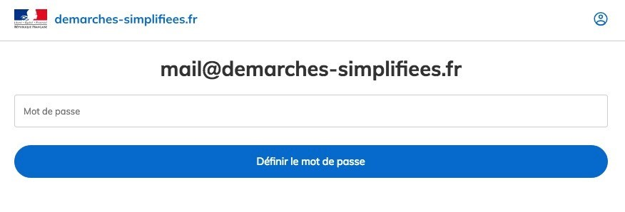
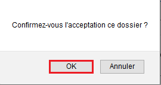
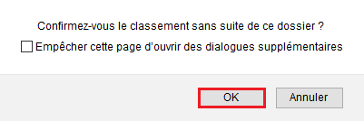
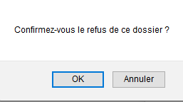
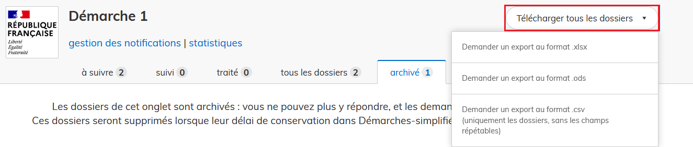
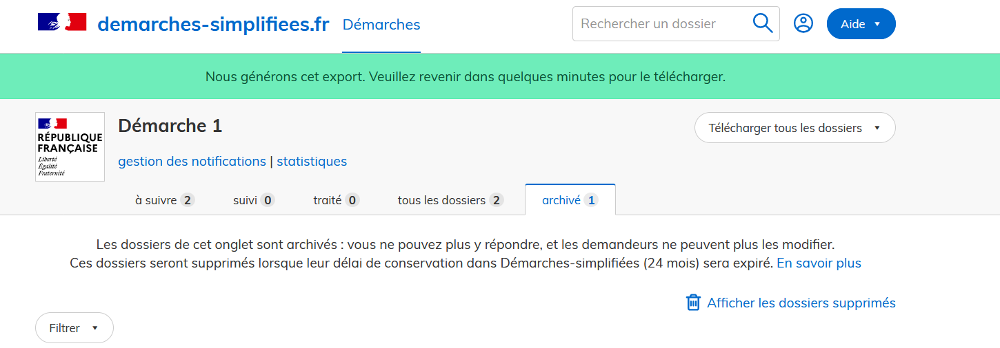
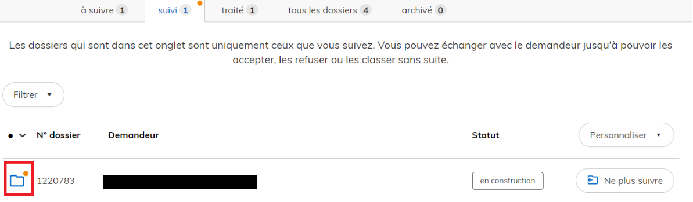
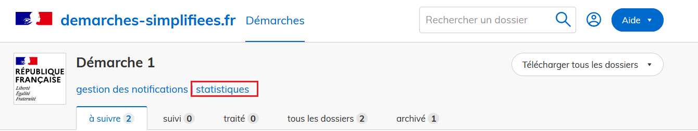
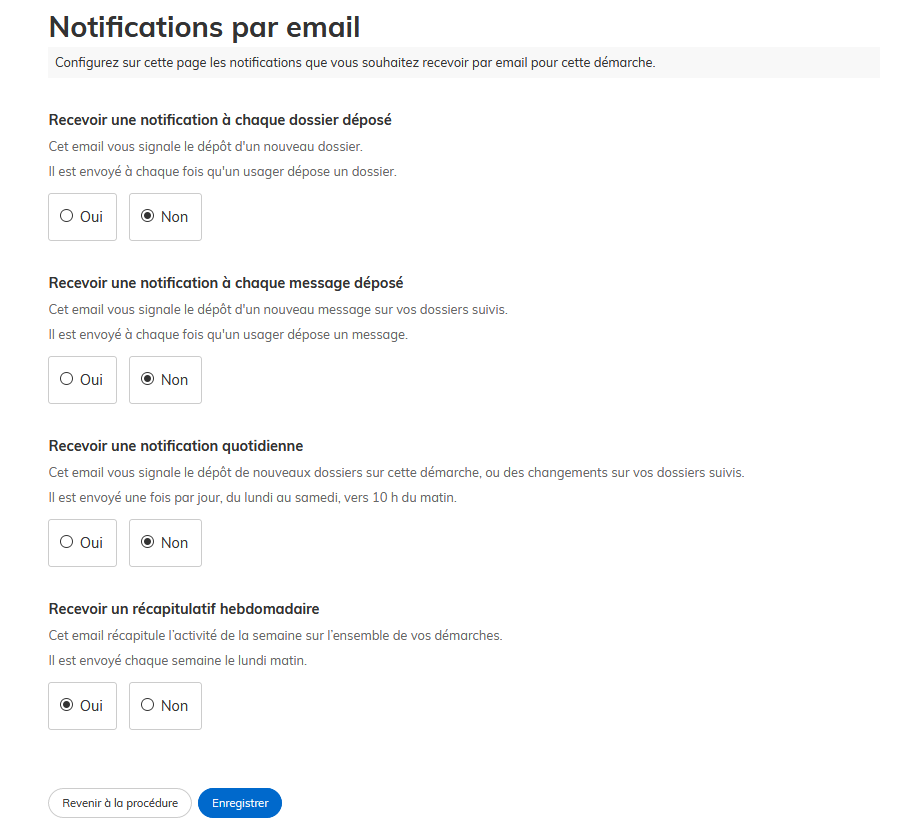

# Tutoriel instructeur

Ce tutoriel détaille les étapes d’instruction d'un dossier sur demarches-simplifiees.fr par un instructeur.

**Télécharger la version papier du tutoriel**


TUTORIEL PAPIER AU 4 FEVRIER 2021


## Version vidéo

Attention : nous apportons continuellement des améliorations à demarches-simplifiees.fr. De ce fait, la vidéo ci-dessous n'est pas nécessairement à jour contrairement à la documentation écrite qui suit.



## Qu'est-ce qu'un instructeur ?

Un instructeur est une personne nommée par un administrateur afin de prendre en charge le traitement et l'instruction des dossiers d'une démarche administrative.&#x20;

L'instructeur a accès au contenu des dossiers de la démarche sur laquelle il a été nommé (champs renseignés, pièces justificatives, messagerie). Il dispose des droits pour statuer sur le dossier (acceptation, classement sans suite, refus) et peut inviter un tiers à consulter un dossier afin d'émettre un avis sur celui-ci si l'administrateur de la démarche le permet.&#x20;

## 1. Se connecter à demarches-simplifiees.fr

* **Réception du message d’invitation à devenir instructeur sur une procédure :**

Un instructeur nommé pour la première fois par un administrateur pour suivre une procédure reçoit une invitation par e-mail :&#x20;

Ce lien renvoie à la page suivante :

Cette page permet à l'instructeur de définir le mot de passe qui sera associé à son compte, et qu'il utilisera ultérieurement pour se connecter à demarches-simplifiees.fr.

Si vous devez confirmer votre compte à chaque connexion, veuillez consulter la [page dédiée](https://faq.demarches-simplifiees.fr/article/63-je-dois-confirmer-mon-compte-a-chaque-connexion).

## 2. Le tableau de suivi des procédures

Le tableau de suivi des démarches permet à l’instructeur d’avoir une vue d’ensemble des procédures pour lesquelles il a été nommé. Le nom de la démarche et son numéro y figurent.&#x20;

Les démarches sont classées dans plusieurs onglets : les démarches publiées, en test et closes.&#x20;

<figure><figcaption>
Interface instructeur et vue sur les démarches
</figcaption></figure>

Cliquer sur le nom d'une des procédures permet d'accéder au détail de celle-ci. Par défaut la procédure s’ouvre sur les dossiers « à suivre ». Vous pouvez continuer d'instruire une démarche même si elle est close. Seul le dépôt de nouveau dossier ne sera plus possible sur cette démarche close.&#x20;

Les dossiers sont classés selon leur stade de traitement : à suivre, suivi, traité, au total, supprimé récemment, expirant et archivé.

<figure><figcaption>
Vue du tableau de bord instructeur 
</figcaption></figure>

Ces différents stades de traitement correspondent à :

* **à suivre** : onglet contenant l'ensemble des dossiers qui ne sont suivis par aucun instructeur. Pour s'assigner le dossier, il suffit de cliquer sur "suivre le dossier".
* **Suivi** : onglet listant seulement les dossiers suivis par l'instructeur connecté. Lorsque vous suivez un dossier, le dossier n'apparaît plus dans les dossiers à suivre pour les autres instructeurs assignés à la démarche. Il faudra qu'ils aillent dans l'onglet "au total" pour retrouver ce dossier.
* **Traité** : dossiers sur lesquels un ou plusieurs instructeurs ont statué et apporté une décision.&#x20;
* **Au total** : l'ensemble des dossiers de la démarche dont ceux suivis par les instructeurs autres que celui connecté. Si la démarche est routée, vous ne trouverez que les dossiers de votre groupe.
* **Supprimé récemment** : Vous y retrouvez les dossiers "traités" que vous avez supprimé
* **Expirant** : les dossiers ont une durée de conservation fixé par l'administrateur de la démarche. Les dossiers qui arrivent à expiration sont donc dans cet onglet. Passé ce délai, les dossiers expirent définitivement. Il faut donc les instruire avant l'expiration.   &#x20;
* **Archivé** : dossiers archivés par un instructeur. Seuls les dossiers traités peuvent être archivés. La messagerie est automatiquement désactivée sur le dossier dès que le dossier est archivé.&#x20;

### **A. Personnaliser le tableau de suivi des dossiers**&#x20;

Le tableau de suivi des dossiers est paramétrable afin de modifier ou d’ajouter des colonnes faisant figurer des champs relatifs à la procédure.

Cliquez sur le bouton «  Personnaliser » situé en haut à droite,  puis cliquez sur le champ de recherche et sélectionner le champ souhaité ; enfin cliquez sur le bouton « Enregistrer » comme suit :&#x20;

<figure><figcaption>
Personnalisation du tableau de bord instructeur 
</figcaption></figure>

Un champ peut être retiré du tableau de suivi : cliquez de nouveau sur « Personnaliser » puis retirez le champ en cliquant sur la croix figurant sur le libellé du champ en question puis sur le bouton « Enregistrer ».&#x20;

<figure><figcaption>
Retrait d'un champ 
</figcaption></figure>

Si vous retirez toutes les colonnes depuis le bouton « Personnaliser », seuls les numéros des dossiers seront affichés en plus du statut de ceux-ci.&#x20;

Vous pouvez sélectionner tout type de champ pour la personnalisation de votre tableau de bord notamment des annotations privées et le champ oui/non de l'avis expert. Cela peut vous être utile dans l'instruction de vos dossiers.&#x20;

### B. Filtrer les dossiers

Il est possible de filtrer les dossiers à l'aide des champs présents dans la procédure pour n'afficher que les dossiers qui vous intéressent.

Pour cela, il faut cliquer sur le bouton « Filtrer », Sélectionner un champ, puis une valeur associée à ce champ et cliquer sur le bouton « Ajouter un filtre ». Vous aurez alors accès à l'ensemble des champs du formulaire pour filtrer les dossiers.

<figure><figcaption>
Filtrer l'affichage du tableau selon des champs
</figcaption></figure>

&#x20;Sélectionnez la colonne voulue, puis saisissez une valeur et cliquez sur le bouton « Ajouter le filtre » comme suit :

<figure><figcaption>
Exemple de filtre en tant qu'instructeur 
</figcaption></figure>

<figure><figcaption>
Affichage du tableau de bord avec un filtre de date de création de dossier
</figcaption></figure>

### **C. Trier les dossiers**&#x20;

Il possible de trier les dossiers par ordre alphabétique et/ou numérique en cliquant sur la colonne souhaitée, en plus des options de filtre et de personnalisation sus-mentionnés.

Dans l'exemple suivant, vous pouvez afficher grâce au filtre "personnaliser le tableau" le "nom" du demandeur, son "prénom" et la date de dépôt du dossier. Si vous cliquez sur une des colonnes, vous ferez apparaître les dossiers par ordre (soit alphabétique si vous cliquez sur "nom", soit chronologique si vous cliquez sur "déposé le", etc)

<figure><figcaption>
Affichage avec tri par défaut
</figcaption></figure>

En cliquant sur la colonne "Nom", "Prénom" ou "Déposé le", l'affichage est modifié : dans cet exemple, nous avons cliqué sur "déposé le" pour faire apparaître les dossiers par ordre chronologique de dépôt de dossier.&#x20;

<figure><figcaption></figcaption></figure>

En cliquant de nouveau sur la même colonne, le tri est effectué en sens inverse.

### **D. Suivre un dossier**

Les dossiers déposés sont regroupés par défaut sous le statut « à suivre ».

Un dossier à suivre a le statut « en construction ». Il est consultable et modifiable par l’usager.

Pour suivre un dossier, cliquez sur le bouton « Suivre le dossier ». Le dossier est alors automatiquement transféré dans les dossiers avec le statut « suivi ».

<figure><figcaption>
Suivre un dossier
</figcaption></figure>

Suivre un dossier signifie s’attribuer le traitement de celui-ci et permet de le sortir de la liste de tous les dossiers à suivre.&#x20;

En suivant un dossier, l'instructeur sera alors notifié _via_ une pastille orange sur le dossier, si ce dernier a été modifié par l'usager ou si l'usager a écrit un nouveau message. Il est donc important que chaque dossier instruit soit suivi par au moins un instructeur afin que le service instructeur soit alerté en cas de changement concernant le dossier.&#x20;

<figure><figcaption>
Exemple de pastille orange en cas de modification ou de nouveau message
</figcaption></figure>

Plusieurs instructeurs peuvent suivre le même dossier.

## 3. Instruire un dossier

### A. Présentation des onglets

L’instructeur a accès à un ensemble de fonctionnalités :

#### _-_ Demande :

Cet onglet est un récapitulatif du dossier qui permet notamment d'identifier le demandeur et affiche les champs du formulaire tels que remplis par l’usager.

<figure><figcaption>
Onglet "Demande" récapitulatif du dossier, en tant qu'instructeur
</figcaption></figure>

#### &#x20;- Annotations privées :

Équivalent au cadre réservé à l’administration sur les formulaires papiers, il permet à l’instructeur de saisir les informations demandées par l’administration pour le suivi du traitement des dossiers.

Ce cadre est strictement réservé aux instructeurs. Il n’est visible ni par les usagers ni par les personnes invitées à consulter le dossier.

Une fois les annotations renseignées, il convient de cliquer sur le bouton « Sauvegarder » afin d'enregistrer toute modification comme suit :

<figure><figcaption>
Sauvegarde d'annotation privée, en tant qu'instructeur
</figcaption></figure>

Il est possible qu’il ne figure aucune annotation privée à remplir si la procédure n'en prévoit pas. C'est à l'administrateur de la démarche de paramétrer les annotations privées.&#x20;

<figure><figcaption>
Cas de figure "Aucune annotation privée", en tant qu'instructeur
</figcaption></figure>

#### _- Avis externes :_&#x20;

Cette fonctionnalité permet à l’instructeur d’inviter un tiers dit « expert » à rendre un avis sur le dossier.

L'instructeur à l'origine de l'invitation doit renseigner au moins une adresse e-mail. Chaque adresse correspond à un expert invité par e-mail à formuler un avis sur le dossier en question.

<figure><figcaption>
Inviter des personnes à donner leur avis, en tant qu'instructeur
</figcaption></figure>

Il est également possible de poser une question à un expert qui devra répondre par "oui" ou "non". Ce champ est pratique puisqu'une fois que l'expert a formulé un avis et répondu à cette question, vous pourrez faire apparaître ce champ dans le tableau de bord et donc instruire les dossiers plus rapidement.&#x20;

Vous pouvez aussi joindre une pièce jointe à la demande d'avis à l'expert.&#x20;

<figure><figcaption></figcaption></figure>

### L'ajout d'experts à une démarche&#x20;

Nouvelles fonctionnalités : l'administrateur de la démarche peut désormais gérer les experts d'une démarche. Pour ce faire, il dispose de trois fonctionnalités. Pour en savoir plus, nous vous invitons à consulter notre page consacrée à la gestion des experts invités par l'administrateur d'une démarche en cliquant [ici](https://doc.demarches-simplifiees.fr/tutoriels/tutoriel-administrateur#12-la-gestion-des-avis-experts-invites-de-votre-demarche). &#x20;

Ainsi, selon le choix de gestion des experts par l'administrateur de la démarche, plusieurs cas d'usage sont envisageables pour les instructeurs :&#x20;

&#x20;    **1. La liberté de solliciter des experts invités**&#x20;

* Premier cas d'usage : lorsque l'administrateur de la démarche a accordé le droit aux instructeurs de solliciter l'avis d'experts invités, ce dernier peut également faire le choix de laisser aux instructeurs la liberté de solliciter des experts invités, afin qu'après notification, ils émettent un avis sur un dossier. \

* Ainsi, les instructeurs de la démarche doivent désormais,  **entrer une à une les adresses email des experts invités sollicités à émettre un avis.** Et ensuite**, cliquer sur les adresses email** afin que le choix des experts invités soit bien pris en compte dans la démarche comme l'illustre la capture d'écran ci- dessous :&#x20;

<figure><figcaption></figcaption></figure>

&#x20;       **2. Le choix de solliciter un expert parmi une liste prédéfinie par l'administrateur**&#x20;

* Deuxième cas d'usage : les administrateurs de la démarche peuvent également faire le choix d'opter pour la nouvelle fonctionnalité relative à la gestion des experts invités en définissant, désormais, à l'avance une liste d'experts invités. Pour en savoir plus concernant la gestion des avis experts invités par l'administrateur d'une démarche, nous vous invitons à consulter notre page consacrée au tutoriel « administrateur » en cliquant [ici](https://doc.demarches-simplifiees.fr/tutoriels/tutoriel-administrateur#12-la-gestion-des-avis-experts-invites-de-votre-demarche). \

* Dès lors, les instructeurs de la démarche **pourront uniquement inviter et demander l'avis des experts prédéfinis au sein de la liste.** &#x20;

.png>)

* L'instructeur de la démarche devra alors **cliquer une à une sur les adresses e-mail des experts** sollicités à émettre un avis parmi la liste prédéfinie par l'administrateur.

### Message et option de visibilité de l'avis renseigné :&#x20;

* Une fois l'adresse e-mail des experts de la liste ajoutée, la fonctionnalité « avis externe » permet également à l'instructeur de personnaliser le message adressé à l'expert. En ce sens, **l'instructeur a la possibilité de partager une pièce justificative à l'expert** afin de l'aider à rendre son avis . \

* De plus, l**es avis externes ne sont pas visibles par l'usager**.\

* En revanche, l'instructeur peut choisir **si l'avis sera confidentiel** (visible uniquement par les instructeurs) **ou partagé avec les autres experts invités**, en cliquant sur le menu déroulant situé à droite de la mention « Cet avis sera », comme suit :

<figure><figcaption>
Les deux options de visibilité des avis
</figcaption></figure>

* Une fois l'adresse e-mail, le message et l'option de visibilité de l'avis renseigné, **cliquer sur le bouton «** **Demander un avis** **»** situé en bas de l'écran afin d'envoyer une invitation par e-mail à l'expert.&#x20;


INFORMATION : le nombre d'avis que l'instructeur peut demander est illimité.


#### _- Messagerie :_&#x20;

La messagerie permet à l’instructeur d’échanger directement avec l’usager par messages sur le dossier afin de faciliter son instruction. Le fil de messagerie permet de garder l’historique des échanges avec l’usager de manière centralisée.

Pour envoyer un message à l’usager : taper le contenu du message puis cliquer sur le bouton « Envoyer ».

Pour envoyer une pièce jointe à l’usager : cliquer sur le bouton « Parcourir », sélectionner un fichier puis cliquer sur le bouton « Envoyer le message ».&#x20;

Une pièce jointe ne peut pas être envoyée seule, il est nécessaire de taper un texte dans le corps du message.

La capacité maximale d’envoi de pièce jointe est de 20 Mo par pièce envoyée.


ATTENTION : si vous commencez à saisir un message, ne quittez pas la page en cours car le brouillon du message ne sera pas sauvegardé.&#x20;


<figure><figcaption>
Messagerie de l'instructeur 
</figcaption></figure>

<figure><figcaption>
Vue de la messagerie pour envoyer un messager et/ou une pièce jointe
</figcaption></figure>

#### _- Personnes impliquées :_

Cet onglet fait office de récapitulatif de l'ensemble des personnes contribuant au traitement du dossier : il permet à l'instructeur d'envoyer le dossier à un autre instructeur qui a été au préalable nommé sur la procédure. Celui-ci suivra alors automatiquement le dossier concerné et recevra également un e-mail lui indiquant que le dossier lui a été transmis.

Cet onglet contient également:&#x20;

* La liste des instructeurs qui suivent le dossier&#x20;
* Les personnes à qui un avis a été demandé (demande d'avis aux experts)
* Les personnes invitées par l'usager à co-construire ou modifier le dossier

<figure><figcaption>
Liste des personnes impliquées dans la vue instructeur
</figcaption></figure>

* Les "décisions rendues" récapitulent l'ensemble des changements de statut du dossiers (du dépôt du dossier à son instruction) avec les dates et heures de ces modifications.&#x20;
* "Réaffectations" vous permet de suivre si le dossier a été réaffecté à un autre groupe instructeur. Cela peut être pratique lorsque l'usager dépose son dossier sur le mauvais groupe instructeur pour le re-router vers le bon groupe.&#x20;

<figure><figcaption></figcaption></figure>

### B. Premières étapes : construction et instruction du dossier

#### - _Dossier en construction_

Une fois un dossier déposé par un usager, ce dossier est au stade « En construction ». Le statut du dossier est notifié en haut à gauche de votre écran :&#x20;

<figure><figcaption>
Dossier en construction vu de l'interface instructeur
</figcaption></figure>

Un dossier « en construction » reste modifiable par l'usager. Ce stade permet à l'instructeur de s'assurer de la complétude du dossier. En cas d'information manquante, l'instructeur peut les réclamer à l'usager grâce à la messagerie.&#x20;

#### _- Passer le dossier en instruction :_

Une fois le dossier complet, il convient de passer ce dossier au statut « En instruction » afin d'empêcher toute nouvelle modification par l'usager_._ Pour cela, cliquez sur le bouton « En construction » en haut à droite de l’écran puis cliquez sur le bouton « Passer en instruction ».&#x20;

<figure><figcaption>
Passage en instruction d'un dossier
</figcaption></figure>

L’instructeur peut à tout moment passer un dossier en « construction » en « Instruction ».&#x20;

Un dossier en instruction n’est plus modifiable par l’usager. Si l'usager doit apporter des modifications sur un dossier en instruction, il faudra que l'instructeur repasse le dossier en construction.&#x20;

Un message automatique est envoyé à l’usager au moment du passage en instruction afin de l’avertir qu’il ne peut plus modifier son dossier.

Toutefois, les échanges de messages et de documents entre l’instructeur et l’usager restent possibles à travers la messagerie.

#### _- Repasser le dossier en "instruction" au statut en "construction" :_

Il est possible pour l’instructeur de repasser le dossier en construction (après l'avoir passé en instruction) afin de permettre à l’usager de modifier ou compléter son dossier.

Cliquez sur le bouton « Repasser en construction » en haut à droite de l’écran. L’instructeur est alors invité à confirmer son choix de repassage en construction en cliquant sur le bouton bleu « Valider et repasser en construction ».

<figure><figcaption>
Repasser un dossier en construction
</figcaption></figure>

_**- Demande de correction d'un dossier :**_&#x20;

L'instructeur a la possibilité de demander à l'usager d'apporter des corrections à son dossier.&#x20;

Pour cela, lorsque vous êtes dans l'onglet "demande" qui permet de consulter le dossier, il faut cliquer sur "Repasser en construction" puis renseigner l'encart "Demander une correction" en expliquant clairement à l'usager les modifications attendues sur le dossier.&#x20;

Demander une correction basculera automatiquement le dossier "en construction".&#x20;

<figure><figcaption>
Demande de correction du dossier usager
</figcaption></figure>

Une fois que la demande de correction a été demandée sur le dossier, la mention "en attente" s'affiche sur le dossier.&#x20;

<figure><figcaption>
Dossier en attente de correction
</figcaption></figure>

Cette mention s'affiche également dans le tableau de bord ce qui permet de distinguer plus facilement les dossiers complets des dossiers en attente de modification :&#x20;

<figure><figcaption>
Dossier en attente dans le tableau de bord de l'instructeur
</figcaption></figure>

### C. Rendre une décision sur le dossier

L’instruction du dossier peut aboutir à trois décisions :&#x20;

* Accepter
* Classer sans suite
* Refuser

Dans les trois cas, la décision peut être motivée par le biais d'un encart spécial : ce motif est optionnel en cas d'acceptation, mais est obligatoire dans les deux autres cas. Celui-ci peut par ailleurs apparaître ou non dans les e-mails reçus par l'usager ou sur l'attestation en fonction des paramètres retenus par l'administrateur de la procédure.&#x20;

Par ailleurs il est également possible de joindre un justificatif à la décision lequel sera reçu par l'usager sur la boite e-mail associée à son compte.&#x20;

#### a. Accepter le dossier

Cliquez sur le bouton « En instruction » en haut à droite de l’écran puis cliquer sur le bouton « Accepter ». L’instructeur peut alors rédiger une motivation dans l'encart dédié qui sera consultable par l’usager dans son dossier après acceptation. Dans le cas d'une acceptation, cette motivation reste optionnelle.&#x20;

<figure><figcaption>
Accepter un dossier en tant qu'instructeur
</figcaption></figure>

Cliquez ensuite sur le bouton « Valider la décision ». Confirmez le choix de validation en cliquant sur le bouton « OK » comme suit :

Un message automatique est envoyé à l’usager afin de le notifier de l’acceptation de son dossier. La motivation est consultable par l'usager sur son dossier. Elle peut aussi être envoyée dans le corps du message automatique si le message a été paramétré ainsi par l'administrateur.

Le dossier passe automatiquement dans l’onglet des dossiers traités.

#### b. Classer sans suite le dossier

Cliquez sur le bouton « En instruction » en haut à droite de l’écran puis cliquer sur le bouton « Classer sans suite ». L’instructeur doit alors remplir une motivation qui sera consultable par l’usager dans son dossier après classement sans suite. Cliquez sur le bouton « Valider la décision ». Confirmez le choix de validation en cliquant sur le bouton « OK» .

<figure><figcaption>
Classement sans suite d'un dossier
</figcaption></figure>

Un message de notification est envoyé à l’usager. Le dossier passe automatiquement dans l’onglet des dossiers traités.

#### c. Refuser le dossier

Cliquez sur le bouton « En instruction » en haut à droite de l’écran puis cliquer sur le bouton « Refuser ». L’instructeur doit alors rédiger une motivation qui sera consultable par l’usager dans son dossier après acceptation. Cliquez sur le bouton « Valider la décision ». Confirmez le choix de validation en cliquant sur le bouton « OK ».

<figure><figcaption>
Refuser un dossier en tant qu'instructeur
</figcaption></figure>

Un message automatique est envoyé à l’usager afin de le notifier du refus de son dossier. La motivation est consultable par l'usager sur son dossier. Elle peut aussi être envoyée dans le corps du message automatique si le message a été paramétré ainsi par l'administrateur.

Le dossier passe automatiquement dans l’onglet des dossiers traités.

Quelle que soit la décision du dossier, l'instructeur a la possibilité de joindre une pièce jointe à la décision en cliquant sur "ajouter un justificatif".&#x20;

#### d. Repasser un dossier en instruction&#x20;

Une fois la décision prise, si celle-ci a été prise par erreur ou si l'instructeur souhaite revenir sur sa décision, il est possible de repasser le dossier en instruction.

Cliquez sur le bouton relatif au statut du dossier (Accepté, Classé sans suite ou Refusé) en haut à droite de l’écran puis cliquez sur le bouton « Repasser en instruction».


**ATTENTION** : l'acceptation d'un dossier est une action créatrice de droits. Revenir sur cette décision dans un **délai supérieur à 4 mois** après l'avoir prise peut vous exposer à des risques de poursuites de la part de l'usager.&#x20;


#### e. Archiver un dossier

Cette fonctionnalité permet à l’instructeur d’avoir une vision plus claire du suivi des dossiers. Le fait d'archiver un dossier désactive la messagerie de celui-ci. Vous ne recevrez également plus de notifications le concernant. Les dossiers restent toutefois consultables par l'instructeur.

Dans l’onglet « traité », cliquez sur le bouton « Archiver le dossier ». Le dossier est automatiquement transféré dans l’onglet « archivé ».

<figure><figcaption>
Archiver un dossier depuis la vue instructeur
</figcaption></figure>

Il est possible de repasser le dossier dans l’onglet « traité ».  Il suffit de cliquer sur l'onglet « archivé » puis sur le bouton "Désarchiver le dossier ». Le dossier est alors automatiquement transféré dans l’onglet « traité ».

<figure><figcaption>
Désarchiver un dossier depuis le tableau de bord instructeur
</figcaption></figure>

## 4. Récapitulatif de l'activité - extraire les dossiers

### A. Extraire les dossiers

L’ensemble des dossiers est téléchargeable sous la forme d'un tableur récapitulatif aux formats .csv, .xlsx ou .ods.

Cliquez sur le bouton « Télécharger tous les dossiers » situé en haut à droite de votre écran. Un menu déroulant s'affiche alors pour proposer un export selon le format souhaité :

* demander un export au format .xlsx
* demander un export au format .csv (uniquement les dossiers, sans les champs répétables)
* demander un export au format .ods


**ATTENTION** : Veillez à désactiver les extensions de blocage de publicités qui peuvent empêcher le téléchargement du fichier d'export.&#x20;


Cliquez sur le format souhaité afin de lancer la préparation du fichier d'extraction :

Un message s'affiche afin d'informer que le fichier est en cours de préparation.

Après quelques minutes (environ 5 minutes), vous pouvez rafraîchir la page afin d'accéder au bouton de téléchargement.&#x20;

Lorsque le libellé du bouton change (il passe de "Demander un export" à "Télécharger l'export"), vous pouvez télécharger votre fichier. Vous n'êtes pas obligé de rester sur cette page durant la génération du fichier tableur.

Le temps de préparation du fichier d'export est variable selon le nombre de dossiers déposés.&#x20;

Le tableau d’extraction des dossiers contient autant de colonnes que de champs dans la procédure et présente un dossier par ligne, pour plus d'informations sur l'extraction des données, vous pouvez consultant la page dédiée en cliquant [ici](https://doc.demarches-simplifiees.fr/pour-aller-plus-loin/exports-de-donnees).

Vous pouvez faire la demande auprès du support pour bénéficier le la possibilité d'exporter les dossiers en format ZIP ( Dossiers + PJ+ données+ horodatage !)

### B. Extraire les dossiers et les pièces jointes

Le tableau d'extraction des dossiers ne contient pas les pièces jointes par les usagers à leurs dossiers. Vous pouvez télécharger l'ensemble des pièces jointes, dossier par dossier, en utilisant le bouton "Télécharger toutes les pièces jointes". Si vous souhaitez télécharger l'ensemble des pièces jointes de tous les dossiers, il faut utiliser notre API.

## 6. Autres paramètres

### A. Notifications de mise à jour d'un dossier

Toute modification effectuée par l’usager sur un dossier suivi ou traité génère une notification du côté instructeur afin de l’en avertir. Cette notification est représentée par une pastille orange qui permet à l’instructeur de trouver le ou les dossier(s) mis à jour par l'usager.&#x20;

La pastille orange apparaît d’abord sur la colonne d’état du dossier concerné, dans l'exemple ci-après sur la colonne « suivis » :

.PNG>)

En accédant à la colonne concernée, la pastille se trouve alors sur le dossier mis à jour :

Si  vous suivez plusieurs dossiers, utiliser les options de personnalisation (_cf. ultra_ 2.A) et de filtre (_cf. ultra_ 2.B) afin d'afficher les dossiers les plus récents par exemple.

### B. Statistiques

Sur chaque procédure, l'instructeur a accès à des statistiques :

Ces statistiques sont calculées à partir du temps effectif de traitement des dossiers.&#x20;

### C. Récapitulatif de l'activité

L'instructeur est notifié par e-mail de l'activité sur chacune des procédures sur lesquelles il a été nommé. L'e-mail signale le dépôt de nouveaux dossiers et les changements effectués par les usagers sur les dossiers suivis.&#x20;

Toutefois, si la démarche est déclarative, cet e-mail n'est pas envoyé.&#x20;

Afin de paramétrer son choix de notification, l'instructeur a accès au bouton « gestion des notifications » depuis le tableau de bord de la démarche :

Quatre types de notifications sont proposés, dont vous trouverez le détail ci-après :

#### a. Notification à chaque dossier déposé

Cet e-mail vous signale le dépôt de chaque nouveau dossier. Si vous choisissez cette notification, un e-mail sera automatiquement envoyé pour vous informer qu'un usager a déposé un dossier.&#x20;

#### b. Notification à chaque message déposé

Cet e-mail vous signale le dépôt d'un nouveau message sur vos dossiers suivis. Il est envoyé à chaque fois qu'un usage dépose un message.

#### c. Notification quotidienne

En plus de la notification hebdomadaire, l'instructeur peut faire le choix d'une notification quotidienne afin de recevoir un récapitulatif sur une fréquence plus soutenue.&#x20;

Cet notification est envoyée du lundi au samedi vers 10h du matin.

#### d. Notification hebdomadaire

Un e-mail hebdomadaire est envoyé le lundi matin à l’instructeur afin de faire le bilan de l’activité d’une procédure sur la semaine. L'e-mail présente le récapitulatif de l'activité par procédures suivies.&#x20;

Cette notification n'est pas désactivable, et permet d'informer _a minima_ l'instructeur du dépôt de dossiers sur la procédure si celui-ci ne se connecte qu'occasionnellement.
