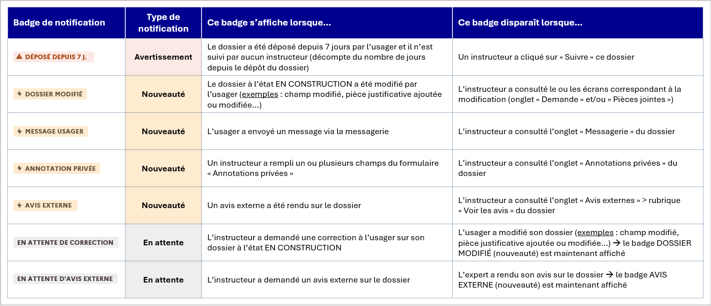

# Tutoriel instructeur

Ce tutoriel détaille les étapes d’instruction d'un dossier sur demarches-simplifiees.fr par un instructeur.

**Télécharger la version papier du tutoriel**

## Version vidéo

Attention : nous apportons continuellement des améliorations à demarches-simplifiees.fr. De ce fait, la vidéo ci-dessous n'est pas nécessairement à jour contrairement à la documentation écrite qui suit.



**Webinaire :**&#x20;

Participez à nos webinaires dédiés aux instructeurs, organisés chaque troisième mardi du mois, pour vous former et poser toutes vos questions.

## Qu'est-ce qu'un instructeur ?

Un instructeur est une personne nommée par un administrateur afin de prendre en charge le traitement et l'instruction des dossiers d'une démarche administrative.&#x20;

L'instructeur a accès au contenu des dossiers de la démarche sur laquelle il a été nommé (champs renseignés, pièces justificatives, messagerie). Il dispose des droits pour statuer sur le dossier (acceptation, classement sans suite, refus) et peut inviter un tiers à consulter un dossier afin d'émettre un avis sur celui-ci si l'administrateur de la démarche le permet.&#x20;

## 1. Se connecter à demarches-simplifiees.fr

* **Réception du message d’invitation à devenir instructeur sur une procédure :**&#x20;

**Les instructeurs doivent obligatoirement être affectés à une démarche par les administrateurs.**&#x20;

Un instructeur nommé pour la première fois par un administrateur pour suivre une procédure reçoit une invitation par e-mail :&#x20;

Ce lien renvoie à la page suivante :

Cette page permet à l'instructeur de définir le mot de passe qui sera associé à son compte, et qu'il utilisera ultérieurement pour se connecter à demarches-simplifiees.fr.

Si vous devez confirmer votre compte à chaque connexion, veuillez consulter la [page dédiée](https://faq.demarches-simplifiees.fr/article/63-je-dois-confirmer-mon-compte-a-chaque-connexion).

## 2. Le tableau de suivi des procédures

### A. Personnaliser l'ordre des démarches et accès direct à une démarche&#x20;

Le tableau de suivi des démarches permet à l’instructeur d’avoir une vue d’ensemble des procédures pour lesquelles il a été nommé. Le nom de la démarche, son numéro et des compteurs de dossiers y figurent.&#x20;

Les démarches sont classées dans plusieurs onglets : les démarches publiées, en test et closes.&#x20;

Vous avez la possibilité de personnaliser l'ordre d'affichage des démarches . Pour cela, il suffit de cliquer sur le bouton " personnaliser l'ordre" :&#x20;

<figure><figcaption>
La liste des démarches en tant qu'instructeur 
</figcaption></figure>

Vous pourrez alors déplacer les démarches dans la liste pour les classer en fonction de vos préférences comme ci-dessous :&#x20;

<figure><figcaption>
Personnalisation de l'ordre des démarches
</figcaption></figure>

Pour accéder directement, il est désormais possible de sélectionner la démarche concernée depuis la barre de recherche " accès direct" située à droite de votre interface instructeur :&#x20;

<figure><figcaption>
Accès direct à une démarche 
</figcaption></figure>

### B. Le suivi des dossiers&#x20;

Cliquer sur le nom d'une des procédures permet d'accéder au détail de celle-ci. Par défaut la procédure s’ouvre sur les dossiers « à suivre ». Vous pouvez continuer d'instruire une démarche même si elle est close. Seul le dépôt de nouveau dossier ne sera plus possible sur cette démarche close.&#x20;

Les dossiers sont classés selon leur stade de traitement : à suivre, suivi par moi, traités, au total, expirants, à archiver et supprimés.

<figure><figcaption>
tableau de suivi des dossiers
</figcaption></figure>

Ces différents stades de traitement correspondent à :

* **à suivre** : onglet contenant l'ensemble des dossiers qui ne sont suivis par aucun instructeur. Pour s'assigner le dossier, il suffit de cliquer sur "suivre le dossier".
* **Suivi par moi** : onglet listant seulement les dossiers suivis par l'instructeur connecté. Lorsque vous suivez un dossier, le dossier n'apparaît plus dans les dossiers à suivre pour les autres instructeurs assignés à la démarche. Il faudra qu'ils aillent dans l'onglet "au total" pour retrouver ce dossier.
* **Traités** : dossiers sur lesquels un ou plusieurs instructeurs ont statué et apporté une décision.&#x20;
* **Au total :** contient l'ensemble des dossiers déposés sur cette démarche, quel que soit leur statut (« à suivre », « suivis par moi », « traités »). Si les dossiers sont routés dans des groupes instructeurs, vous ne trouverez dans cet onglet que les dossiers du (des) groupe(s) dont vous faites partie.
* **Expirants :** contient les dossiers dont le délai de conservation va bientôt expirer (la durée de conservation des dossiers est fixée par l'administrateur de la démarche).
* **A archiver :** contient les dossiers qui étaient anciennement dans l’onglet « traités » (ils ont été déplacés par un instructeur dans cet onglet « à archiver »). La messagerie usager est automatiquement désactivée sur le dossier dès qu’il est « à archiver ». Ces dossiers seront supprimés lorsque leur délai de conservation dans demarches-simplifiees.fr sera expiré. Pour sauvegarder et archiver vos dossiers sur votre serveur, vous devez les télécharger.
* **Corbeille :** cet onglet contient :\
  \- les dossiers dont le délai de conservation a expiré (la durée de conservation des dossiers est fixée par l'administrateur de la démarche).\
  \- les dossiers « traités » qui ont été mis à la corbeille par les instructeurs.\
  À partir de la date à laquelle les dossiers ont été mis dans la corbeille, vous disposez d’un délai de 7 jours pour les télécharger / restaurer / étendre leur durée de conservation d’un mois. Passé ce délai, ces dossiers seront supprimés définitivement.

### **C. Personnaliser le tableau de suivi des dossiers**&#x20;

Le tableau de suivi des dossiers est paramétrable afin de modifier ou d’ajouter des colonnes faisant figurer des champs relatifs à la procédure. La personnalisation du tableau de bord vous permet de prendre connaissance des informations avant d'accéder au dossier.&#x20;

Pour cela, cliquez sur le bouton «  Personnaliser » situé en haut à droite,  puis cliquez sur le champ de recherche et sélectionner le champ souhaité ; enfin cliquez sur le bouton « Enregistrer » comme suit :&#x20;

<figure><figcaption>
Personnalisation du tableau de bord instructeur 
</figcaption></figure>

Un champ peut être retiré du tableau de suivi : cliquez de nouveau sur « Personnaliser » puis retirez le champ en cliquant sur la croix figurant sur le libellé du champ en question puis sur le bouton « Enregistrer ».&#x20;

<figure><figcaption>
Retrait d'un champ
</figcaption></figure>

Si vous retirez toutes les colonnes depuis le bouton « Personnaliser », seuls les numéros des dossiers seront affichés en plus du statut de ceux-ci.&#x20;

Vous pouvez sélectionner tout type de champ pour la personnalisation de votre tableau de bord notamment des annotations privées et le champ oui/non de l'avis expert. Cela peut vous être utile dans l'instruction de vos dossiers.&#x20;

### D. Filtrer les dossiers

Il est possible de filtrer les dossiers à l'aide des champs présents dans la procédure pour n'afficher que ceux qui vous intéressent.

Pour cela, il faut cliquer sur le bouton « sélectionner un filtre », situé en haut à gauche,  sélectionner la colonne souhaitée, puis une valeur associée à ce champ et cliquer sur le bouton « Ajouter le filtre ». Vous aurez alors accès à l'ensemble des champs du formulaire pour filtrer les dossiers:&#x20;

<figure><figcaption>
Filtrer l'affichage du tableau de bord 
</figcaption></figure>

&#x20;Sélectionnez la colonne voulue, puis saisissez une valeur et cliquez sur le bouton « Ajouter le filtre » comme suit :

<figure><figcaption>
Exemple de filtre en tant qu'instructeur 
</figcaption></figure>

<figure><figcaption>
Affichage du tableau de bord avec un filtre de date de création du dossier 
</figcaption></figure>

### **E. Trier les dossiers**&#x20;

Il possible de trier les dossiers par ordre alphabétique et/ou numérique en cliquant sur la colonne souhaitée, en plus des options de filtre et de personnalisation sus-mentionnés.

Dans l'exemple suivant, vous pouvez afficher grâce au filtre "personnaliser le tableau" le "nom" du demandeur, son "prénom" et la date de dépôt du dossier. Si vous cliquez sur une des colonnes, vous ferez apparaître les dossiers par ordre (soit alphabétique si vous cliquez sur "nom", soit chronologique si vous cliquez sur "déposé le", etc)

<figure><figcaption>
Affichage avec tri par défaut
</figcaption></figure>

En cliquant sur la colonne "Nom", "Prénom" ou "Déposé le", l'affichage est modifié : dans cet exemple, nous avons cliqué sur "date de dépôt" pour faire apparaître les dossiers par ordre chronologique de dépôt de dossier.&#x20;

<figure><figcaption></figcaption></figure>

En cliquant de nouveau sur la même colonne, le tri est effectué en sens inverse.

### **F. Suivre un dossier**

Les dossiers déposés sont regroupés par défaut sous le statut « suivis par moi ».

Un dossier à suivre a le statut « en construction ». Il est consultable et modifiable par l’usager.

Pour suivre un dossier, cliquez sur le bouton « Suivre ». Le dossier est alors automatiquement transféré dans les dossiers avec le statut « suivi ».

<figure><figcaption></figcaption></figure>

Suivre un dossier signifie s’attribuer le traitement de celui-ci et permet de le sortir de la liste de tous les dossiers à suivre.&#x20;

En suivant un dossier, l'instructeur sera alors notifié _via_ une pastille rouge sur le dossier, si ce dernier a été modifié par l'usager, si l'usager a écrit un nouveau message ou encore si un avis a été rendu. Il est donc important que chaque dossier instruit soit suivi par au moins un instructeur afin que le service instructeur soit alerté en cas de changement concernant le dossier.&#x20;

<figure><figcaption></figcaption></figure>

Plusieurs instructeurs peuvent suivre le même dossier. Pour cela, les instructeurs peuvent rechercher le dossier depuis l'onglet " au total" ou se transférer le dossier depuis l'onglet "personnes impliquées" du dossier.&#x20;

## 3. Instruire un dossier

### A. Présentation des onglets

L’instructeur a accès à un ensemble de fonctionnalités :

#### _-_ Demande :

Cet onglet est un récapitulatif du dossier qui permet notamment d'identifier le demandeur et affiche les champs du formulaire tels que remplis par l’usager.

<figure><figcaption>
Onglet "demande" récapitulatif du dossier, en tant qu'instructeur 
</figcaption></figure>

#### &#x20;- Annotations privées :

Équivalent au cadre réservé à l’administration sur les formulaires papiers, il permet à l’instructeur de saisir les informations demandées par l’administration pour le suivi du traitement des dossiers.

Ce cadre est strictement réservé aux instructeurs. Il n’est visible ni par les usagers ni par les personnes invitées à consulter le dossier.

Les annotations sont automatiquement enregistrées.&#x20;

<figure><figcaption></figcaption></figure>

**Il est possible qu’il ne figure aucune annotation privée à remplir si la procédure n'en prévoit pas**. C'est à l'administrateur de la démarche de paramétrer les annotations privées.&#x20;

<figure><figcaption>
Cas de figure "aucune annotation privée", en tant qu'instructeur 
</figcaption></figure>

#### _- Avis externes :_&#x20;

Cette fonctionnalité permet à l’instructeur d’inviter un tiers dit « expert » à rendre un avis sur le dossier.

L'instructeur à l'origine de l'invitation doit renseigner au moins une adresse e-mail. Chaque adresse correspond à un expert invité par e-mail à formuler un avis sur le dossier en question.

<figure><figcaption></figcaption></figure>

Il est également possible de poser une question à un expert qui devra répondre par "oui" ou "non". Ce champ est pratique puisqu'une fois que l'expert a formulé un avis et répondu à cette question, vous pourrez faire apparaître ce champ dans le tableau de bord et donc instruire les dossiers plus rapidement.&#x20;

Vous pouvez aussi joindre une pièce jointe à la demande d'avis à l'expert et faire le choix de partager l'avis avec les autres experts ou le rendre confidentiel.&#x20;

### L'ajout d'experts à une démarche&#x20;

Seul l'administrateur de la démarche peut gérer les experts d'une démarche. Pour ce faire, il dispose de trois fonctionnalités. Pour en savoir plus, nous vous invitons à consulter notre page consacrée à la gestion des experts invités par l'administrateur d'une démarche en cliquant [ici](https://doc.demarches-simplifiees.fr/tutoriels/tutoriel-administrateur#12-la-gestion-des-avis-experts-invites-de-votre-demarche). &#x20;

Ainsi, selon le choix de gestion des experts par l'administrateur de la démarche, plusieurs cas d'usage sont envisageables pour les instructeurs :&#x20;

&#x20;    **1. La liberté de solliciter des experts invités**&#x20;

* Premier cas d'usage : lorsque l'administrateur de la démarche a accordé le droit aux instructeurs de solliciter l'avis d'experts invités, ce dernier peut également faire le choix de laisser aux instructeurs la liberté de solliciter des experts invités de leur choix afin qu'après notification, ils émettent un avis sur un dossier. \

* Ainsi, les instructeurs de la démarche devront **entrer une à une les adresses email des experts invités sollicités à émettre un avis.** Et ensuit&#x65;**, cliquer sur les adresses email** afin que le choix des experts invités soit bien pris en compte dans la démarche comme l'illustre la capture d'écran ci- dessous :&#x20;

<figure><figcaption></figcaption></figure>

&#x20;       **2. Le choix de solliciter un expert parmi une liste prédéfinie par l'administrateur**&#x20;

* Deuxième cas d'usage : les administrateurs de la démarche peuvent également faire le choix d'opter pour la nouvelle fonctionnalité relative à la gestion des experts invités en définissant, désormais, à l'avance une liste d'experts invités. Pour en savoir plus concernant la gestion des avis experts invités par l'administrateur d'une démarche, nous vous invitons à consulter notre page consacrée au tutoriel « administrateur » en cliquant [ici](https://doc.demarches-simplifiees.fr/tutoriels/tutoriel-administrateur#12-la-gestion-des-avis-experts-invites-de-votre-demarche). \

* Dès lors, les instructeurs de la démarche **pourront uniquement inviter et demander l'avis des experts prédéfinis au sein de la liste.** &#x20;

<figure><figcaption></figcaption></figure>

* L'instructeur de la démarche devra alors **cliquer une à une sur les adresses e-mail des experts** sollicités à émettre un avis parmi la liste prédéfinie par l'administrateur.

### Message et option de visibilité de l'avis renseigné :&#x20;

* Une fois l'adresse e-mail des experts de la liste ajoutée, la fonctionnalité « avis externe » permet également à l'instructeur de personnaliser le message adressé à l'expert. En ce sens, **l'instructeur a la possibilité de partager une pièce justificative à l'expert** afin de l'aider à rendre son avis . \

* De plus, l**es avis externes ne sont pas visibles par l'usager**.\

* En revanche, l'instructeur peut choisir **si l'avis sera confidentiel** (visible uniquement par les instructeurs) **ou partagé avec les autres experts invités**, en cliquant sur le menu déroulant situé à droite de la mention « Cet avis sera », comme suit:&#x20;

<figure><figcaption></figcaption></figure>

* Une fois l'adresse e-mail, le message et l'option de visibilité de l'avis renseigné, **cliquer sur le bouton «** **Demander un avis** **»** situé en bas de l'écran afin d'envoyer une invitation par e-mail à l'expert.&#x20;


INFORMATION : le nombre d'avis que l'instructeur peut demander est illimité.


L'instructeur a la possibilité de relancer l'expert ou de révoquer la demande d'avis.&#x20;

<figure><figcaption>
Relancer l'expert ou révoquer la demande d'avis 
</figcaption></figure>

#### _- Messagerie :_&#x20;

La messagerie permet à l’instructeur d’échanger directement avec l’usager par messages sur le dossier afin de faciliter son instruction. Le fil de messagerie permet de garder l’historique des échanges avec l’usager de manière centralisée.

Pour envoyer un message à l’usager : taper le contenu du message puis cliquer sur le bouton «Envoyer».

Pour envoyer une pièce jointe à l’usager : cliquer sur le bouton « Parcourir », sélectionner un fichier puis cliquer sur le bouton « Envoyer le message ».&#x20;

Une pièce jointe ne peut pas être envoyée seule, il est nécessaire de taper un texte dans le corps du message.

La capacité maximale d’envoi de pièce jointe est de 20 Mo par pièce envoyée.


ATTENTION : si vous commencez à saisir un message, ne quittez pas la page en cours car le brouillon du message ne sera pas sauvegardé.&#x20;


<figure><figcaption>
Messagerie du dossier en tant qu'instructeur 
</figcaption></figure>

#### _- Personnes impliquées :_

Cet onglet fait office de récapitulatif de l'ensemble des personnes contribuant au traitement du dossier. Depuis cet onglet, il est également possible d'envoyer le dossier à un autre instructeur qui a été au préalable nommé sur la procédure. Celui-ci suivra alors automatiquement le dossier concerné et recevra également un e-mail lui indiquant que le dossier lui a été transmis.

Cet onglet contient également:&#x20;

* La liste des instructeurs qui suivent le dossier&#x20;
* Les personnes à qui un avis a été demandé (demande d'avis aux experts)
* Les personnes invitées par l'usager à co-construire ou modifier le dossier
* Les "décisions rendues" récapitulent l'ensemble des changements de statut du dossiers (du dépôt du dossier à son instruction) avec les dates et heures de ces modifications.&#x20;

<figure><figcaption>
Liste des personnes impliquées en tant qu'instructeur 
</figcaption></figure>

* Dans le cadre d'une démarche avec du routage, l'onglet "Réaffectations" vous permet de suivre si le dossier a été réaffecté et de le transférer à un autre groupe instructeur. Cela peut être pratique lorsque l'usager dépose son dossier sur le mauvais groupe instructeur pour le re-router vers le bon groupe.&#x20;

<figure><figcaption>
Liste des personnes impliquées dans la vue instructeur
</figcaption></figure>

### B. Premières étapes : construction et instruction du dossier

#### - _Dossier en construction_

Une fois un dossier déposé par un usager, ce dossier est au stade « En construction ». Le statut du dossier est notifié en haut à gauche de votre écran :&#x20;

<figure><figcaption></figcaption></figure>

Un dossier « en construction » reste modifiable par l'usager. Ce stade permet à l'instructeur de s'assurer de la complétude du dossier. En cas d'information manquante, l'instructeur peut les réclamer à l'usager grâce à la messagerie ou depuis le bouton "demande une correction" afin que mieux suivre les demandes de modifications depuis le tableau de suivi des dossiers.&#x20;

#### _- Passer le dossier en instruction :_

Une fois le dossier complet, il convient de passer ce dossier au statut « En instruction » afin d'empêcher toute nouvelle modification par l'usage&#x72;_._ Pour cela, cliquez sur le bouton « En construction » en haut à droite de l’écran puis cliquez sur le bouton « Passer en instruction ».&#x20;

<figure><figcaption></figcaption></figure>

L’instructeur peut à tout moment passer un dossier en « construction » en « Instruction ».&#x20;

Un dossier en instruction n’est plus modifiable par l’usager. Si l'usager doit apporter des modifications sur un dossier en instruction, il faudra que l'instructeur repasse le dossier en construction.&#x20;

Un message automatique est envoyé à l’usager au moment du passage en instruction afin de l’avertir qu’il ne peut plus modifier son dossier.

Toutefois, les échanges de messages et de documents entre l’instructeur et l’usager restent possibles à travers la messagerie.

Par ailleurs, pour le moment,  les dossiers en instruction n'expirent pas.&#x20;

#### _- Repasser le dossier en "instruction" au statut en "construction" :_

Il est possible pour l’instructeur de repasser le dossier en construction (après l'avoir passé en instruction) afin de permettre à l’usager de modifier ou compléter son dossier.

Cliquez sur le bouton « Repasser en construction » en haut à droite de l’écran. L’instructeur est alors invité à confirmer son choix de repassage en construction en cliquant sur le bouton bleu « Valider et repasser en construction ».

<figure><figcaption></figcaption></figure>

_**- Demande de correction d'un dossier :**_&#x20;

L'instructeur a la possibilité de demander à l'usager d'apporter des corrections à son dossier.&#x20;

Pour cela, lorsque vous êtes dans l'onglet "demande" qui permet de consulter le dossier, il faut cliquer sur "Repasser en construction" puis renseigner l'encart "Demander une correction" en expliquant clairement à l'usager les modifications attendues sur le dossier.&#x20;

Demander une correction basculera automatiquement le dossier "en construction".&#x20;

<figure><figcaption>
Demande de correction à l'usager 
</figcaption></figure>

Une fois que la demande de correction a été demandée sur le dossier, la mention "en attente" s'affiche sur le dossier.&#x20;

<figure><figcaption>
Dossier en attente de correction 
</figcaption></figure>

Cette mention s'affiche également dans le tableau de bord ce qui permet de distinguer plus facilement les dossiers complets des dossiers en attente de modification :&#x20;

<figure><figcaption>
Dossier en attente de correction depuis le tableau de suivi des dossiers en tant qu'instructeur 
</figcaption></figure>

### C. Prendre une décision sur le dossier

Lors du traitement des dossiers, l'instructeur peut choisir d'instruire les dossiers un à un ou bien d'instruire les dossiers **en masse (voir point 4)**.&#x20;

L’instruction du dossier peut aboutir à trois décisions :&#x20;

* Accepter
* Classer sans suite
* Refuser

Dans les trois cas, la décision peut être motivée par le biais d'un encart spécial : ce motif est optionnel en cas d'acceptation, mais est obligatoire dans les deux autres cas. Celui-ci peut par ailleurs apparaître ou non dans les e-mails reçus par l'usager ou sur l'attestation en fonction des paramètres retenus par l'administrateur de la procédure.&#x20;

Par ailleurs il est également possible de joindre un justificatif à la décision lequel sera reçu par l'usager sur la boite e-mail associée à son compte.&#x20;

#### a. Accepter le dossier

Cliquez sur le bouton « instruire le dossier » en haut à droite de l’écran puis cliquer sur le bouton « Accepter ». L’instructeur peut alors rédiger une motivation dans l'encart dédié qui sera consultable par l’usager dans son dossier après acceptation. Dans le cas d'une acceptation, cette motivation reste optionnelle.&#x20;

L'instructeur a également la possibilité de transmettre une pièce jointe au moment de l'acceptation du dossier et de prévisualiser l'attestation automatique d'acceptation, (uniquement si celle-ci a été paramétrée par l'administrateur de la démarche).&#x20;

<figure><figcaption></figcaption></figure>

Cliquez ensuite sur le bouton « Valider la décision ». Confirmez le choix de validation en cliquant sur le bouton « OK » comme suit :

<figure><figcaption></figcaption></figure>

Un message automatique est envoyé à l’usager afin de le notifier de l’acceptation de son dossier. La motivation est consultable par l'usager sur son dossier. Elle peut aussi être envoyée dans le corps du message automatique si le message a été paramétré ainsi par l'administrateur.

Le dossier passe automatiquement dans l’onglet des dossiers traités.

#### b. Classer sans suite le dossier

Cliquez sur le bouton « En instruction » en haut à droite de l’écran puis cliquer sur le bouton « Classer sans suite ». L’instructeur doit alors remplir une motivation qui sera consultable par l’usager dans son dossier après classement sans suite. Cliquez sur le bouton « Valider la décision ». Confirmez le choix de validation en cliquant sur le bouton « OK» .

<figure><figcaption>
Classement sans suite d'un dossier
</figcaption></figure>

Un message de notification est envoyé à l’usager. Le dossier passe automatiquement dans l’onglet des dossiers traités.

#### c. Refuser le dossier

Cliquez sur le bouton « En instruction » en haut à droite de l’écran puis cliquer sur le bouton « Refuser ». L’instructeur doit alors rédiger une motivation qui sera consultable par l’usager dans son dossier après acceptation. Cliquez sur le bouton « Valider la décision ». Confirmez le choix de validation en cliquant sur le bouton « OK ».

<figure><figcaption>
Refuser un dossier en tant qu'instructeur
</figcaption></figure>

Un message automatique est envoyé à l’usager afin de le notifier du refus de son dossier. La motivation est consultable par l'usager sur son dossier. Elle peut aussi être envoyée dans le corps du message automatique si le message a été paramétré ainsi par l'administrateur.

Le dossier passe automatiquement dans l’onglet des dossiers traités.

Quelle que soit la décision du dossier, l'instructeur a la possibilité de joindre une pièce jointe à la décision en cliquant sur "ajouter un justificatif".&#x20;

#### d. Repasser un dossier en instruction&#x20;

Une fois la décision prise, si celle-ci a été prise par erreur ou si l'instructeur souhaite revenir sur sa décision, il est possible de repasser le dossier en instruction.

Cliquez sur le bouton relatif au statut du dossier (Accepté, Classé sans suite ou Refusé) en haut à droite de l’écran puis cliquez sur le bouton « Repasser en instruction».


**ATTENTION** : l'acceptation d'un dossier est une action créatrice de droits. Revenir sur cette décision dans un **délai supérieur à 4 mois** après l'avoir prise peut vous exposer à des risques de poursuites de la part de l'usager.&#x20;


#### e. Archiver un dossier

Cette fonctionnalité permet à l’instructeur d’avoir une vision plus claire du suivi des dossiers. Le fait d'archiver un dossier désactive la messagerie de celui-ci. Vous ne recevrez également plus de notifications le concernant. Les dossiers restent toutefois consultables par l'instructeur.

Dans l’onglet « traité », cliquez sur le bouton « Archiver le dossier ». Le dossier est automatiquement transféré dans l’onglet « archivé ».

<figure><figcaption>
Archiver un dossier depuis la vue instructeur
</figcaption></figure>

Il est possible de repasser le dossier dans l’onglet « traité ».  Il suffit de cliquer sur l'onglet « archivé » puis sur le bouton "Désarchiver le dossier ». Le dossier est alors automatiquement transféré dans l’onglet « traité ».

<figure><figcaption>
Désarchiver un dossier depuis le tableau de bord instructeur
</figcaption></figure>

## 4. Instruction en masse des dossiers

**a. Suivre les dossiers "en masse" :**&#x20;

Pour pouvoir instruire les dossiers en masse, vous devez d'abord suivre ces dossiers. Pour cela, vous devez cocher les cases correspondants aux dossiers que vous souhaitez instruire. Pour sélectionner tous les dossiers, vous devez cliquer sur la case en haut à gauche comme suit:&#x20;

<figure><figcaption>
Suivi en masse des dossiers
</figcaption></figure>

Une fois que vous aurez coché sur les cases des dossiers que vous souhaitez instruire, le bouton bleu qui vous permet de "suivre les dossiers" s'affichera. Il vous suffira de cliquer dessus pour réaliser l'action de suivi des dossiers:&#x20;

<figure><figcaption>
Suivi des dossiers en masse
</figcaption></figure>

Un message s'affichera pour confirmer l'action de masse réalisée. Cliquez sur "ok" pour valider l'action. Les dossiers seront automatiquement transférés vers l'onglet des dossiers "suivis".&#x20;

<figure><figcaption>
Confirmation de l'action de masse
</figcaption></figure>

Dans l'onglet des dossiers suivis, un message vous informe lorsque "L'action de masse est terminée" :

<figure><figcaption>
L'action de masse est terminée
</figcaption></figure>

Vous pouvez dès lors procéder au passage en instruction en masse des dossiers.&#x20;

**b. Passage en instruction en masse des dossiers**

Sur le même principe que l'action de suivi des dossiers, il vous suffit de cocher les cases des dossiers que vous souhaitez passer en instruction puis cliquer sur le bouton "Passer en instruction". Un message de confirmation s'affichera pour valider l'action.&#x20;

<figure><figcaption>
Passage des dossiers en instruction
</figcaption></figure>

c. Prise de la décision des dossiers en masse:&#x20;

Quelle que soit la décision (acceptation, classement sans suite ou refus des dossiers), le processus est le même.&#x20;

Dans l'onglet des dossiers suivis, l'instructeur doit cocher la case tout en haut pour sélectionner tous les dossiers, ou bien les cases correspondants aux dossiers qu'il souhaite instruire. Puis, il doit cliquer sur le bouton bleu "instruire les dossiers" et sélectionner la décision souhaitée entre "Accepter les dossiers", "Refuser les dossiers" ou bien "Classer sans suite les dossiers".&#x20;

A savoir que le motif de la décision pour les dossiers acceptés est optionnel, il est en revanche **obligatoire** pour les dossiers refusés et classés sans suite.&#x20;

<figure><figcaption></figcaption></figure>

**Le motif renseigné sera le même pour tous les dossiers sélectionnés puisqu'il s'agit d'une action en masse**. L'usager sera notifié par email du motif de la décision.&#x20;

Un justification optionnel peut aussi être envoyé en masse à tous les dossiers sélectionnés.&#x20;

<figure><figcaption>
Motif de la décision des dossiers 
</figcaption></figure>

Une fois la décision "de masse", le bandeau suivant apparaîtra vous informant qu'une action de masse est en cours:&#x20;

<figure><figcaption>
Instruction en masse des dossiers
</figcaption></figure>


A noter : Les actions de masse peuvent prendre un certain temps en fonction du nombre de dossiers sélectionnés. Il se peut que vous deviez recharger la page pour que l'action soit effectuée.&#x20;


Lorsque l'action de masse est effectuée, vous retrouverez les dossiers qui ont été instruits dans l'onglet des dossiers "traités": un bandeau vert vous informe que l'action de masse d'instruction des dossiers est terminée.&#x20;

<figure><figcaption>
Action de masse terminée dans l'onglet des dossiers suivis 
</figcaption></figure>

d. Archivage des dossiers en masse

Sur le même principe expliqué précedemment, il est possible d'archiver les dossiers en masse depuis l'onglet des dossiers "traités". Il suffit de cocher la case en haut à gauche pour sélectionner tous les dossiers ou bien cocher chacun des dossiers à archiver. Seuls les dossiers qui ont été traités peuvent être archivés.&#x20;

<figure><figcaption>
Archivage des dossiers en masse
</figcaption></figure>

Une fois les dossiers archivés, vous les retrouverez dans l'onglet des dossiers "archivés". La messagerie sera automatiquement désactivée pour ces dossiers. Vous pouvez désarchiver les dossiers, pour cela, il suffit de cliquer sur "désarchiver le dossier".&#x20;

## 5. Récapitulatif de l'activité - extraire les dossiers

### A. Extraire les dossiers

L’ensemble des dossiers est téléchargeable sous la forme d'un tableur récapitulatif aux formats .csv, .xlsx, .ods ou .zip. Les dossiers peuvent être téléchargés, quel que soit leur statut.&#x20;

Cliquez sur le bouton « Télécharger tous les dossiers » situé en haut à droite de votre écran. Un menu déroulant s'affiche alors pour proposer un export selon le format souhaité :

* demander un export au format .xlsx : un fichier excel sera généré avec l'ensemble des champs du formulaire, des annotations privées et des avis de l'expert.&#x20;
* demander un export au format .csv (uniquement les dossiers, sans les champs répétables)
* demander un export au format .ods : une feuille de calcul au format OpenDocument générée par OpenOffice.&#x20;
* demander un export au format .zip : il contient un fichier en pdf du dossier ainsi que toutes les pièces jointes associées au dossier. Il contient également l'attestation si le dossier a été paramétré avec une attestation.&#x20;


**ATTENTION** : Veillez à désactiver les extensions de blocage de publicités qui peuvent empêcher le téléchargement du fichier d'export.&#x20;


Cliquez sur le format souhaité afin de lancer la préparation du fichier d'extraction :

<figure><figcaption>
Télécharger tous les dossiers, en tant qu'instructeur
</figcaption></figure>

Vous devez ensuite cliquer sur l'icône pour générer le fichier comme suit:&#x20;

<figure><figcaption>
Téléchargement de l'export
</figcaption></figure>

Lorsque le libellé du bouton change (il passe de "Demander un export" à "Télécharger l'export"), vous pouvez télécharger votre fichier. Vous n'êtes pas obligé de rester sur cette page durant la génération du fichier tableur.

Un message s'affiche afin d'informer que le fichier est en cours de préparation.

<figure><figcaption>
Téléchargement des dossiers en cours 
</figcaption></figure>

Après quelques minutes , vous pouvez rafraîchir la page afin d'accéder au bouton de téléchargement.&#x20;

<figure><figcaption>
Téléchargement des dossiers prêt
</figcaption></figure>

Le temps de préparation du fichier d'export est variable selon le nombre de dossiers déposés.&#x20;

Le tableau d’extraction des dossiers contient autant de colonnes que de champs dans la procédure et présente un dossier par ligne, pour plus d'informations sur l'extraction des données, vous pouvez consultant la page dédiée en cliquant [ici](https://doc.demarches-simplifiees.fr/pour-aller-plus-loin/exports-de-donnees).

### B. Extraire les dossiers et les pièces jointes

Vous ne pouvez pas télécharger uniquement les pièces jointes associées aux dossiers. Vous devez télécharger l'ensemble du dossier en .zip pour avoir accès aux pièces jointes.&#x20;

Vous pouvez faire un export massif de l'ensemble des dossiers ou bien exporter dossier par dossier. Pour éviter une attente longue, nous vous conseillons d'exporter vos dossiers au fur et à mesure des dépôts.&#x20;

L'API vous permet également de télécharger les dossiers et les pièces jointes.&#x20;

### C. Personnaliser les exports

Vous avez la possibilité en tant qu’instructeur de personnaliser vos exports:&#x20;

Cela vous permet de générer une extraction des dossiers avec seulement les colonnes qui vous intéressent. Pour ce faire, il faut cliquer sur “Modèles d’export” sur l’onglet “téléchargements” de votre interface d’instruction.&#x20;

\

<figure><figcaption>
Onglet "Téléchargements"
</figcaption></figure>

A noter: Vos modèles d’export peuvent être partagés avec l'ensemble des instructeurs .&#x20;

<figure><figcaption>
Page "Modèles d'export"
</figcaption></figure>

Il vous suffit de remplir les champs et de sélectionner les colonnes souhaitées.&#x20;

<figure><figcaption>
Paramétrage du modèle d'export
</figcaption></figure>

<figure><figcaption></figcaption></figure>

\

<figure><figcaption></figcaption></figure>

<figure><figcaption></figcaption></figure>

\
Une fois l’ensemble des champs sélectionnés, l’export est créé et figure sur ma liste:&#x20;

<figure><figcaption>
Page des modèles d'export
</figcaption></figure>

Pour télécharger l’export, revenez à votre écran de gestion, cliquez sur “télécharger les dossiers” et sélectionnez “à partir d’un modèle”\

<figure><figcaption>
Téléchargement à partir d'un modèle
</figcaption></figure>

## 6. Autres paramètres

### A. Notifications sur les dossiers

**a. Les pastilles rouges**&#x20;

Tout événement sur un dossier génère une notification du côté de l’instructeur qui suit le dossier, afin de l’en avertir.

Une pastille rouge est alors affichée sur l’écran de suivi des dossier au niveau du ou des onglets contenant des dossiers avec notifications, dans l'exemple ci-après sur les onglets « suivis par moi » et « traités » :&#x20;

<figure><figcaption></figcaption></figure>

**b. Les badges de notifications**

Des badges de notifications sont affichés automatiquement pour signaler des événements sur les dossiers :&#x20;

<figure><figcaption>
Table des notifications
</figcaption></figure>

Les notifications de type **“Avertissement”** sont communes à tous les instructeurs du dossier considéré, qu’ils suivent ou non celui-ci.

Les notifications relatives aux **“Nouveautés”** ou de type **“En attente”** sont quant à elles propres à chaque instructeur qui suit le dossier. Elles viennent préciser ce à quoi correspond la pastille rouge présentée dans la partie précédente.

Ces badges de notifications sont visibles dans les écrans suivants :&#x20;

* dans la liste des dossiers, sous le numéro de dossier :&#x20;

<figure><figcaption>
Tableau de suivi des dossiers
</figcaption></figure>

* dans la vue détaillée d'un dossier, à côté de son état :&#x20;

<figure><figcaption>
Vue détaillée d'un dossier
</figcaption></figure>

**c. Filtrer les dossiers avec notifications**

Dans la liste des dossiers, vous pouvez filtrer les dossiers en fonction des badges de notifications. Pour cela, il faut cliquer sur le bouton « Sélectionner un filtre », situé en haut à gauche, sélectionner la colonne « Notifications sur le dossier », puis le badge de notification souhaité, et cliquer sur le bouton « Ajouter le filtre ».

<figure><figcaption>
Filtrer l'affichage des dossiers par type de notification
</figcaption></figure>

**d. Remonter les dossiers avec notifications**

Vous avez aussi la possibilité de faire remonter les dossiers avec une notification. Les dossiers remonteront en fonction de la date des dernières mises à jour apportées (dans le dossier, dans la messagerie, etc). Cela peut être utile lorsque les pastilles rouges sont effacées.&#x20;

<figure><figcaption>
Remonter les dossiers avec notifications
</figcaption></figure>

### **B. Les labels**

Les labels permettent aux admins et instructeurs d’étiqueter les dossiers pour mieux les identifier ou les organiser. Les couleurs disponibles permettre de s’y retrouver plus facilement. Les labels sont standards ou personnalisables.&#x20;

Ils sont configurables par l'administrateur de la démarche. Ce dernier a la possibilité de modifier les labels ou d’en créer un nouveau.&#x20;

En tant qu''instructeur, il vous suffit de rentrer dans le dossier en question et les labels seront affichés en haut à gauche du dossier comme ci-dessous:&#x20;

&#x20;

<figure><figcaption></figcaption></figure>

Pour ajouter ou modifier un label sur un dossier, vous devez cliquer sur le point à droite des labels pour les afficher:&#x20;

<figure><figcaption></figcaption></figure>

\
Vous pourrez ensuite rechercher plus facilement les dossiers depuis votre tableau de bord en utilisant le filtre dédié aux labels ou en personnalisant votre tableau de bord  instructeur comme ci-dessous:&#x20;

<figure><figcaption></figcaption></figure>

### C. Statistiques

Sur chaque procédure, l'instructeur a accès à des statistiques :

<figure><figcaption>
Statistiques de la démarche
</figcaption></figure>

Ces statistiques sont calculées à partir du temps effectif de traitement des dossiers. Elles permettent aux instructeurs d'avoir une vue d'ensemble sur la démarche et un suivi de l'instruction.&#x20;

Dans cet onglet "statistiques", vous trouverez les informations suivantes:&#x20;

* Le temps de traitement usuel de la démarche&#x20;
* 4 graphiques qui représentent respectivement: le temps de traitement des dossiers, l'avancée des dossiers, le taux d'acceptation et la répartition par semaine.&#x20;

Ces données ne peuvent être exportées. En revanche, elles sont publiques et peuvent donc être consultées à tout moment.&#x20;

### D. Récapitulatif de l'activité

L'instructeur est notifié par e-mail de l'activité sur chacune des procédures sur lesquelles il a été nommé. L'e-mail signale le dépôt de nouveaux dossiers et les changements effectués par les usagers sur les dossiers suivis.&#x20;

Toutefois, si la démarche est déclarative, cet e-mail n'est pas envoyé.&#x20;

Afin de paramétrer son choix de notification, l'instructeur a accès au bouton « gestion des notifications » depuis le tableau de bord de la démarche :

<figure><figcaption>
Onglet gestion des notifications 
</figcaption></figure>

Cinq types de notifications sont proposés, dont vous trouverez le détail ci-après : vous pouvez sélectionner"oui" ou par "non" en fonction de votre besoin :&#x20;

<figure><figcaption>
Gestion des notifications instructeur
</figcaption></figure>

Une fois les notifications paramétrées, vous devez cliquer sur le bouton "enregistrer" en bas de page :

<figure><figcaption>
Enregistrer les notifications
</figcaption></figure>

#### a. Notification à chaque dossier déposé

Cet e-mail vous signale le dépôt de chaque nouveau dossier. Si vous choisissez cette notification, un e-mail sera automatiquement envoyé pour vous informer qu'un usager a déposé un dossier.&#x20;

#### b. Notification à chaque message déposé

Cet e-mail vous signale le dépôt d'un nouveau message sur vos dossiers suivis. Il est envoyé à chaque fois qu'un usager dépose un message via la messagerie du dossier.

#### c. Notification quotidienne

En plus de la notification hebdomadaire, l'instructeur peut faire le choix d'une notification quotidienne afin de recevoir un récapitulatif des dossiers à instruire.&#x20;

Cet notification est envoyée du lundi au samedi vers 10h du matin.

#### d. Notification hebdomadaire

Un e-mail hebdomadaire est envoyé le lundi matin à l’instructeur afin de faire le bilan de l’activité d’une procédure sur la semaine. L'e-mail présente le récapitulatif de l'activité par procédures suivies.&#x20;

Cette notification permet d'informer _a minima_ l'instructeur du dépôt de dossiers sur la procédure si celui-ci ne se connecte qu'occasionnellement.

**e. Notification d'un avis rendu par un expert**&#x20;

Un e-mail est envoyé à l'instructeur lorsqu'un expert a rendu un avis sur un dossier.&#x20;
