# Tutoriel usager

Ce tutoriel détaille les étapes de dépôt d'un dossier sur demarches-simplifiees.fr par un usager.

## Version vidéo



## 1. Accéder à la procédure pour le dépôt d’un dossier sur demarches-simplifiees.fr

### **A. Accéder au lien vers la procédure**&#x20;

La page d'accueil de demarches-simplifiees.fr permet à l'usager de se connecter : elle ne permet pas de créer un compte, ni de rechercher une démarche.

 (1).png>)

Afin d'accéder à une démarche, et subséquemment à la possibilité de créer un compte, le service administratif compétent en charge de la démarche communique le lien vers celle-ci à ses administrés : le lien peut être public sur le site internet du service compétent, ou communiqué directement aux usagers par e-mail ou par le biais de flyers et autres moyens de communication.

Ce lien renvoie vers une page de connexion demarches-simplifiees.fr similaire à l'exemple ci-dessous :

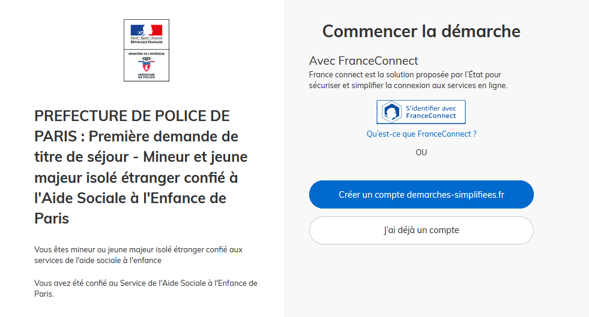

### **B. Se connecter à demarches-simplifiees.fr**&#x20;

Il existe 3 cas de connexion pour accéder à la procédure sur demarches-simplifiees.fr :

* **L’usager possède déjà un compte** sur demarches-simplifiees.fr : cliquer sur « Se connecter » puis renseigner l'e-mail et le mot de passe de connexion
* **L’usager ne possède pas de compte** et souhaite se connecter pour la première fois : entrer un e-mail, choisir un mot de passe et cliquer sur « se connecter ». En cas de doutes, rendez vous sur cette [page](https://www.demarches-simplifiees.fr/users/sign\_up)&#x20;
* **L’usager possède un compte France Connect** : cliquer sur le bouton « France Connect », choisir un compte de connexion en cliquant sur un des boutons (La Poste, Ameli, etc.), entrer les identifiants liés au compte sélectionné. La redirection vers demarches-simplifiees.fr est automatique.

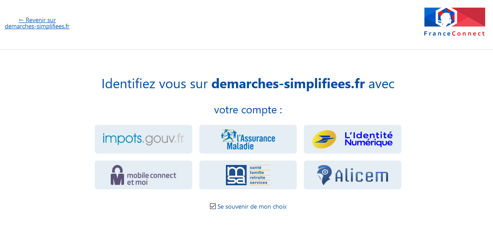

S'il s'agit d'une inscription, un lien vous sera envoyé par e-mail afin de valider votre inscription. Veillez à consulter les courriers indésirables, spams ou e-mails promotionnels vers lesquels l'e-mail de validation peut être redirigé automatiquement.

Par ailleurs, si vous ne recevez pas cet e-mail assurez-vous que votre entreprise n'utilise pas un filtre anti-spam qui empêcherait la réception de celui-ci.&#x20;

## 2. Déposer un dossier

### A. Page d'accueil de la démarche

Le formulaire peut viser deux types d'usagers :&#x20;

* Une entreprise ou organisme possédant un numéro SIRET
* Une personne physique

* Une entreprise ou un organisme possédant un numéro SIRET :

La première information demandée est le numéro SIRET permettant de récupérer des informations juridiques et financières auprès de l'INSEE et d'Infogreffe.

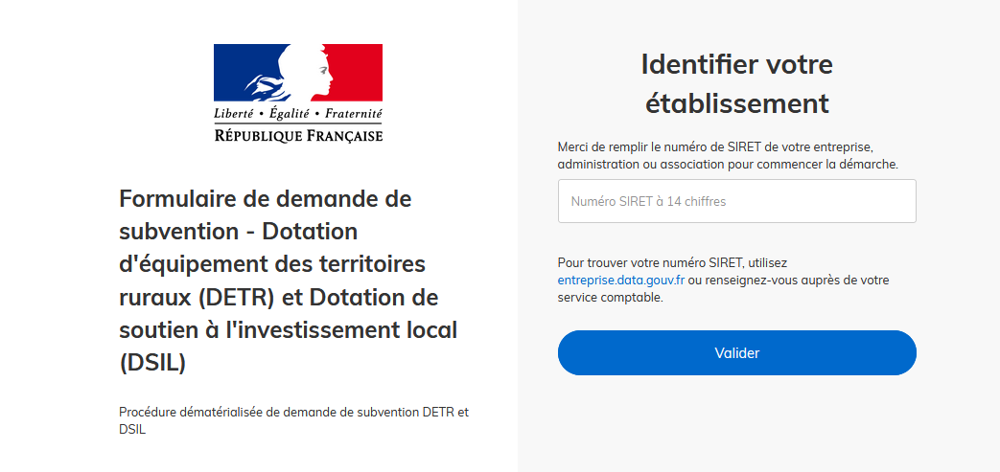

Après avoir indiqué le numéro SIRET et cliqué sur le bouton « Valider », un récapitulatif des informations récupérées s'affiche comme suit :

.PNG>)

Une fois les informations relatives à l'établissement vérifiées, cliquer sur le bouton "Continuer avec ces informations".  Vous êtes alors redirigé vers le formulaire.

* Une personne physique :

Les premières informations demandées sont la civilité, le nom et le prénom de l'usager. Une fois que vous avez cliqué sur "Continuer", vous êtes automatiquement redirigé vers le formulaire.

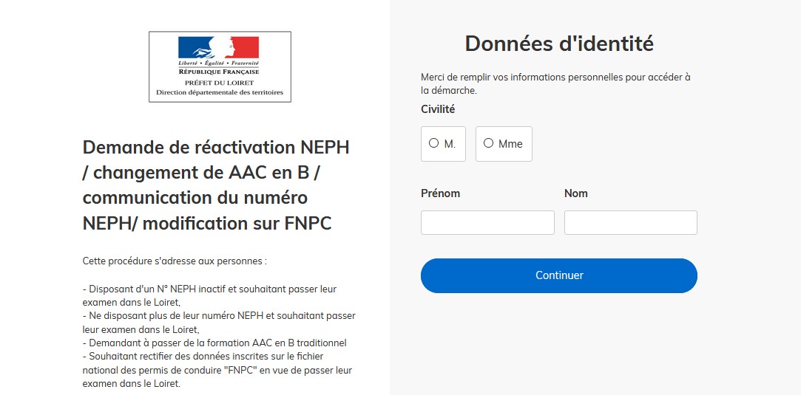

### **B. Remplir le formulaire**

#### Présentation des champs du formulaire


**ATTENTION** : les champs à côté desquels figure un astérisque sont obligatoires. Cela signifie que le dépôt du dossier est conditionné par le remplissage de ces champs.


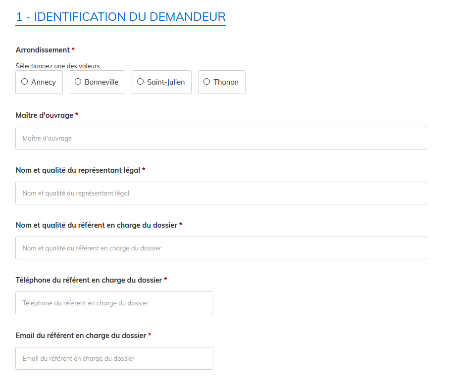

**Déposer un document en pièce-jointe**&#x20;

Le dépôt du dossier peut nécessiter l’ajout de pièces-jointes afin de fournir des documents justificatifs.

Pour chaque document demandé, cliquer sur parcourir, sélectionner un fichier puis cliquer sur "Ouvrir". Le nom du fichier sélectionné apparait à côté du bouton "Parcourir", la pièce est alors enregistrée.

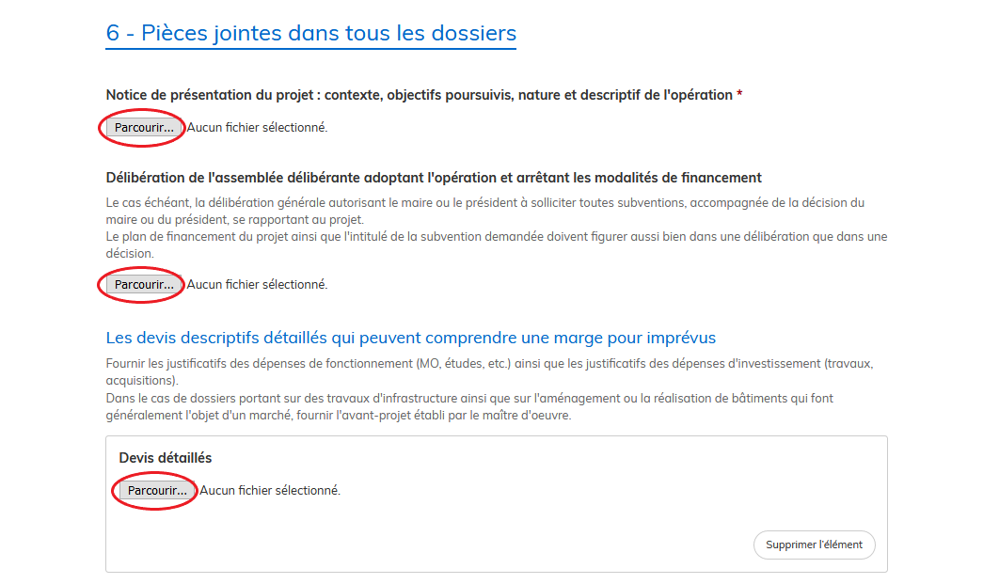

Le dépôt du dossier peut nécessiter de remplir un document vierge annexe au formulaire. Le document vierge est disponible dans la section « Pièces-jointes ». Cliquer sur le lien en bleu, télécharger le fichier, remplir le document puis l’ajouter en pièce-jointe dans le dossier demarches-simplifiees.fr.

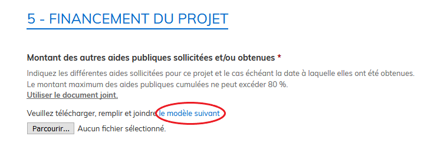

La capacité maximale d’ajout de pièce-jointe est de 20 Mo au total par enregistrement. Si l'ensemble des pièces-jointe dépasse 20 Mo au moment de cliquer sur le bouton « Enregistrer », ajouter les pièces jointes une par une et cliquer sur enregistrer à chaque ajout de pièce.

Formats de pièces-jointes acceptés : .pdf, .doc, .docx, .xls, .xlsx, .cvs, .ppt, .pptx, .odt, .ods, .odp, .jpg, .jpeg, .png

#### Co-construction du dossier : inviter une personne à modifier le dossier

Il est possible d'inviter un tiers à compléter ou à modifier un dossier.&#x20;

En accédant au dossier concerné, cliquer sur le bouton "Inviter une personne à modifier ce dossier" en haut à droite, saisir une adresse e-mail. Vous pouvez ajouter un message à votre destinataire. Enfin, cliquer sur le bouton « Envoyer une invitation ».&#x20;

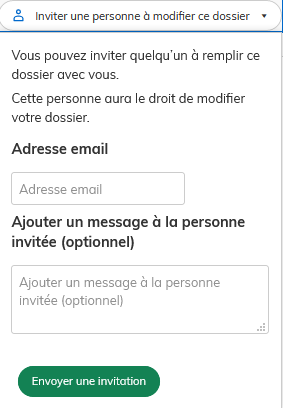

La personne invitée reçoit alors un e-mail l’invitant à se connecter sur demarches-simplifiees.fr afin d'accéder au dossier. Une fois connecté, l’invité a accès à l’ensemble du dossier et est libre de le modifier ou le compléter.&#x20;

Toutefois, l'invité ne peut pas déposer le dossier. Seul l'usager à l'origine du dossier dispose des droits pour déposer celui-ci.

### **C. Enregistrer le dossier en brouillon**

A tout moment le dossier peut être enregistré en brouillon. Le mode brouillon permet d’enregistrer les informations renseignées dans le formulaire sans que le dossier ne soit rendu visible par le service instructeur. Pour cela il suffit de cliquer sur le bouton "Enregistrer le brouillon", situé en bas à gauche de votre écran.

Le brouillon est accessible depuis votre espace personnel et peut être complété à tout moment.

Un message apparaît pour vous confirmer la sauvegarde de votre brouillon.&#x20;

### **D. Déposer le dossier**

Une fois le dossier complété, cliquer sur le bouton « Déposer le dossier » afin de le transmettre au service instructeur.

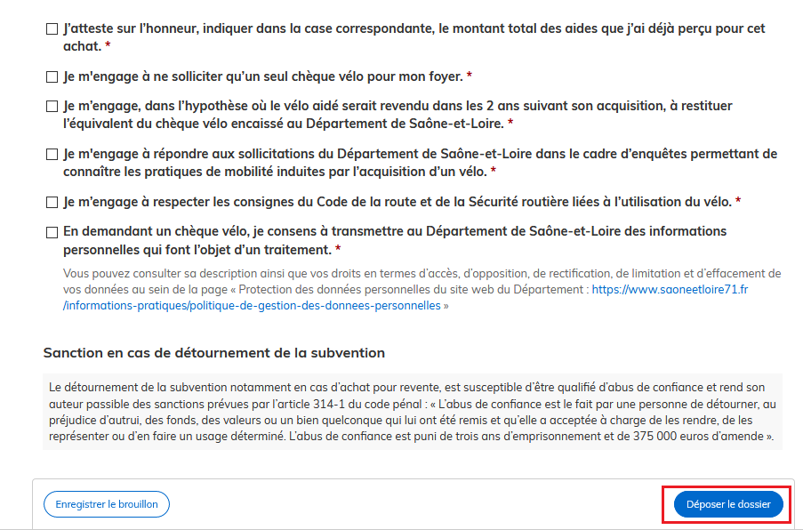

Le dossier passe alors du statut «brouillon» au statut « en construction ».&#x20;

Le statut "en construction" indique que le dossier est visible par l’administration mais reste modifiable par l'usager.

## 3. Accéder au suivi de mon dossier

### A. Présentation du tableau de bord

En se connectant avec son adresse e-mail et son mot de passe, l'usager a accès à l'onglet "Mes dossiers".

#### Mes dossiers

Cet onglet reprend toutes les démarchées effectuées par l'usager. Vous accédez ainsi à l'ensemble des dossiers, quelque soit leur statut (brouillon, en construction, déposé).

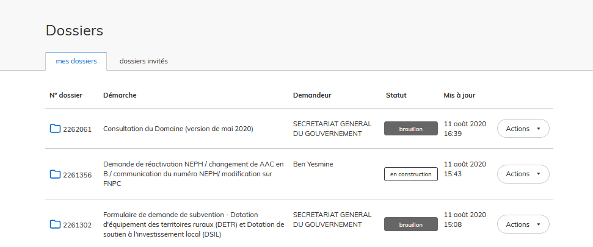

Les dossiers sont identifiés par un numéro et par l'intitulé de la démarche.

**Dossiers invités**

Cet onglet reprend les dossiers sur lesquels l'usager a été invité afin d'apporter des modifications ou de participer à la complétude du dossier :

.png>)

### B. Les différents statuts d'un dossier

#### Brouillon

Une fois la démarche effectuée par l'usager et le dossier enregistré, celui-ci est au statut de brouillon tant que l'usager ne l'a pas déposé.&#x20;

#### En construction

Une fois le dossier déposé par l'usager, son statut est "en construction". L'usager peut encore le modifier.

#### En instruction

Le dossier "en instruction" est pris en charge par le service compétent. Il ne peut plus être modifié par l'usager, mais est toujours consultable.

#### Accepté / Sans suite / Refusé

Le dossier prend l'un de ces statuts une fois que le service compétent a statué : la messagerie est alors désactivée.&#x20;

### C. Consultation d'un dossier

Afin d'accéder au détail d'un dossier, cliquer sur celui-ci :

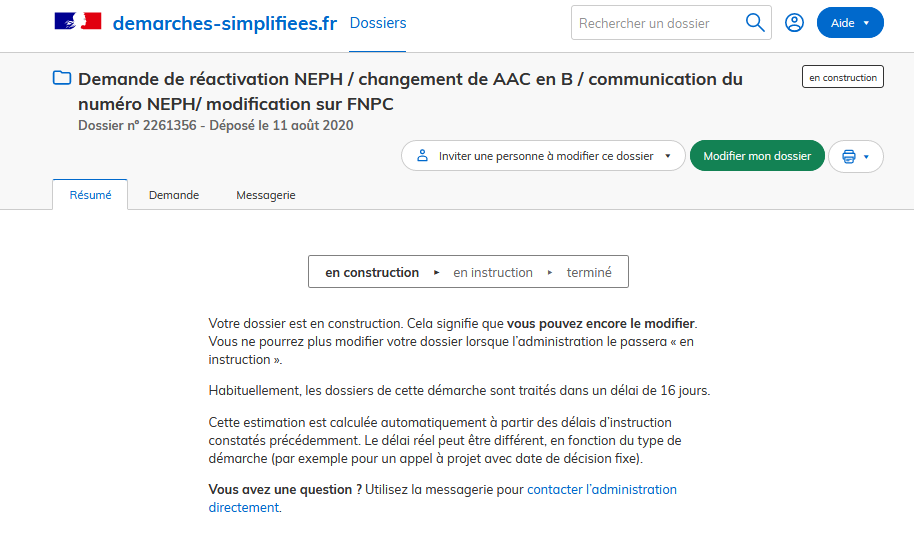

### D. Modifier un dossier

Un dossier peut être modifié s'il est en brouillon ou en construction. Pour cela cliquer sur le bouton "Modifier mon dossier" en haut à droite :

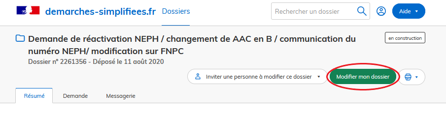

Une fois les modifications effectuées, n'oubliez pas de cliquer sur le bouton "Enregistrer les modifications du dossier", situé en bas de page :

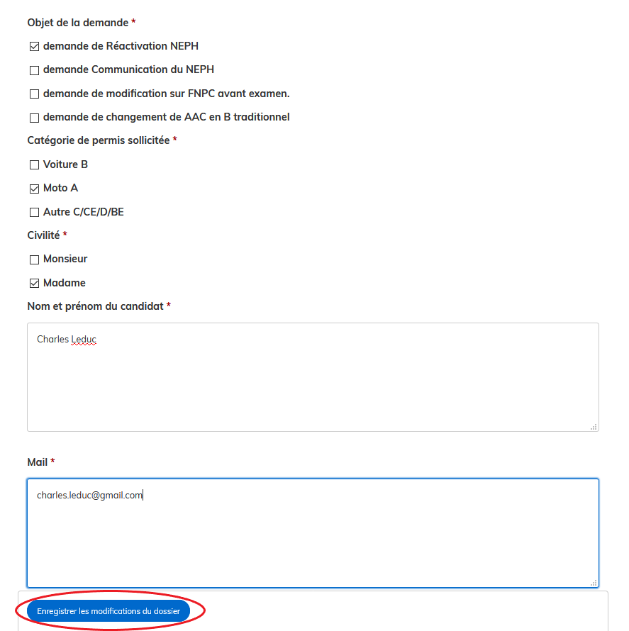

### E. Utiliser la messagerie pour contacter le service instructeur

Un onglet "Messagerie" est intégrée au dossier : celui-ci reprend les e-mails qui sont envoyés à l'usager et lui permet de communiquer directement avec le service instructeur.

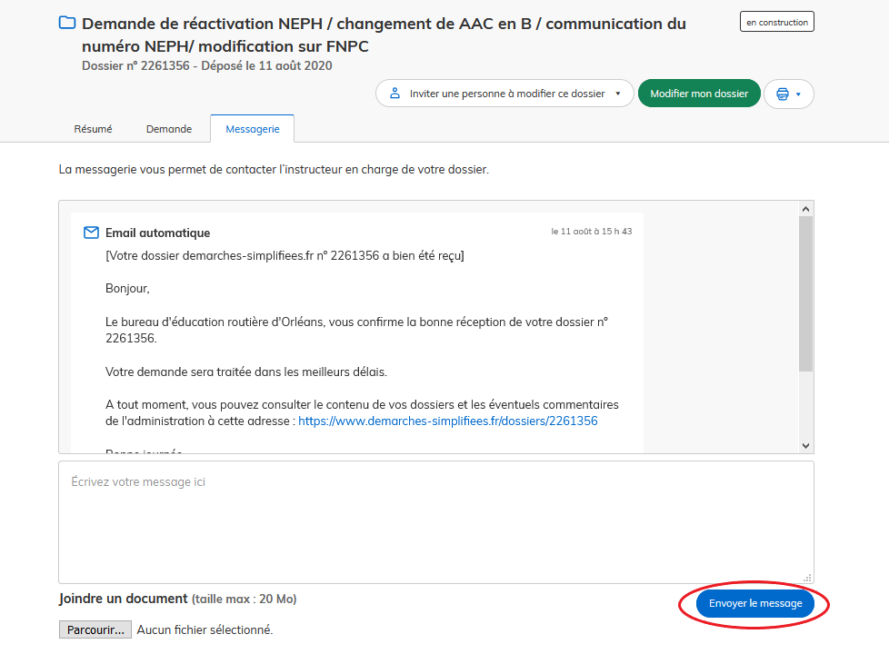

Après avoir saisi le corps du texte, cliquer sur le bouton « Envoyer le message ».

Possibilité de joindre un fichier au message (max 20 Mo) en cliquant sur « Parcourir ».

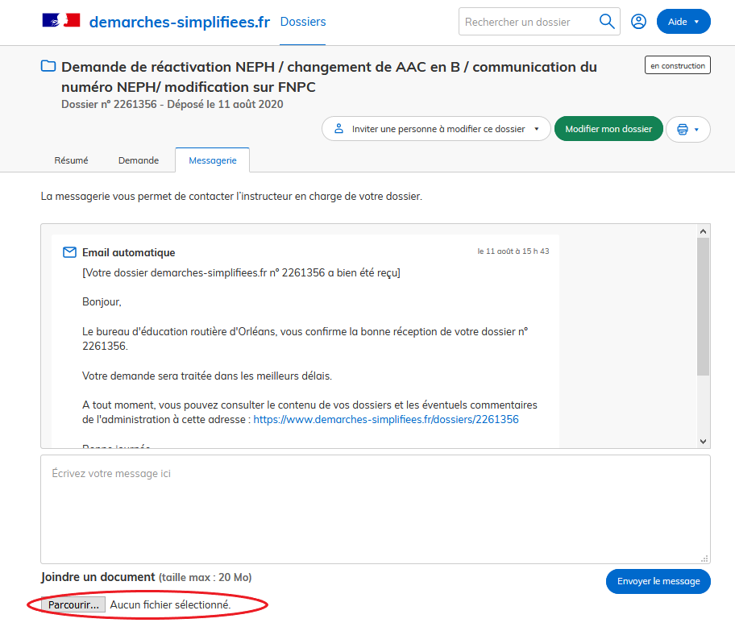

En absence de réponse ou si vous souhaitez contacter directement l'administration, les informations de contact sont disponibles en bas de page de la démarche concernée, sous la rubrique "Poser une question sur votre dossier".&#x20;

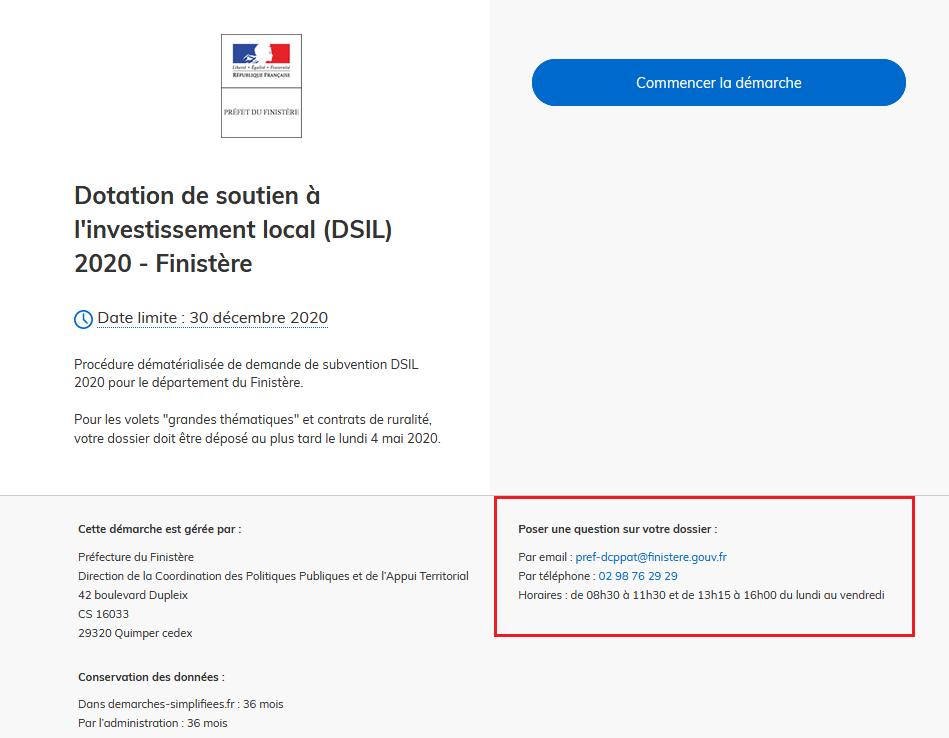


**ATTENTION** : Une fois l'instruction du dossier terminée et la décision prise, l'usager n'aura plus accès à la messagerie.&#x20;

